# Contexto del Proyecto — SICOG (Sistema de Control Operacional de Gas, PDVSA Gas)
*Generado para continuar el proyecto en Claude Code / otra sesión. Reemplaza al resumen anterior (`Resumen_Proyecto_Control_Operacional_Gas.md`).*

**Nombre oficial del sistema: SICOG.** Usar este nombre en el `package.json` raíz del monorepo, título de la app (`web`), y cualquier referencia de marca dentro de la UI (ej. header del login, título de pestaña del navegador).

---

## 1. Objetivo del proyecto

Reemplazar el balance diario de gas natural que actualmente se lleva manualmente en Excel (`NUEVO_BALANCE_ACTUALIZADO.xlsm`) en la Gerencia de Control Operacional / Despacho Central de PDVSA Gas, mediante una aplicación web.

**Importante**: la carga de datos NO es por importación de archivos Excel — es **transcripción manual**. Los analistas digitan directamente en la aplicación, igual que hoy digitan en el Excel.

*Matiz encontrado al auditar el archivo (decisión #48)*: el Excel actual no es 100% manual. Once celdas de la hoja `FUENTES` (presiones de estaciones y un flujo) se alimentan solas desde **AspenTech InfoPlus.21** vía la función `ATGetTimeVal` del complemento. Es un bloque angosto — el balance en sí (clientes, fuentes, quema) sí es transcripción manual — y **queda fuera del alcance de SICOG**.

---

## 2. Rol del asistente / reglas de trabajo

- Actúa como experto en la industria del gas en Venezuela + experto en desarrollo de software, asesor del desarrollo de esta aplicación.
- **Preferir simplicidad sobre sobre-diseño** — ya se revirtió una vez un modelo más complejo de `ESTACION` (con UTM, telemetría, etc. metido en Despacho quando en realidad era de Mantenimiento).
- Diagramas ER siempre en **Mermaid** (`erDiagram`).
- **Preguntar antes de asumir** reglas de negocio no confirmadas — nunca rellenar vacíos con suposiciones.
- **No mezclar dominios** (Despacho, Mantenimiento, Calidad de Gas, Análisis Operacional) aunque compartan base de datos. Catálogos verdaderamente transversales (`USUARIO`, `REGION_MTTO` reutilizada por Actividades) se comparten por referencia, no se duplican.
- Cualquier cambio a un modelo ya confirmado se presenta como **propuesta explícita (diff conceptual)**, nunca se sobrescribe silenciosamente.
- No incluir datos personales sensibles de empleados (cédula, fecha de nacimiento, dirección, tallas) en el modelo ni reproducirlos en el chat.
- Seguridad como **prioridad uno** en cualquier decisión de arquitectura de software.

---

## 3. Stack técnico confirmado

| Capa | Tecnología |
|---|---|
| Frontend | Next.js (App Router), responsive, **shadcn/ui**, **TanStack Table** (data tables), **TanStack Query** (fetching/cache) |
| Formularios | **react-hook-form + zod**, schemas de zod compartidos con el backend |
| Backend | Node.js + **Express.js** |
| ORM | **Prisma** — aislado exclusivamente en la capa Repository, nunca importado directamente en Services/Controllers |
| Base de datos | **PostgreSQL** — nombre: `ctrl_operacional_gas`, con **pgvector** habilitado desde el script inicial (para RAG Fase 2). **Desarrollo**: contenedor Docker local (`docker-compose.yml`, imagen `pgvector/pgvector:pg16`) — ver decisión #40. **Producción**: contenedor `postgres` del stack Coolify (ver fila Despliegue), mismo patrón |
| Arquitectura | Controller → Service → Repository (no MVC "puro") |
| Monorepo | **pnpm workspaces** |
| Despliegue | Un solo stack vía **Coolify** (docker-compose): `web`, `api`, `postgres`. `ollama` se agrega solo cuando arranque la Fase 2 RAG, no antes |
| Principios obligatorios | **SOLID** en la aplicación, **ACID** en la base de datos |

**Aplicación de SOLID/ACID:**
- SRP: Controller traduce HTTP↔Service; Service tiene la lógica de negocio; Repository solo persiste.
- OCP/DIP: Services dependen de interfaces de Repository (`IUsuarioRepository`, etc.), nunca de Prisma directamente. Si se necesita SQL crudo (queries agregadas tipo "Balance Nación" o el "REAL" de Actividades), va dentro del Repository vía `$queryRaw` parametrizado (nunca concatenación de strings).
- ACID: transacciones para cargas de balance, constraints (`CHECK`, `UNIQUE`, `FK`), aislamiento `SERIALIZABLE` en cierre de turno, triggers de auditoría.

**Convención de nombres Prisma/BD (confirmada):**
- Modelos Prisma: PascalCase singular (`Usuario`, `LecturaBalance`); campos: camelCase, mapeados a snake_case singular en la columna física vía `@map` (`clienteId` → `cliente_id`).
- Tablas físicas: snake_case, primera palabra del nombre en plural vía `@@map` (`usuarios`, `lecturas_balance`, `regiones_operativa`).

### Estructura del monorepo

```
ctrl-operacional-gas/
  apps/
    web/                    → Next.js
    api/                    → Express
      src/modules/
        despacho/            → controllers/ services/ repositories/
        mantenimiento/
        actividades/
        auth/
        calidad-gas/          ← carpeta mínima, se llena al diseñar Dominio C
        analisis-operacional/  ← carpeta mínima, se llena al diseñar Dominio D
      src/shared/            → middlewares, prisma-client.ts, domain types
  packages/
    db/                      → schema.prisma
    shared-types/            → DTOs compartidos
    shared-validators/       → schemas de zod (frontend + backend)
  docker-compose.yml
```

### Seguridad (prioridad uno)
- bcrypt costo 12 para contraseñas.
- JWT: access token 15 min, refresh token 7 días en cookie `httpOnly` + `secure` + `sameSite: strict`. Refresh guardado en tabla Postgres (`SESION_REFRESH`), no en Redis — menos piezas expuestas para 10 usuarios simultáneos.
- Rotación de secreto JWT: **pospuesta** para cuando el sistema esté en producción estable (no es prioridad ahora, pero queda documentada como mejora futura: mantener lista corta de secretos válidos con expiración para rotar sin downtime).
- Rate limiting en login (`express-rate-limit`, ~5 intentos / 15 min).
- Bloqueo de cuenta: `USUARIO.bloqueado boolean` — **desbloqueo manual exclusivo del superadmin**, no automático por tiempo.
- RBAC validado **en el backend siempre**, nunca solo en frontend (frontend = UX, backend = autorización real). Middleware centralizado (`requireDepartamento`, `requirePuestoMinimo`).
- `helmet` + CORS restringido al dominio del `web`.
- Usuario de BD de la app con permisos mínimos (sin `SUPERUSER`); migraciones con usuario aparte más privilegiado.
- Nunca loguear contraseñas/tokens/body de login.
- Auditoría de seguridad: login (IP, timestamp), intentos de autorización fallidos (`LOG_INTENTO_NO_AUTORIZADO`), además de los `*_HISTORIAL` ya definidos por integridad de datos.

---

## 4. Dominios del sistema (misma base de datos, sin relación funcional entre sí en los datos operativos)

- **Dominio A — Despacho**: balance diario, fuentes de gas, novedades operativas, contactos, quema nacional. **CERRADO.**
- **Dominio B — Mantenimiento**: estaciones T&D, instrumentación, telemetría semanal. **CERRADO** (incluye rediseño de telemetría de esta sesión).
- **Dominio E — Actividades y Horas-Hombre**: módulo transversal, un botón/sección por departamento, con catálogos propios por departamento. **CERRADO** (basado en `ACTIVIDADES_MDC_FINAL_V4.xls`, estructura de Mantenimiento; los otros 3 departamentos comparten estructura pero con su propio catálogo de `INSUMO`/`PRODUCTO_SERVICIO`, aún no levantado).
- **Autorización / `USUARIO`**: jerarquía de departamentos y puestos. **CERRADO.**
- **Dominio C — Calidad de Gas**: **PENDIENTE**, falta el Excel dedicado. Preview de parámetros físico-químicos disponible vía `Plantilla_Standar_2.pptx` (composición química, poder calorífico, límites Resolución 162 MENPET).
- **Dominio D — Análisis Operacional**: **PENDIENTE**, sin Excel ni especificación aún.

---

## 5. Archivos ya analizados

| Archivo | Qué es | Estado |
|---|---|---|
| `NUEVO_BALANCE_ACTUALIZADO.xlsm` | Balance diario real (8 hojas). Auditado contra el ERD de Despacho — estructura general consistente, sin gaps. Hoja `GUIA WEB` confirmó que Empresas Mixtas/LIC se comportan como `CLIENTE`. **Corrección**: una segunda auditoría de las fórmulas activas (no solo los valores) sí encontró un gap real de granularidad en el catálogo `FUENTE` — ver decisión #39. | Analizado a fondo, base y auditoría del Dominio A. |
| `INVENTARIO_ESTACIONES.xls` | 251 estaciones T&D. Auditado: confirma el catálogo real de 6 regiones de Mantenimiento (Nor-Oriente, Este-Oriente, Sur-Oriente, Centro, Centro-Occidente, Occidente), 16 tipos de instrumento ISA, `tipo_enlace_com` cerrado a 3 valores (IP PDVSA, SATELITAL, SERIAL PDVSA). | Base y auditoría del Dominio B. |
| `DISPON_SISUGAS_Semana_35.xls` | Reporte semanal de disponibilidad/telemetría real (6 hojas). Reveló que el estatus de telemetría real tiene 4 dimensiones independientes por estación (Comunicación, Eléctrico, Instrumentación, Caseta), no un solo campo — forzó el rediseño de `REPORTE_TELEMETRIA_ESTACION`. | Usado para rediseñar telemetría. |
| `ACTIVIDADES_MDC_FINAL_V4.xls` | Formato real de control de horas-hombre y actividades de Mantenimiento (bitácora + plan/real + % derivados). Estructura genérica reutilizable por los 4 departamentos; catálogos (`INSUMO`, `PRODUCTO_SERVICIO`) varían por departamento. | Base del módulo Actividades. |
| `Manual DAO.pptx` | **"Guía de Información Sistemas de Transporte de Gas 2023" — documento oficial y autoridad sobre los sistemas.** 110 diapositivas: índice de sistemas, nomenclatura de estaciones por sistema, puntos de entrega/recepción, calidad de gas, data técnica de tuberías. Es la fuente de las decisiones #16 (7 sistemas), #41 (`sistema_id` de cada fuente), #47 (Empresas Mixtas como fuente) y del mapeo de la #46. | Analizado a fondo. En `archivos-fuente/`. |
| `Plantilla_Standar_2.pptx` | Manual técnico de una sesión anterior; **no está en `archivos-fuente/`**, no se pudo re-verificar. Su afirmación de "8 sistemas de transporte" **queda superada** por el `Manual DAO.pptx`, que confirma 7 (decisión #16). Sigue válido lo que aportó sobre la jerarquía Región→Subregión (opción c) para Oriente. | Superado parcialmente; conservar sólo lo de regiones. |
| `CLIENTE_Interaction-correccion.pdf` | Correcciones manuscritas al primer ERD. | Aplicadas. |
| `ESTACIONES.accdb` / 16 CSVs exportados | Catálogo de 288 estaciones T&D, bitácora de actividades/indicadores GCO, directorio de contactos. | Resuelto vía CSVs; mayormente Dominio B. |

**Privacidad**: los datos personales sensibles de `PERSONAL.csv` (cédula, fecha de nacimiento, dirección, tallas) **no se replican** en el modelo ni en logs de la aplicación.

**Dónde viven**: los archivos fuente están en `archivos-fuente/` en la raíz del repo, **gitignoreada a propósito** — son documentos internos de PDVSA y archivos binarios grandes, no tienen por qué entrar al historial de git. Hoy están ahí: `NUEVO BALANCE ACTUALIZADO.xlsm`, `Manual DAO.pptx`, `ACTIVIDADES MDC FINAL V4.xls`, `DISPON_SISUGAS_Semana_35.xls`, `INVENTARIO ESTACIONES.xls` y `ESTACIONES TyD.csv`.

---

## 6. Decisiones clave confirmadas (no rediseñar sin volver a preguntar)

1. Nombre de la BD: `ctrl_operacional_gas`.
2. ~~Balance diario: 2 cortes al día (puntual y cierre_promedio), digitados independientemente~~ **Corregido, ver decisión #34**: el cierre_promedio ya no se digita aparte, se deriva del historial de correcciones del puntual del día.
3. Registro "cerrado" puede ser corregido por cualquier analista — de ahí la obligatoriedad del historial de auditoría.
4. `LECTURA_FUENTE`: sin campos `procesado`/`residual` (el volumen del corte ya representa lo procesado).
5. "Desvío" no es campo numérico — es una fuente más dentro de `FUENTE` (ej. "Desvío – Ventas Directas").
6. `NOVEDAD_OPERATIVA` tiene `tipo` (catálogo, ver punto 20) e `impacto` (texto descriptivo, no escala).
7. `SISTEMA` aplica tanto a `FUENTE` como a `CLIENTE`.
8. `ESTACION` es simple (no UTM/telemetría en Despacho) — eso es Dominio B. `FUENTE` es simple: `id`, `nombre`, `sistema_id`.
9. Módulo Actividades/Indicadores GCO es parte del sistema, sin relación funcional con Despacho.
10. Datos personales sensibles NO se replican.
11. Autenticación: `USUARIO.nombre` único (login), `password_hash` (bcrypt), gestión exclusiva del superadmin, sin auto-registro.
12. Relación Cliente↔Fuente vía `SISTEMA`: un cliente pertenece a un solo sistema (`CLIENTE.sistema_id`).
13. `LECTURA_FUENTE` tiene auditoría igual que `LECTURA_BALANCE` (`estado` + `*_HISTORIAL`).
14. Quema de gas a nivel nacional, tabla `QUEMA_NACIONAL` (`fecha`, `tipo_corte`, `mmpced`), digitado manualmente. **El mismo mecanismo puntual/cierre_promedio de la decisión #34 aplica aquí** (tiene su propio `QUEMA_NACIONAL_HISTORIAL`).
15. "Balance Nación" es **query-calculado**, no tabla nueva.
16. ~~Catálogo `SISTEMA` real: 9 sistemas (ANACO-JOSE-ORIENTE, NOR ORIENTE/SINORGAS, PUERTO ORDAZ, CENTRO-CARACAS, CENTRO/OCCIDENTE, COSTA OESTE, COSTA ESTE, ULE-AMUAY, ENTREGAS DIRECTAS OCC).~~ **Corregido y confirmado con fuente oficial**: `Manual DAO.pptx` ("Guía de Información Sistemas de Transporte de Gas 2023", `archivos-fuente/`) — índice de contenido (slide 2) y encabezados de cada sección (slides 5, 22, 32, 41, 51, 77, 90) — confirman **7 sistemas reales**, no 9. Los 9 nombres anteriores eran una mezcla incorrecta de agrupaciones regionales de reporte (como aparecen en `NUEVO_BALANCE_ACTUALIZADO.xlsm`) con el catálogo oficial de sistemas de transporte, que es distinto:
    1. Anaco - José - Puerto La Cruz - Sinorgas (Sinorgas es una subred de estaciones dentro del mismo sistema, no un sistema aparte)
    2. Anaco - Puerto Ordaz
    3. La Toscana - San Vicente
    4. Jusepín - Criogénico
    5. Anaco - Caracas - Barquisimeto - Río Seco
    6. Ulé - Amuay
    7. Transcaribeño (así aparece en el índice del manual; las diapositivas internas de esta sección lo llaman "Transoceánico" — inconsistencia del propio manual, no confirmada cuál es el nombre vigente; se sembró como "Transcaribeño")
    **Sembrado** en `packages/db/prisma/seed.ts`.
17. Regiones operativas de Despacho (`REGION_OPERATIVA`): 4 — Oriente, Centro, Centro-Occidente, Occidente.
18. **Jerarquía de regiones de Mantenimiento confirmada (opción c)**: `REGION_OPERATIVA` (4, Despacho) es la región madre; `REGION_MTTO` (6, Mantenimiento) es más granular — Oriente se subdivide en Nor-Oriente / Sur-Oriente / Este-Oriente; Centro, Centro-Occidente y Occidente son 1:1 con su región madre. Confirmado con datos reales de `INVENTARIO_ESTACIONES.xls`, `DISPON_SISUGAS` y `Plantilla_Standar_2.pptx`.
19. **`ACTIVIDAD_REGISTRO.region_id` reutiliza `REGION_MTTO`** (nullable = alcance nacional), en vez de crear una tabla `SUBREGION` duplicada — misma fuente de verdad para ambos dominios.
20. Empresas Mixtas/LIC (Petro Monagas, Mavegas, Bitor, Petropiar, Petro Delta, Gas Guárico, Ypergas) se modelan como **`CLIENTE`** (`tipo_sector = 'Empresa Mixta'`), confirmado con evidencia de `NUEVO_BALANCE_ACTUALIZADO.xlsm` hoja `GUIA WEB`.
21. Departamentos (4, cada usuario pertenece a exactamente uno, excepto Gerente/Superadmin): Despacho, Mantenimiento, Análisis Operacional, Calidad de Gas.
22. Visibilidad general: cualquier usuario **consulta** cualquier departamento; solo **edita** el suyo.
23. Jerarquía organizacional: Gerente (1, cubre los 4) → Superintendente de Despacho (Despacho+Mantenimiento) / Superintendente de Análisis (Calidad de Gas+Análisis Operacional) → Supervisor (uno por depto) → Ingeniero / Analista (**dos cargos distintos, misma jerarquía** — confirmado).
24. Pares Superintendente↔Departamentos son **fijos** (no reasignables) — confirmado.
25. En el módulo de Actividades, un superior ve **toda la cadena hacia abajo** (no solo un nivel) — confirmado.
26. `USUARIO.rol` (obsoleto) se **reemplaza por completo** por `puesto_id` + `departamento_id` — confirmado.
27. `DEPARTAMENTO`, `PUESTO`, `SUPERINTENDENCIA_DEPARTAMENTO` (tabla puente superintendente↔departamento) ya modeladas y cerradas — ver ERD sección 7.
28. **Rediseño de `REPORTE_TELEMETRIA_ESTACION`**: 4 dimensiones independientes vía FK a `ESTADO_TELEMETRIA` (Comunicación, Eléctrico, Instrumentación, Caseta) en vez de un solo enum. `SISTEMA DE CONTROL LOCAL` → dimensión `INSTRUMENTACION` (se refiere al PLC). `AFECTACION POR HURTO` → valor dentro de `ELECTRICO`. "Esperando reporte" **no se guarda** — se calcula por ausencia de fila en la semana. `detalle_medicion` y `observacion` quedan como texto libre.
29. `ESTATUS` de `ACTIVIDAD_REGISTRO`: catálogo cerrado de 3 — **RECIBIDO → EN PROCESO → FINALIZADO**.
30. `ACTIVIDAD_META` (plan anual de horas-hombre): la carga el **Supervisor** de cada departamento, **una vez al año** (una fila por `producto_servicio_id` + mes).
31. **Gobernanza de catálogos "de negocio"** (`INSUMO`, `PRODUCTO_SERVICIO`, `ESTADO_TELEMETRIA`, `GERENCIA_REQUIRIENTE`, `ESTATUS` de Actividades, y `NOVEDAD_OPERATIVA.tipo` como candidato futuro): administrados por **Supervisor de su propio departamento hacia arriba** (Supervisor, Superintendente, Gerente) — nunca Superadmin (no conoce el dominio) ni cualquier Analista (riesgo de duplicados, ya visto en los Excel reales con "OPERATIVA" vs "OPERATIVO"). **Soft-delete** (`activo boolean`), nunca borrado físico, para no romper reportes históricos.
32. Distinción ENUM técnico vs. catálogo editable: ENUM de base de datos solo para campos **estructurales** (el sistema ramifica lógica según el valor, ej. `tipo_corte`, `tipo_red`, `dimension` de `ESTADO_TELEMETRIA`); catálogo editable en tabla para listas **de negocio** que crecen sin tocar código (estados, tipos de actividad, insumos).
33. **Nombre oficial del sistema: SICOG** (Sistema de Control Operacional de Gas) — elegido por no chocar con nombres de sistemas reales ya existentes en la operación (`SISUGAS`, `WEBGAS`, `Infoplus21`) y por no favorecer a un solo dominio.
34. **Mecánica real de PUNTUAL/CIERRE_PROMEDIO** (corrige la decisión #2, aplica igual a `LECTURA_BALANCE` y `QUEMA_NACIONAL` — ver #14): el valor `PUNTUAL` de un cliente/fecha (o de la quema nacional/fecha) se puede corregir varias veces durante el día; cada corrección genera una fila en su propio `*_HISTORIAL` (mecanismo ya existente, reusado tal cual). Al cumplirse las 24 horas se calcula `CIERRE_PROMEDIO` como la **media aritmética simple** (no ponderada por el tiempo que cada valor estuvo vigente) de todos los valores que tuvo el `PUNTUAL` ese día — el historial de ese día más el valor final vigente —, y **se guarda como fila propia** (no es query-calculado como "Balance Nación", decisión #15, porque alimenta el informe formal de cierre). El `PUNTUAL` del día siguiente **arranca con el último valor del día anterior** (carry-forward), nunca en blanco — ese arranque es lógica de Service, no cambia el schema.
35. **Se elimina el campo `estado` (Cerrado/Pendiente) de `LECTURA_BALANCE` y `LECTURA_FUENTE`, y `estado_ant` de sus respectivos `*_HISTORIAL`** — corrige las decisiones #13 y #34 en este punto específico. Motivo: (a) no existe columna equivalente en ninguna de las hojas reales auditadas de `NUEVO_BALANCE_ACTUALIZADO.xlsm`, era una suposición previa sin evidencia; (b) el registro "cerrado" nunca restringe edición (decisión #3, cualquier analista corrige cualquier registro), por lo que el campo no gatilla ninguna regla de negocio real; (c) tras la decisión #34, `CIERRE_PROMEDIO` se deriva automáticamente a las 24h, lo que reduce aún más la utilidad de un estado manual. El historial de auditoría (`*_HISTORIAL`) sigue siendo obligatorio — esto no cambia, solo se retira el campo `estado` en sí. **Impacto**: actualizar `schema.prisma` (quitar `estado`/`estadoAnt` de `LecturaBalance`, `LecturaBalanceHistorial`, `LecturaFuente`, `LecturaFuenteHistorial`) y, si ya se generó, la migración de Prisma. **Hecho.**
36. **`CLIENTE.tipo_sector` deja de ser `String` libre y se convierte en catálogo editable `SECTOR_CLIENTE`** (`id`, `nombre`, `activo`) — mismo patrón de gobernanza de la decisión #31 (editable por Supervisor+ de Despacho, soft-delete, nunca borrado físico). Corrige la decisión #20 en este punto específico: el valor `'Empresa Mixta'` pasa de ser un literal string a una fila del catálogo (`CLIENTE.sector_id FK → SECTOR_CLIENTE`), sin cambiar el hecho ya confirmado de que Empresas Mixtas/LIC se modelan como `CLIENTE`. **Motivo**: la auditoría de `NUEVO_BALANCE_ACTUALIZADO.xlsm` (hoja `EJECUTIVO PUNTUAL`, tabla "CONSUMO POR SECTORES") reveló que `tipo_sector` en la práctica tiene una lista real de valores de negocio que crece — **Petrolero, Eléctrico, Siderúrgico, Petroquímico, Cemento, Otros** (6, confirmados leyendo las fórmulas de la hoja, no solo los valores) además de `Empresa Mixta` — mismo riesgo de typos ("OPERATIVA" vs "OPERATIVO") que motivó volver catálogo a `INSUMO`/`ESTADO_TELEMETRIA`. **Hecho** en `schema.prisma`.
37. **Reporte "Consumo por Sectores" confirmado en el alcance de Despacho** — total de gas por `SECTOR_CLIENTE` y por `REGION_OPERATIVA`. Es **query-calculado**, mismo patrón que "Balance Nación" (decisión #15): `SUM(LECTURA_BALANCE.volumen_mmpced)` agrupado por `CLIENTE.sector_id` y `CLIENTE.region_id`. No requiere tabla nueva — vive como query agregada en el Repository de Despacho cuando se diseñen los endpoints (§9.4 #10).
38. **"Quema Puntual" y "Quema TyD" son el mismo dato — resuelve el pendiente §9.6 #6 con evidencia, no con suposición.** Auditando las fórmulas activas de `NUEVO_BALANCE_ACTUALIZADO.xlsm`: `EJECUTIVO PUNTUAL!G31` ("QUEMA TYD", vista puntual) y `PROMEDIO!G49` ("QUEMA TYD", vista de cierre) apuntan ambas a `=FUENTES!I29`, la celda justo debajo de la etiqueta `"QUEMA PUNTUAL"` (`FUENTES!I28`). Es decir, "Quema Puntual" es la etiqueta del dato de entrada y "Quema TyD" es solo cómo se referencia ese mismo número en las vistas puntual/cierre — confirma que la decisión #14/#34 (`QUEMA_NACIONAL` con `tipo_corte` PUNTUAL/CIERRE_PROMEDIO) ya estaba bien diseñada. **No requiere cambio de schema.** También se confirmó que "QUEMA TYD" aparece en la misma fila que la tabla "CONSUMO POR SECTORES" solo por diseño visual de la hoja — la fórmula prueba que no es una suma de esos sectores ni tiene relación matemática con ellos (son dos datos independientes que casualmente comparten espacio en la hoja).
39. **Granularidad real del catálogo `FUENTE` — resuelve el pendiente §9.6 #7, corrige la afirmación "sin gaps" de la sección 5.** Una segunda auditoría más profunda de `NUEVO_BALANCE_ACTUALIZADO.xlsm` (hojas `FUENTES` y `GUIA WEB`) y confirmación explícita del owner del proyecto establecen que `FUENTE` necesita bastante más granularidad de la asumida originalmente — sigue sin ser cambio de schema (`FUENTE` ya es simple: `id/nombre/sistema_id`, decisión #8), es una corrección al alcance real del **seed data**:
    - **Plantas divididas por tren** (cada tren se lee y corrige de forma independiente, no es una sola fila por complejo): San Joaquín Tren A y B, San Joaquín Tren C, Santa Bárbara Tren A y B, Santa Bárbara Tren C, El Tablazo LGN1, El Tablazo LGN2.
    - **Jusepín**: planta activa confirmada por el owner del proyecto (aparece en `GUIA WEB` con la misma estructura Desvío/Procesado/Descarga que San Joaquín/Santa Bárbara, aunque reportó vacío el día auditado) — se agrega al catálogo.
    - **8 fuentes adicionales bajo "Directo a Ventas" (Oriente)**, confirmadas como `FUENTE` (no `CLIENTE`) por el owner del proyecto: RECAT SJ, SJB FI FII, SOTO, AGUASAY 5A, BAJO GUANIPA, ETSJ, ZAPATO VIEJO, CORREDOR JUSEPIN-CRIOGENICO.
    - **7 fuentes adicionales bajo "Gas manejado desde El Tablazo" (Occidente)**, confirmadas como `FUENTE` (no `CLIENTE`) por el owner del proyecto: C. Petroquímico, Planta Fertilizante, Comb. Trans. a Pequiven, Hacia La Paz Gas E&P, Hacia Ramón Laguna, Hacia La Pica-Ule Amuay, Hacia La Pica-Retorno a Prod.
    Total: ~22 filas de `FUENTE` solo de esta hoja, frente a la asunción previa de una fila por complejo mayor. **Impacto**: ninguno en `schema.prisma`; el seed data real (§9.4 #9) debe usar esta lista en vez de una versión simplificada. **Sembrado, ver decisión #41 para el `sistema_id` de cada una.**
40. **Se abandona Supabase para desarrollo — se usa Postgres local en Docker en su lugar** (decisión explícita del owner del proyecto, corrige la fila "Base de datos" de la sección 3). Motivo: fricción de conectividad repetida y no resuelta en varias sesiones — el host directo de Supabase es IPv6-only (inalcanzable desde la red de desarrollo), el Session Pooler (IPv4) sí resolvía el DNS pero una VPN local bloqueaba el protocolo Postgres real (el handshake TCP pasaba, los datos no), y una vez resuelto eso, las 4 extensiones que Supabase preinstala (`pgcrypto`, `uuid-ossp`, `pg_stat_statements`, `supabase_vault`, en un esquema separado que `prisma migrate reset` no toca) seguían generando "drift" en la primera migración sin una solución limpia. Ninguno de estos problemas es del dominio de negocio — es puramente friccion de infraestructura de un proveedor externo para un ambiente de desarrollo local. **Nuevo setup**: `docker-compose.yml` (raíz) con un servicio `postgres` usando la imagen `pgvector/pgvector:pg16` (Postgres + pgvector preinstalado, sin las extensiones propietarias de Supabase), base `ctrl_operacional_gas` (decisión #1), levantado con `docker compose up -d`. `schema.prisma` vuelve a declarar solo `extensions = [vector]` (se quitan las 4 extensiones de Supabase, ya no aplican). La migración baseline manual creada para sortear el drift de Supabase se eliminó por completo — se empieza de cero con Postgres en blanco. **Producción sigue igual** (contenedor `postgres` del stack Coolify, sección 3) — este cambio es solo para desarrollo local, y de hecho lo acerca más al mismo patrón de producción (Postgres en contenedor propio) en vez de depender de un servicio gestionado externo.
41. **Asignación `sistema_id` real de las ~22 filas de `FUENTE` (decisión #39)**, resuelta con `Manual DAO.pptx` (nomenclatura de estaciones por sistema, slides 9/24/43/87-89):
    - San Joaquín Tren A y B, San Joaquín Tren C, RECAT SJ*, SJB FI FII* → **Anaco - José - Puerto La Cruz - Sinorgas** (el manual lista "Extracción San Joaquín"/"Criogénico San Joaquín" en este sistema; *RECAT SJ/SJB FI FII no aparecen con ese nombre exacto en el manual, inferido por convención de nombre "SJ" = San Joaquín, no confirmado al 100%).
    - Santa Bárbara Tren A y B, Santa Bárbara Tren C, Jusepín, SOTO, AGUASAY 5A, BAJO GUANIPA, ETSJ, ZAPATO VIEJO, CORREDOR JUSEPIN-CRIOGENICO → **Jusepín - Criogénico** (el manual lista textualmente "Santa Bárbara STB", "Soto STO", "Aguasay Nueva AGN", "Bajo Guanipa BJG", "Zapato Viejo ZPV" y "Estación Terminal San Joaquín ETSJ" como estaciones de este sistema).
    - El Tablazo LGN1, El Tablazo LGN2, y las 7 fuentes de "Gas manejado desde El Tablazo" (C. Petroquímico, Planta Fertilizante, Comb. Trans. a Pequiven, Hacia La Paz Gas E&P, Hacia Ramón Laguna, Hacia La Pica-Ule Amuay, Hacia La Pica-Retorno a Prod.) → **Ulé - Amuay** (el manual ubica el segmento de tubería "La Pica - El Tablazo" dentro de la sección técnica de este sistema).
    **Sembrado** en `packages/db/prisma/seed.ts` junto con el catálogo `SISTEMA` de la decisión #16.
42. **El cierre diario lo dispara un job automático a medianoche, no una acción humana** (completa la decisión #34, que decía "al cumplirse las 24 horas" sin especificar el disparador). Un job programado dentro de `apps/api` hace dos cosas en la misma corrida: (a) **cierra el día anterior** calculando el `CIERRE_PROMEDIO` de cada cliente (media aritmética simple de todos los valores que tuvo su `PUNTUAL` ese día: las filas de `LECTURA_BALANCE_HISTORIAL` de esa fecha más el valor final vigente) y guardándolo como fila propia; y (b) **abre el día nuevo** con el carry-forward de la decisión #43. Motivo de elegir job sobre un endpoint de "cerrar día" manual: el cierre alimenta el informe formal y no puede quedar sin hacerse porque nadie se acordó, ni hacerse dos veces. Aplica igual a `QUEMA_NACIONAL` (decisión #14). **`CIERRE_PROMEDIO` no se puede crear por la API** — el `POST` de lecturas sólo acepta `PUNTUAL`; el job es el único que escribe filas de cierre. Corregir un cierre ya calculado sí se permite (decisión #3), vía `PATCH`, y genera historial como cualquier otra corrección.
43. **El carry-forward del `PUNTUAL` se persiste como fila real, no es sólo una sugerencia de pantalla** (precisa la decisión #34). Cuando el job de la decisión #42 abre el día, crea la fila `PUNTUAL` de cada cliente con el último valor vigente del día anterior. Motivo: si un cliente no se toca en todo el día, igual tiene un valor vigente y entra al cierre — no quedan huecos en el informe formal. El analista sólo corrige lo que cambió, y esas correcciones son las que alimentan la media del cierre.
44. **Una corrección tardía recalcula el cierre ya emitido** (completa las decisiones #34 y #42). La decisión #3 permite corregir cualquier registro, incluso de días ya cerrados; cuando eso pasa, el `CIERRE_PROMEDIO` de ese día se vuelve a calcular incluyendo el valor corregido, y **el recálculo queda auditado en el historial del propio cierre** (la fila de cierre es una `LECTURA_BALANCE` más, con su propio `*_HISTORIAL`). El número formal siempre refleja el mejor dato disponible, y queda registrado quién lo cambió y cuándo. Precisión asociada: para calcular la media cuentan **todas** las filas del historial de esa lectura, sin filtrar por cuándo se hizo la corrección — la fila ya está atada a una fecha, así que sus valores son los que tuvo ese día aunque el analista la corrija días después.
45. **Una corrección tardía se arrastra a los días siguientes que sigan siendo copias intactas del carry-forward, y se detiene en el primero que un analista fijó a mano.** Motivo: sin esto, un valor equivocado en el día D queda propagado en silencio por toda la cadena de días heredados (decisión #43); con esto, corregir el origen corrige la cadena, sin destruir el trabajo de quien sí revisó un día posterior. Cada día propagado se corrige con el mecanismo normal, así que **deja su fila de historial**. **Detalle de implementación que importa**: "intacto" se detecta comparando el valor con el que se heredó, **no** preguntando "¿tiene historial?" — la propia propagación escribe historial, así que ese criterio se rompería en la segunda corrección de la misma cadena. Limitación conocida: si un analista fija a mano exactamente el mismo número que se heredó, el sistema no puede distinguirlo de una copia intacta y lo tratará como tal.
46. **Catálogo real de `CLIENTE`: 111 filas, con región y sector extraídos de las fórmulas del Excel, no inferidos por el nombre.** Las fórmulas de la tabla "Consumo por Sectores" (`EJECUTIVO PUNTUAL`) referencian celda por celda a cada cliente de la hoja `CEN-ORI`, así que el mapeo `cliente → región → sector` sale de la propia lógica del Excel (94 de las 110 filas). Decisiones asociadas del owner:
    - **Mapeo etiqueta del Excel → sistema oficial** (las 9 agrupaciones de la hoja no son los 7 sistemas de la decisión #16): ANACO-JOSE-ORIENTE y NOR ORIENTE/SINORGAS → *Anaco - José - Puerto La Cruz - Sinorgas*; PUERTO ORDAZ → *Anaco - Puerto Ordaz*; CENTRO-CARACAS y CENTRO/OCCIDENTE → *Anaco - Caracas - Barquisimeto - Río Seco*; COSTA OESTE, COSTA ESTE y ULE-AMUAY → *Ulé - Amuay* (los dos primeros confirmados buscándolos en el Manual DAO: la slide 82 se titula "Puntos de Entregas de Gas SISTEMA ULÉ - AMUAY" y el esquema de la slide 79 muestra "Lagunigas, EyP, CAMC, Ramal Norte, Costa Oeste" dentro de ese sistema).
    - **Autogeneración y plantas eléctricas internas** (`AUTOGENERACION PLC`, `P.E. FURRIAL`, `AUTOGENERACIÓN SOTO`…) → `CLIENTE` con sector **Otros**. El Excel las deja fuera de todos los totales por sector, así que agruparlas en "Otros" es lo más cercano a cómo las trata hoy. Mismo criterio para los industriales que están en cero y no aparecen en ninguna fórmula.
    - **`RECAT SAN JOAQUIN` y `SAN JOAQUIN BOOSTER (SJB)` no son clientes**: quedan sólo como `FUENTE` (decisiones #39/#41). `CENTRO OPERATIVO SAN JOAQUIN (COSJ)` **sí** es cliente.
    - **Los aportes y transferencias entre sistemas no son clientes** (`APORTE A EYP K00/K04+600`, `TRANSFERENCIA ICO-NURGAS`): son movimientos entre sistemas y quedan fuera del catálogo. Falta decidir si el sistema necesita modelarlos de alguna forma.
    - El catálogo se genera en `packages/db/prisma/clientes.seed.ts` (archivo generado, no editar a mano) y se carga desde `seed.ts`.
47. **Las Empresas Mixtas/LIC son `FUENTE` *y* `CLIENTE` a la vez — corrige la decisión #20, que sólo las contemplaba como cliente.** Evidencia: los volúmenes no coinciden entre las dos hojas (Petro Monagas **aporta 60.61** en el bloque "APORTE" de `FUENTES` pero **consume 12** como cliente en `CEN-ORI`; Petropiar aporta 0 y consume 39), o sea son dos flujos distintos de la misma contraparte — normal en gas: la empresa produce gas asociado que entrega al sistema, y además consume gas para su operación. El Manual DAO lo confirma sin ambigüedad: la **slide 27 se titula "Puntos De Recepción De Gas — FUENTES QUE APORTAN GAS AL SISTEMA"** y lista a Petro Piar, PetroMonagas y Petro Delta.
    - **Como `FUENTE`** se sembraron 9, con el sistema tomado del manual: Petro Monagas, Mavegas, Bitor, Petropiar y Petro Delta → *Anaco - Puerto Ordaz* (slide 27); Gas Guárico e Ypergas → *Anaco - Caracas - Barquisimeto - Río Seco* (slides 52-60); Cardón IV → *Ulé - Amuay* (slide 84); PAGMI → *Anaco - José - Puerto La Cruz - Sinorgas* (slides 6/8/12).
    - **Como `CLIENTE` mantienen el sector `Petrolero`** que les asignan las fórmulas del Excel, *no* `Empresa Mixta`. Razón: así el reporte "Consumo por Sectores" del sistema coincide exactamente con el del Excel. **Consecuencia**: el sector `Empresa Mixta` del catálogo queda con 0 clientes; si no se le encuentra uso, corresponde desactivarlo (soft-delete, decisión #31).
    - **`OTROS OCCIDENTE`** (grupo "ENTREGAS DIRECTAS OCC", 15 MMPCED) se carga como `CLIENTE` del sistema *Ulé - Amuay*. Ese grupo no existe en el Manual DAO — es una convención del balance, no un sistema de transporte.
    - **El seed pasó a ser aditivo**: inserta sólo lo que falta en vez de saltarse el catálogo entero si ya tiene filas, así se puede ampliar sin borrar la base. La clave de comparación **no puede ser sólo el nombre**: el Excel trae homónimos legítimos (`ALCASA` en dos regiones, y una bolsa `OTROS` por sistema), así que se compara por nombre+sistema(+región para clientes). Los homónimos además se desambiguan al generar el catálogo, agregando la agrupación de origen entre paréntesis (`OTROS (PUERTO ORDAZ)`, `ALCASA (CENTRO/OCCIDENTE)`): en la hoja se distinguen por dónde están, pero en una grilla no.
48. **Las presiones de estaciones quedan fuera del alcance de SICOG.** El Excel las trae en dos bloques de la hoja `FUENTES` (`I49:N54` e `I57:N62`, con espejo en `EJECUTIVO PUNTUAL` `G55:G64`), pero **no se digitan**: son 11 celdas alimentadas por el complemento de **AspenTech InfoPlus.21** vía `ATGetTimeVal("EPA:PT105.PRPUL.", ...)` — 9 tags de presión (`PT`) y uno de flujo (`N70:FT006.FLIDI.`). Motivo de dejarlas fuera, confirmado por el owner: **los analistas ya miran esas presiones directo del SCADA**, no del Excel, así que replicarlas en SICOG no agrega valor y abriría un frente de integración con el historiador (accesos, credenciales, consulta desde el servidor) sin beneficio real. El bloque del Excel es una copia de conveniencia de algo que ya tienen en vivo en mejor forma. **Consecuencia**: el modelo no tiene ni tendrá campos de presión; quien las necesite usa el SCADA.
49. **Ningún token de sesión viaja en el cuerpo de la respuesta ni es accesible desde JavaScript.** Access (15 min) y refresh (7 días) van en cookies `httpOnly` + `sameSite: strict` + `secure` en producción. Completa la sección 3, que sólo había decidido la cookie del refresh. Motivo: si el frontend guarda el access token en memoria o en storage, un XSS puede leerlo y usarlo fuera del sitio; con `httpOnly` no puede, y `sameSite: strict` corta el CSRF sin necesidad de un token anti-CSRF aparte. **Impacto**: `requireAuth` lee la cookie además del header `Authorization: Bearer`, que se conserva para pruebas y clientes que no son navegador.
50. **El refresh token rota en cada uso y el reuso se trata como robo.** Cada `POST /auth/refresh` emite un par nuevo y revoca el anterior; si llega un refresh **ya revocado**, se revocan **todas** las sesiones de ese usuario y se registra el hecho. El `@unique` sobre `token_hash` y la columna `revocado_en` ya estaban en el schema para esto. El token se guarda con **SHA-256, no bcrypt**: es aleatorio de 256 bits, no un secreto elegido por una persona, así que bcrypt sólo agregaría latencia sin encarecer ningún ataque real.
51. **Los intentos fallidos de login NO bloquean la cuenta.** La única defensa automática es el rate limiting (5 intentos fallidos / 15 min); el campo `USUARIO.bloqueado` queda como acción manual del superadmin (§3, decisión #11). Motivo: bloquear por intentos fallidos habilita una denegación de servicio trivial — cualquiera que conozca un nombre de usuario podría dejar afuera a esa persona hasta que un administrador la libere. En cambio, **bloquear a alguien sí le corta el acceso de inmediato**: el refresh verifica `bloqueado` y revoca sus sesiones en vez de esperar a que expire el token.

---

## 7. ERD consolidado (vigente)

```mermaid
erDiagram
  %% ===== DOMINIO A: DESPACHO =====
  REGION_OPERATIVA ||--o{ CLIENTE : agrupa
  SISTEMA ||--o{ FUENTE : ubica
  SISTEMA ||--o{ CLIENTE : distribuye
  SECTOR_CLIENTE ||--o{ CLIENTE : clasifica
  CLIENTE ||--o{ LECTURA_BALANCE : tiene
  USUARIO ||--o{ LECTURA_BALANCE : digita
  LECTURA_BALANCE ||--o{ LECTURA_BALANCE_HISTORIAL : genera
  USUARIO ||--o{ LECTURA_BALANCE_HISTORIAL : modifica
  FUENTE ||--o{ LECTURA_FUENTE : tiene
  USUARIO ||--o{ LECTURA_FUENTE : digita
  LECTURA_FUENTE ||--o{ LECTURA_FUENTE_HISTORIAL : genera
  USUARIO ||--o{ LECTURA_FUENTE_HISTORIAL : modifica
  CLIENTE ||--o{ NOVEDAD_OPERATIVA : "puede originar"
  FUENTE ||--o{ NOVEDAD_OPERATIVA : "puede originar"
  USUARIO ||--o{ NOVEDAD_OPERATIVA : registra
  CLIENTE ||--o{ CONTACTO : "puede tener"
  FUENTE ||--o{ CONTACTO : "puede tener"
  USUARIO ||--o{ QUEMA_NACIONAL : digita
  QUEMA_NACIONAL ||--o{ QUEMA_NACIONAL_HISTORIAL : genera
  USUARIO ||--o{ QUEMA_NACIONAL_HISTORIAL : modifica

  %% ===== DOMINIO B: MANTENIMIENTO =====
  REGION_MTTO ||--o{ AREA_MTTO : agrupa
  AREA_MTTO ||--o{ ESTACION : agrupa
  ESTACION ||--o{ ESTACION_INSTRUMENTO : tiene
  TIPO_INSTRUMENTO ||--o{ ESTACION_INSTRUMENTO : clasifica
  ESTACION ||--o{ REPORTE_TELEMETRIA_ESTACION : genera
  USUARIO ||--o{ REPORTE_TELEMETRIA_ESTACION : digita
  ESTADO_TELEMETRIA ||--o{ REPORTE_TELEMETRIA_ESTACION : "clasifica (x4 FKs)"

  %% ===== DOMINIO E: ACTIVIDADES / HORAS-HOMBRE (transversal, sin relación funcional con A/B) =====
  DEPARTAMENTO ||--o{ INSUMO : clasifica
  DEPARTAMENTO ||--o{ GERENCIA_REQUIRIENTE : clasifica
  INSUMO ||--o{ PRODUCTO_SERVICIO : agrupa
  PRODUCTO_SERVICIO ||--o{ ACTIVIDAD_REGISTRO : detalla
  PRODUCTO_SERVICIO ||--o{ ACTIVIDAD_META : planifica
  USUARIO ||--o{ ACTIVIDAD_REGISTRO : ejecuta
  GERENCIA_REQUIRIENTE ||--o{ ACTIVIDAD_REGISTRO : solicita
  REGION_MTTO ||--o{ ACTIVIDAD_REGISTRO : "ubica (nullable = nacional, catálogo reutilizado de Mantenimiento)"

  %% ===== AUTORIZACIÓN =====
  DEPARTAMENTO ||--o{ USUARIO : clasifica
  PUESTO ||--o{ USUARIO : ocupa
  USUARIO ||--o{ USUARIO : "supervisa / es cubierto por"
  DEPARTAMENTO ||--o{ SUPERINTENDENCIA_DEPARTAMENTO : cubre
  USUARIO ||--o{ SUPERINTENDENCIA_DEPARTAMENTO : cubre

  %% ===== SEGURIDAD (materializada al escribir schema.prisma, no dibujada antes) =====
  USUARIO ||--o{ SESION_REFRESH : tiene
  USUARIO ||--o{ LOG_LOGIN : intenta
  USUARIO ||--o{ LOG_INTENTO_NO_AUTORIZADO : genera

  %% ===== ENTIDADES =====
  REGION_OPERATIVA { int id PK
    string nombre }
  SISTEMA { int id PK
    string nombre }
  CLIENTE { int id PK
    int region_id FK
    int sistema_id FK
    int sector_id FK
    string nombre }
  SECTOR_CLIENTE { int id PK
    string nombre "catálogo editable por Supervisor+ de Despacho: Empresa Mixta, Petrolero, Eléctrico, Siderúrgico, Petroquímico, Cemento, Otros"
    boolean activo }
  FUENTE { int id PK
    int sistema_id FK
    string nombre }
  USUARIO { int id PK
    string nombre UK
    string password_hash
    int puesto_id FK
    int departamento_id "FK, nullable (Gerente/Superadmin)"
    int supervisor_id "FK a USUARIO, nullable"
    boolean bloqueado }
  LECTURA_BALANCE { bigint id PK
    int cliente_id FK
    date fecha
    string tipo_corte
    numeric volumen_mmpced
    int usuario_id FK }
  LECTURA_BALANCE_HISTORIAL { bigint id PK
    bigint lectura_id FK
    numeric volumen_mmpced_ant
    int usuario_id FK
    timestamp modificado_en }
  LECTURA_FUENTE { bigint id PK
    int fuente_id FK
    date fecha
    numeric volumen_mmpced
    int usuario_id FK }
  LECTURA_FUENTE_HISTORIAL { bigint id PK
    bigint lectura_fuente_id FK
    numeric volumen_mmpced_ant
    int usuario_id FK
    timestamp modificado_en }
  QUEMA_NACIONAL { bigint id PK
    date fecha
    string tipo_corte
    numeric mmpced
    int usuario_id FK }
  QUEMA_NACIONAL_HISTORIAL { bigint id PK
    bigint quema_nacional_id FK
    numeric mmpced_ant
    int usuario_id FK
    timestamp modificado_en }
  NOVEDAD_OPERATIVA { bigint id PK
    int cliente_id FK
    int fuente_id FK
    enum tipo "lista aún sin cerrar del todo, incluye 'Corrida de Pig'; candidato a pasar a catálogo editable"
    text impacto
    timestamp inicio
    timestamp fin
    string causa
    numeric mmpced_afectados
    int usuario_id FK }
  CONTACTO { int id PK
    int cliente_id FK
    int fuente_id FK
    string nombre_operador
    string telefono }

  REGION_MTTO { int id PK
    string nombre "6 valores reales: Nor-Oriente, Este-Oriente, Sur-Oriente, Centro, Centro-Occidente, Occidente" }
  AREA_MTTO { int id PK
    int region_id FK
    string nombre }
  ESTACION { int id PK
    int area_id FK
    string nombre
    string nodo UK
    string tipo_enlace_com "catálogo cerrado real: IP PDVSA, SATELITAL, SERIAL PDVSA"
    enum tipo_red "T | D" }
  TIPO_INSTRUMENTO { int id PK
    string nombre }
  ESTACION_INSTRUMENTO { int id PK
    int estacion_id FK
    int tipo_instrumento_id FK
    int cantidad }
  ESTADO_TELEMETRIA { int id PK
    enum dimension "COMUNICACION | ELECTRICO | INSTRUMENTACION | CASETA (estructural, fijo)"
    string nombre "catálogo editable por Supervisor+ de Mantenimiento"
    boolean activo }
  REPORTE_TELEMETRIA_ESTACION { bigint id PK
    int estacion_id FK
    date fecha_reporte
    int estado_comunicacion_id FK
    int estado_electrico_id FK
    int estado_instrumentacion_id FK
    int estado_caseta_id FK
    text detalle_medicion
    text observacion
    int usuario_id FK }

  DEPARTAMENTO { int id PK
    string nombre "Despacho, Mantenimiento, Calidad de Gas, Análisis Operacional" }
  PUESTO { int id PK
    string nombre "Gerente, Superintendente, Supervisor, Ingeniero, Analista" }
  SUPERINTENDENCIA_DEPARTAMENTO { int id PK
    int superintendente_id FK
    int departamento_id FK }

  INSUMO { int id PK
    int departamento_id FK
    string nombre
    boolean activo }
  PRODUCTO_SERVICIO { int id PK
    int insumo_id FK
    string nombre
    text descripcion_actividad
    boolean activo }
  ACTIVIDAD_REGISTRO { bigint id PK
    int producto_servicio_id FK
    int usuario_id FK
    int region_id "FK a REGION_MTTO, nullable = nacional"
    date fecha_desde
    date fecha_hasta
    int cantidad
    numeric hh
    int gerencia_requiriente_id FK
    string estatus "catálogo: RECIBIDO, EN PROCESO, FINALIZADO"
    text detalle }
  ACTIVIDAD_META { bigint id PK
    int producto_servicio_id FK
    int anio
    int mes
    int cantidad_meta
    numeric hh_meta }
  GERENCIA_REQUIRIENTE { int id PK
    int departamento_id FK
    string nombre
    boolean activo }

  SESION_REFRESH { bigint id PK
    int usuario_id FK
    string token_hash UK "hash del refresh token, nunca en claro"
    timestamp expira_en
    timestamp creado_en
    timestamp revocado_en "nullable"
    string ip "nullable"
    string user_agent "nullable" }
  LOG_LOGIN { bigint id PK
    int usuario_id "FK, nullable si el nombre de usuario no existe"
    string nombre
    boolean exitoso
    string ip
    timestamp creado_en }
  LOG_INTENTO_NO_AUTORIZADO { bigint id PK
    int usuario_id FK
    string ruta
    string motivo
    string ip
    timestamp creado_en }
```



---

## 8. Prototipo visual (previo, requiere actualización)

- React funcional (sin backend), 8 vistas: Login, Balance Diario, Lectura de Fuentes, Novedades Operativas, Contactos, Estaciones, Reporte de Telemetría, Reportes, Gestión de Usuarios.
- Estética "sala de control": fondo azul-tinta oscuro, tipografía monoespaciada en valores numéricos, reloj de turno en vivo.
- Ubicado en el repo hermano `../SIGCO-GAS-Prototipo-v1/control-operacional-prototipo.jsx` (Vite + React + Tailwind, ya inicializado como git repo aparte). **Pendiente**: reflejar el rediseño de telemetría, el módulo de Actividades, y la nueva estructura de departamentos/jerarquía. No se ha vuelto a tocar en esta sesión.

---

## 9. PENDIENTES ABIERTOS (actualizado a esta sesión)

### 9.1 Dominios sin diseñar
1. **Dominio C — Calidad de Gas**: falta el Excel dedicado. Preview de parámetros físico-químicos disponible en `Plantilla_Standar_2.pptx`.
2. **Dominio D — Análisis Operacional**: sin Excel ni especificación, alcance funcional totalmente por definir.

### 9.2 Módulo de Actividades
3. Estructura de `INSUMO`/`PRODUCTO_SERVICIO` solo se levantó para **Mantenimiento** (vía `ACTIVIDADES_MDC_FINAL_V4.xls`). Falta el equivalente para Despacho, Calidad de Gas y Análisis Operacional — mismo esquema de tablas, catálogos de valores distintos.
4. Lista cerrada completa del ENUM/catálogo `tipo` de `NOVEDAD_OPERATIVA` (Despacho, ya tiene "Corrida de Pig", faltan los demás valores) — candidato a pasar a catálogo editable siguiendo el mismo patrón que se aplicó a Actividades y Telemetría.

### 9.3 Mantenimiento / histórico
5. `SOLICITANTE` en actividades del Access viejo (campo texto libre) — ¿normalizar a FK? (bajo prioridad, dato histórico).

### 9.4 Implementación (no son decisiones de negocio)
6. ~~Escribir el `schema.prisma` completo~~ **Hecho** (`packages/db/prisma/schema.prisma`: Dominios A/B/E + Autorización + tablas de seguridad, con `@@unique`/`@@index`). ~~Falta correr la migración inicial~~ **Hecho**: aplicada contra el Postgres local en Docker (decisión #40), migración `20260910144045_init`.
6b. ~~Sincronizar `schema.prisma` con la decisión #35~~ **Hecho** — se quitó `estado` de `LecturaBalance`/`LecturaFuente` y `estadoAnt` de sus `*Historial`. No existía migración inicial aún, así que no hizo falta una migración correctiva; verificado con `prisma generate` (sin errores) y sin referencias sueltas a esos campos en `apps/web`/`apps/api`.
7. ~~`CHECK` de "exactamente uno" (`cliente_id`/`fuente_id`) en `NOVEDAD_OPERATIVA` y `CONTACTO`~~ **Hecho** — migración adicional `20260910150000_check_exactamente_uno` (Prisma no soporta `CHECK` arbitrario declarativo, se escribió a mano y se aplicó con `prisma migrate deploy` después del `init`).
8. ~~`UNIQUE(estacion_id, fecha_reporte)` en `REPORTE_TELEMETRIA_ESTACION`~~ **Hecho** en el schema (además de `UNIQUE(cliente_id, fecha, tipo_corte)` en `LECTURA_BALANCE`, `UNIQUE(fuente_id, fecha)` en `LECTURA_FUENTE` y `UNIQUE(producto_servicio_id, anio, mes)` en `ACTIVIDAD_META`, derivadas de las decisiones #2 y #30).
9. Seed data: **hecho** vía `packages/db/prisma/seed.ts` (`pnpm --filter @sicog/db run seed`) — 4 regiones de Despacho, 6 regiones de Mantenimiento, `SECTOR_CLIENTE` (7, decisión #36), `DEPARTAMENTO` (4), `PUESTO` (5), `ESTADO_TELEMETRIA` (valores reales de `DISPON_SISUGAS_Semana_35.xls`, typos corregidos — ver nota abajo), `INSUMO`/`PRODUCTO_SERVICIO` de Mantenimiento (18 productos/9 insumos reales de `ACTIVIDADES_MDC_FINAL_V4.xls`, typos corregidos). **Pendiente**: `SISTEMA` y `FUENTE` (decisión #16 en revisión — no se siembran hasta confirmar contra el manual DAO). Los 5 archivos fuente ya analizados viven ahora en `archivos-fuente/` (gitignored, no se commitean).
    - `ESTADO_TELEMETRIA` sembrado: COMUNICACION (Activo, En falla, Fuera de servicio), ELECTRICO (Activo, En falla, Hurtado), INSTRUMENTACION (Activo, En falla), CASETA (Operativo, Necesita mantenimiento). "Activo" en Comunicación y "En falla" en Eléctrico/Instrumentación se infirieron por simetría (el Excel solo lista estaciones con problemas, no un censo completo) — revisar con el Supervisor de Mantenimiento antes de darlo por cerrado; es catálogo editable (decisión #31), se ajusta sin tocar código.
10. Diseñar endpoints/rutas de la API por módulo. **Despacho: hecho** — contrato completo en la sección 11 (rutas, formato de error, paginación, idempotencia), con los schemas zod en `packages/shared-validators` y los DTOs en `packages/shared-types`. Falta el contrato de Mantenimiento, Actividades y `auth`, y falta implementar Despacho (Repository → Service → Controller).
11. Estructura inicial del monorepo (carpetas y configs) — descrita en sección 3, falta materializarla.
12. Actualizar el prototipo visual con los hallazgos de esta sesión.
13. Rotación de secreto JWT — pospuesta explícitamente, implementar cuando el sistema esté en producción estable.

### 9.5 Fase 2 — RAG
14. Plan definido (Ollama + pgvector, modelo 7-8B cuantizado, CPU puro, vía Coolify — mismo despliegue que la app, contenedor de Ollama se agrega solo cuando arranque esta fase). Falta: RAM real de la VM, y si los manuales de procedimientos ya existen documentados o requieren levantamiento con los analistas.

### 9.6 Despacho — verificar
6. ~~"Quema Puntual" vs. "Quema TyD"~~ **Resuelto, ver decisión #38** — son el mismo dato (confirmado por fórmula: ambas vistas apuntan a la misma celda origen). No requirió cambio de schema.
7. ~~Granularidad real del catálogo `FUENTE`~~ **Resuelto, ver decisión #39** — el catálogo real es más granular de lo asumido (plantas por tren, Jusepín, y las 15 fuentes de "Directo a Ventas"/"Gas manejado desde El Tablazo"). No requirió cambio de schema, solo corrige el alcance del seed data pendiente (§9.4 #9).

---

## 10. Próximo paso inmediato

**Estado al cierre de la sesión del 2026-09-10**: base de datos migrada y sembrada con los catálogos reales (7 sistemas, 31 fuentes, 111 clientes); contratos de API escritos para Despacho (§11) y `auth` (§12); funcionando y verificado end to end contra la BD real: el módulo `auth` completo, la rebanada `LECTURA_BALANCE` y el job de cierre diario.

### Por acá arranca la próxima sesión

1. **Gestión de usuarios — es lo que desbloquea todo lo demás.** El login funciona pero **no hay forma de crear un usuario salvo por SQL**, así que hoy nadie puede entrar al sistema. Por la decisión #11 es exclusiva del superadmin y no hay auto-registro. Incluye alta, cambio de contraseña y bloquear/desbloquear.
   - **Decisión pendiente del owner**: no hay **regla de complejidad de contraseña** definida. El login a propósito *no* valida formato (rechazar por forma sólo le diría a un atacante qué no probar), pero al **crear** una contraseña hace falta una regla.
2. **Frontend con las dos pantallas que ya tienen backend** (login y Balance Diario). *Recomendación del asistente, no confirmada por el owner*: hacer esto **antes** de terminar las rebanadas restantes de Despacho, porque la pantalla real va a revelar cosas del contrato que desde el backend no se ven —si el filtro por sistema alcanza, si hacen falta subtotales en la grilla, si `OTROS (PUERTO ORDAZ)` se lee bien— y corregirlas ahora es más barato que con seis módulos construidos encima. El tradeoff: el backend de Despacho queda incompleto un tiempo más.
3. **Resto de las rebanadas de Despacho**, con el contrato de §11 ya escrito: `LECTURA_FUENTE`, `QUEMA_NACIONAL`, `NOVEDAD_OPERATIVA`, `CONTACTO`, los catálogos y los dos reportes query-calculados.
4. **Contrato + API de Mantenimiento y Actividades** (mismo patrón de §11).

### Pendientes menores, no bloqueantes

- Revisar con el Supervisor de Mantenimiento los dos valores de `ESTADO_TELEMETRIA` que se infirieron por simetría (§9.4 #9).
- El Manual DAO se contradice sobre el nombre del 7º sistema: "Transcaribeño" (índice) vs "Transoceánico" (diapositivas internas). Se sembró como Transcaribeño (decisión #16).
- El sector `Empresa Mixta` quedó con 0 clientes tras la decisión #47 — corresponde desactivarlo (soft-delete) si no se le encuentra uso.
- Decidir si los aportes y transferencias entre sistemas (`APORTE A EYP`, `TRANSFERENCIA ICO-NURGAS`), excluidos del catálogo `CLIENTE` por la decisión #46, necesitan modelarse de otra forma.
- Limpiar periódicamente las filas vencidas o revocadas de `SESION_REFRESH` (§12.3); podría ir en el mismo job del cierre diario.
- Migrar la configuración del seed de `package.json#prisma` a `prisma.config.ts` antes de Prisma 7 (hoy sólo emite un warning).
- Dominios C (Calidad de Gas) y D (Análisis Operacional) siguen sin diseñar: falta el Excel/especificación de cada uno (§9.1).
- El prototipo visual del repo hermano sigue sin reflejar los cambios de diseño (§8).

---

## 11. Contrato de la API — Módulo Despacho

Diseñado con la skill `api-and-interface-design` (contract-first). Los tipos **son** la documentación: los schemas de entrada (zod, compartidos frontend/backend) viven en `packages/shared-validators/src/despacho.ts` y los DTOs de salida en `packages/shared-types/src/despacho.ts`. Verificado con 15 checks de comportamiento en runtime (exactamente-uno, rangos de fecha, defaults, coerción de query params).

### 11.1 Convenciones transversales

- **Prefijo**: `/api/despacho`. Sustantivos en plural, sin verbos en la URL.
- **Formato único de error** en todos los endpoints: `{ error: { code, message, details? } }` con `code` ∈ `VALIDATION_ERROR` (422) · `NOT_FOUND` (404) · `UNAUTHORIZED` (401) · `FORBIDDEN` (403) · `CONFLICT` (409) · `INTERNAL_ERROR` (500).
- **Validación sólo en el borde** (controller), con zod. De ahí para adentro Service y Repository confían en los tipos.
- **Representación en el cable**: `id` de tablas BigInt → `string` (JSON no tiene BigInt); `Decimal(14,4)` → `number` (los volúmenes rondan 1.800 MMPCED, muy por debajo del límite de precisión de un double, y las sumas de los reportes se calculan en SQL con `numeric` exacto); `fecha` → `YYYY-MM-DD` (día operativo, sin hora ni zona); timestamps → ISO 8601.
- **Idempotencia**: no se usa header `Idempotency-Key`. Los `POST` de lecturas están protegidos por los `@@unique` que ya existen (`LECTURA_BALANCE(cliente,fecha,tipo_corte)`, `LECTURA_FUENTE(fuente,fecha)`, `QUEMA_NACIONAL(fecha,tipo_corte)`): un reintento no crea una segunda fila, devuelve `409 CONFLICT`. El constraint **es** el mecanismo atómico; no hace falta más porque ningún endpoint tiene efectos externos (no hay pagos, correos ni terceros) — sólo escrituras en la propia BD.
- **Paginación** (`?page=&pageSize=`, máx. 100) **obligatoria** en las listas que crecen sin techo: novedades, contactos, historiales, clientes y fuentes.
- **Paginación en las grillas diarias: opcional, apagada por defecto** (`pageSize` hasta 200). Son 117 clientes reales (contados en la hoja `CEN-ORI`), repartidos por sistema en bloques de 1 a 34 — el Excel nunca los muestra como lista plana. La forma primaria de acortar la grilla es **filtrar por `sistemaId`/`regionId`**, que es como ya trabajan los analistas, no cortar en páginas de N: (a) digitar un día completo serían ~6 cargas de página, cada una con riesgo de perder lo no guardado; (b) los subtotales por sistema y el Balance Nación se calculan sobre todo el bloque, no caben en una página; (c) el corte de página no coincide con ninguna agrupación real (la página 2 arrancaría a mitad de un sistema). Aun así los parámetros existen para no encerrar al frontend. **La respuesta viene siempre envuelta en `Paginated<T>`**, se pidan o no — sin ellos, todo el filtro llega en una sola página. La forma nunca cambia según los parámetros.
- **RBAC** (decisión #22): cualquier usuario autenticado puede hacer `GET` de cualquier módulo; sólo los de Despacho pueden escribir. El catálogo `SECTOR_CLIENTE` además exige Supervisor+ (decisión #31).

### 11.2 Rutas

| Método | Ruta | Notas |
|---|---|---|
| GET | `/sistemas` | Catálogo (7, decisión #16). Sin paginar. |
| GET | `/regiones` | Catálogo (4, decisión #17). Sin paginar. |
| GET | `/sectores-cliente` | Catálogo (7, decisión #36). Sin paginar. |
| POST | `/sectores-cliente` | Supervisor+ de Despacho. |
| PATCH | `/sectores-cliente/:id` | Supervisor+. Soft-delete con `{ activo: false }` — **no hay DELETE** (decisión #31). |
| GET | `/clientes` | Filtros: `sistemaId`, `regionId`, `sectorId`, `q`. Paginado. |
| POST · GET · PATCH | `/clientes` · `/clientes/:id` | |
| GET | `/fuentes` | Filtros: `sistemaId`, `q`. Paginado. |
| POST · GET · PATCH | `/fuentes` · `/fuentes/:id` | |
| GET | `/lecturas-balance?fecha&tipoCorte` | Grilla del día: una fila por cliente, con su lectura o `null`. Filtros `sistemaId`/`regionId`; paginación opcional. |
| POST | `/lecturas-balance` | **Sólo crea `PUNTUAL`** — no acepta `tipoCorte` (decisiones #34/#42). `409` si ya existe. |
| PATCH | `/lecturas-balance/:id` | Sólo cambia `volumenMmpced`; genera fila de historial. Mover de cliente/fecha no es una corrección. |
| GET | `/lecturas-balance/:id/historial` | Paginado. |
| GET | `/lecturas-fuente?fecha` | Grilla del día, filtro `sistemaId`, paginación opcional. **Sin `tipoCorte`**: el schema tiene `@@unique(fuenteId, fecha)`, una lectura por día; la mecánica de la decisión #34 no aplica a fuentes. |
| POST · PATCH | `/lecturas-fuente` · `/lecturas-fuente/:id` | |
| GET | `/lecturas-fuente/:id/historial` | Paginado. |
| GET | `/quema-nacional?fecha&tipoCorte` | Una fila por fecha+corte. |
| POST · PATCH | `/quema-nacional` · `/quema-nacional/:id` | Mismo trato que `LECTURA_BALANCE` (decisión #14). |
| GET | `/quema-nacional/:id/historial` | Paginado. |
| GET | `/novedades` | Filtros: `desde`, `hasta`, `clienteId`, `fuenteId`. Paginado. |
| POST · GET · PATCH | `/novedades` · `/novedades/:id` | `PATCH` no permite cambiar el origen (cliente↔fuente). **Sin DELETE**: no hay campo `activo` y el dominio es auditable; si hace falta borrar, se decide aparte. |
| GET · POST · PATCH · DELETE | `/contactos` · `/contactos/:id` | Único recurso con borrado físico: es un directorio telefónico, no un dato operativo histórico. |
| GET | `/reportes/balance-nacion?fecha&tipoCorte` | Query-calculado (decisión #15), vía `$queryRaw` parametrizado en el Repository. |
| GET | `/reportes/consumo-por-sectores?fecha&tipoCorte` | Query-calculado (decisión #37): totales por sector y por región. |

### 11.3 Notas de implementación (rebanada `LECTURA_BALANCE`)

- **Capas**: `repositories/lectura-balance.repository.ts` (único lugar con Prisma; expone `ILecturaBalanceRepository`) → `services/lectura-balance.service.ts` (recibe la interfaz por constructor, no la implementación) → `controllers/` (traduce HTTP y valida con zod) → `despacho.routes.ts`.
- **Corrección atómica**: el `PATCH` escribe la fila de historial y actualiza el valor **en una sola transacción**. Si fallara el historial no puede quedar el valor cambiado sin rastro (decisión #3).
- **`usuarioId` de la fila vigente = quien fijó el valor actual**, no quien la creó originalmente; el historial guarda la cadena completa de quién cambió qué. Esto además resuelve quién "digita" las filas que crea el job de carry-forward: hereda el usuario del día anterior, sin necesidad de inventar un usuario "sistema".
- **`P2002` se traduce a `CONFLICT` dentro del Repository**, para que el Service no conozca códigos de error de Prisma. Se intenta insertar y se traduce la violación, en vez de consultar-y-después-insertar (que sería una carrera entre dos reintentos simultáneos).
- **Fechas ancladas a UTC** (`fechaToDate`/`dateToFecha`): la columna es `@db.Date` y así `"2026-09-10"` vuelve como `"2026-09-10"` sin corrimiento por la zona horaria del servidor. Verificado en la prueba end-to-end.
- **Arranque fail-closed**: `shared/env.ts` valida la configuración con zod y **mata el proceso si falta `JWT_SECRET`** o mide menos de 32 caracteres. Preferible a levantar firmando tokens con un secreto vacío. (Esto detectó un bug real: `apps/api` no cargaba el `.env` de la raíz; se corrigió usando `dotenv -e ../../.env` en el script `dev`, igual que `packages/db`.)
- **RBAC contra la BD, no contra el token**: el token dice *quién sos*, la consulta dice *qué podés hacer*. Un token viejo de alguien que cambió de departamento no alcanza para escribir.

### 11.4 El job de cierre diario

`shared/scheduler.ts` + `modules/despacho/services/cierre-diario.service.ts`, con `node-cron` a las **00:05 en `CIERRE_DIARIO_TZ`** (por defecto `America/Caracas`: el día operativo es el de Venezuela, no el del reloj del servidor).

- **También corre al arrancar el proceso.** Si la API estaba caída justo a medianoche, el día igual se cierra apenas vuelve, en vez de quedar sin cerrar para siempre.
- **Es idempotente y se auto-recupera**: en cada corrida busca *todos* los días pendientes, no sólo el de ayer. Correrlo dos veces con los mismos datos no crea filas ni ensucia el historial (verificado). Un cierre sólo se reescribe si su valor cambió.
- **Orden**: primero abre los días faltantes encadenando el carry-forward (decisión #43), después cierra todos los días anteriores a hoy. El día en curso nunca se cierra: todavía puede cambiar.
- **Tope de seguridad**: la recuperación se corta a los 31 días y avisa por log. Si el proceso estuvo caído meses, es preferible que alguien mire qué pasó a que el sistema rellene medio año de valores inventados en silencio.
- **Aritmética en `Decimal`, no en float**, redondeando a las 4 posiciones de la columna. Verificado con casos concretos: `(480+500+512.25)/3 → 497.4167` y `(12+18)/2 → 15` para la quema.
- **Un fallo del cierre no tumba la API**: se registra y se reintenta en la próxima corrida.
- **`usuarioId` de las filas que genera el job**: hereda el del día anterior (carry-forward) o el del `PUNTUAL` del que deriva (cierre). No hace falta inventar un usuario "sistema".

### 11.5 Abierto en este contrato

- **`condicion` del Balance Nación**: el Excel real muestra `EMPAQUE` cuando la variación (recibido − transportado) es positiva y `DESEMPAQUE` cuando es negativa. **No está confirmado qué se muestra si la variación es exactamente 0**, ni si hay un umbral de tolerancia en vez de un corte en cero. El tipo hoy sólo declara los dos valores evidenciados.
- **Volúmenes no negativos**: los schemas rechazan valores negativos (un volumen entregado no puede serlo, y "Desvío" es una `FUENTE`, decisión #5). Si existiera algún caso real de lectura negativa, hay que revisarlo.
- **Borrado de novedades**: hoy no hay endpoint. Si los analistas necesitan borrar una novedad mal cargada, hay que decidir entre borrado físico o agregar soft-delete al modelo.

---

## 12. Contrato de la API — Módulo `auth`

Mismo enfoque contract-first de la sección 11. Schemas en `packages/shared-validators/src/auth.ts`, DTO de salida en `packages/shared-types/src/auth.ts`.

### 12.1 Rutas

| Método | Ruta | Notas |
|---|---|---|
| POST | `/api/auth/login` | `{ nombre, password }`. Devuelve el usuario y **pone dos cookies**. Rate limit: 5 intentos fallidos / 15 min. |
| POST | `/api/auth/refresh` | Sin cuerpo: usa la cookie de refresh. Rota el par y revoca el anterior. |
| POST | `/api/auth/logout` | Revoca la sesión actual y borra las cookies. `204`. |
| GET | `/api/auth/sesion` | Quién soy. Requiere estar autenticado. |

**Excepción consciente a la regla de "sustantivos, sin verbos"** de la sección 11.1: son acciones sobre una sesión, no CRUD sobre un recurso, y `login`/`logout`/`refresh` es lo que cualquiera espera encontrar. Se documenta la excepción en vez de ser inconsistente en silencio.

### 12.2 Decisiones de seguridad

- **Ningún token viaja en el cuerpo ni lo ve JavaScript** (decisión #49): access (15 min) y refresh (7 días) van en cookies `httpOnly` + `sameSite: strict` + `secure` en producción. Un XSS no puede robarlos, y `sameSite: strict` corta el CSRF sin necesidad de un token aparte. `requireAuth` lee la cookie y **además** acepta `Authorization: Bearer`, que es lo práctico para pruebas y clientes que no son un navegador.
- **Rotación con detección de reuso** (decisión #50): cada refresh emite un par nuevo y revoca el anterior. Si aparece un refresh **ya revocado**, se asume robo y se **revocan todas las sesiones del usuario**. El `@unique` de `token_hash` y el campo `revocado_en` del schema estaban puestos justo para esto. Verificado.
- **El refresh se guarda con SHA-256, no con bcrypt.** Es un token aleatorio de 256 bits, no un secreto elegido por una persona: bcrypt existe para encarecer el ataque por diccionario y acá no aportaría nada, sólo latencia en cada refresh.
- **No se filtra qué usuarios existen**: mismo mensaje y mismo `401` para "usuario inexistente" y "contraseña incorrecta", y **siempre** se ejecuta un `bcrypt.compare` (contra un hash señuelo si el usuario no existe) para que tampoco se distingan por el tiempo de respuesta. Que la cuenta está bloqueada se informa **sólo después** de acertar la contraseña.
- **Los intentos fallidos NO bloquean la cuenta** (decisión #51). La única defensa automática es el rate limiting; el campo `bloqueado` lo maneja el superadmin a mano (§3). Motivo: bloquear por intentos fallidos habilita una denegación de servicio trivial — cualquiera que conozca un nombre de usuario podría dejar afuera a esa persona a propósito.
- **Bloquear a alguien le corta el acceso de inmediato**: el refresh verifica `bloqueado` y, si lo está, revoca todas sus sesiones en vez de esperar a que expire el token.
- **Auditoría**: `LOG_LOGIN` registra todo intento (exitoso o no) con IP; `LOG_INTENTO_NO_AUTORIZADO` registra los 403 de `requireDepartamento` con ruta y motivo. Nunca se loguea la contraseña, el cuerpo del login ni los tokens.
- **`trust proxy` activado**: Coolify termina TLS por delante, así que sin esto `req.ip` sería siempre la del proxy y tanto el rate limiting como los logs quedarían inservibles.

### 12.3 Lo que todavía no existe

- **Gestión de usuarios** (alta, cambio de contraseña, bloquear/desbloquear). Por la decisión #11 es exclusiva del superadmin y no hay auto-registro; hoy los usuarios se crean sólo por SQL o seed.
- **Reglas de complejidad de contraseña**: no están definidas. El login a propósito **no** valida formato — rechazar por forma sólo le diría a un atacante qué no vale la pena probar —, pero al **crear** una contraseña hará falta una regla.
- **Limpieza de sesiones vencidas**: las filas de `SESION_REFRESH` expiradas o revocadas se acumulan. Conviene un borrado periódico, quizá en el mismo job del cierre diario.
