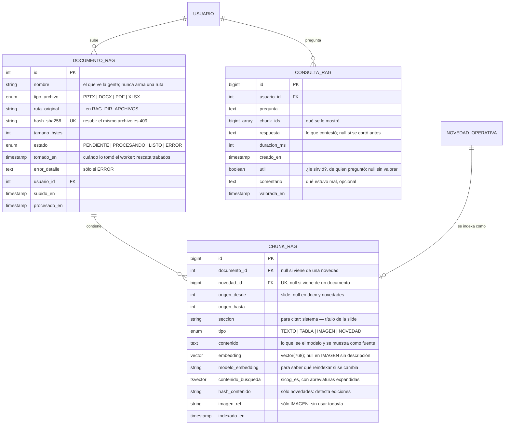

# Contexto del Proyecto — SICOG (Sistema de Control Operacional de Gas, PDVSA Gas)
*Generado para continuar el proyecto en Claude Code / otra sesión. Reemplaza al resumen anterior (`Resumen_Proyecto_Control_Operacional_Gas.md`).*

**Nombre oficial del sistema: SICOG.** Usar este nombre en el `package.json` raíz del monorepo, título de la app (`web`), y cualquier referencia de marca dentro de la UI (ej. header del login, título de pestaña del navegador).

---

## 1. Objetivo del proyecto

Reemplazar el balance diario de gas natural que actualmente se lleva manualmente en Excel (`NUEVO_BALANCE_ACTUALIZADO.xlsm`) en la Gerencia de Control Operacional / Despacho Central de PDVSA Gas, mediante una aplicación web.

**Importante**: la carga de datos NO es por importación de archivos Excel — es **transcripción manual**. Los analistas digitan directamente en la aplicación, igual que hoy digitan en el Excel.

*Matiz encontrado al auditar el archivo (decisión #48)*: el Excel actual no es 100% manual. Once celdas de la hoja `FUENTES` (presiones de estaciones y un flujo) se alimentan solas desde **AspenTech InfoPlus.21** vía la función `ATGetTimeVal` del complemento. Es un bloque angosto — el balance en sí (clientes, fuentes, quema) sí es transcripción manual — y **queda fuera del alcance de SICOG**.

---

## 2. Rol del asistente / reglas de trabajo

- Actúa como experto en la industria del gas en Venezuela + experto en desarrollo de software, asesor del desarrollo de esta aplicación.
- **Preferir simplicidad sobre sobre-diseño** — ya se revirtió una vez un modelo más complejo de `ESTACION` (con UTM, telemetría, etc. metido en Despacho quando en realidad era de Mantenimiento).
- Diagramas ER siempre en **Mermaid** (`erDiagram`).
- **Preguntar antes de asumir** reglas de negocio no confirmadas — nunca rellenar vacíos con suposiciones.
- **No mezclar dominios** (Despacho, Mantenimiento, Calidad de Gas, Análisis Operacional) aunque compartan base de datos. Catálogos verdaderamente transversales (`USUARIO`, `REGION_MTTO` reutilizada por Actividades) se comparten por referencia, no se duplican.
- Cualquier cambio a un modelo ya confirmado se presenta como **propuesta explícita (diff conceptual)**, nunca se sobrescribe silenciosamente.
- No incluir datos personales sensibles de empleados (cédula, fecha de nacimiento, dirección, tallas) en el modelo ni reproducirlos en el chat.
- Seguridad como **prioridad uno** en cualquier decisión de arquitectura de software.

---

## 3. Stack técnico confirmado

| Capa | Tecnología |
|---|---|
| Frontend | Next.js (App Router), responsive, **shadcn/ui**, **TanStack Table** (data tables), **TanStack Query** (fetching/cache) |
| Formularios | **react-hook-form + zod**, schemas de zod compartidos con el backend |
| Backend | Node.js + **Express.js** |
| ORM | **Prisma** — aislado exclusivamente en la capa Repository, nunca importado directamente en Services/Controllers |
| Base de datos | **PostgreSQL** — nombre: `ctrl_operacional_gas`, con **pgvector** habilitado desde el script inicial (para RAG Fase 2). **Desarrollo**: contenedor Docker local (`docker-compose.yml`, imagen `pgvector/pgvector:pg16`) — ver decisión #40. **Producción**: contenedor `postgres` del stack Coolify (ver fila Despliegue), mismo patrón |
| Arquitectura | Controller → Service → Repository (no MVC "puro") |
| Monorepo | **pnpm workspaces** |
| Despliegue | Un solo stack vía **Coolify** (docker-compose): `web`, `api`, `postgres`. `ollama` se suma para la Fase 2 RAG (arrancó el 2026-09-24; en desarrollo corre local, **todavía no está en el compose**, §16.10) |
| Principios obligatorios | **SOLID** en la aplicación, **ACID** en la base de datos |

**Aplicación de SOLID/ACID:**
- SRP: Controller traduce HTTP↔Service; Service tiene la lógica de negocio; Repository solo persiste.
- OCP/DIP: Services dependen de interfaces de Repository (`IUsuarioRepository`, etc.), nunca de Prisma directamente. Si se necesita SQL crudo (queries agregadas tipo "Balance Nación" o el "REAL" de Actividades), va dentro del Repository vía `$queryRaw` parametrizado (nunca concatenación de strings).
- ACID: transacciones para cargas de balance, constraints (`CHECK`, `UNIQUE`, `FK`), aislamiento `SERIALIZABLE` en cierre de turno, triggers de auditoría.

**Convención de nombres Prisma/BD (confirmada):**
- Modelos Prisma: PascalCase singular (`Usuario`, `LecturaBalance`); campos: camelCase, mapeados a snake_case singular en la columna física vía `@map` (`clienteId` → `cliente_id`).
- Tablas físicas: snake_case, primera palabra del nombre en plural vía `@@map` (`usuarios`, `lecturas_balance`, `regiones_operativa`).

### Estructura del monorepo

```
ctrl-operacional-gas/
  apps/
    web/                    → Next.js
    api/                    → Express
      src/modules/
        despacho/            → controllers/ services/ repositories/
        mantenimiento/
        actividades/
        auth/
        calidad-gas/          ← carpeta mínima, se llena al diseñar Dominio C
        analisis-operacional/  ← carpeta mínima, se llena al diseñar Dominio D
      src/shared/            → middlewares, prisma-client.ts, domain types
  packages/
    db/                      → schema.prisma
    shared-types/            → DTOs compartidos
    shared-validators/       → schemas de zod (frontend + backend)
  docker-compose.yml
```

### Seguridad (prioridad uno)
- bcrypt costo 12 para contraseñas.
- JWT: access token 15 min, refresh token 7 días en cookie `httpOnly` + `secure` + `sameSite: strict`. Refresh guardado en tabla Postgres (`SESION_REFRESH`), no en Redis — menos piezas expuestas para 10 usuarios simultáneos.
- Rotación de secreto JWT: **pospuesta** para cuando el sistema esté en producción estable (no es prioridad ahora, pero queda documentada como mejora futura: mantener lista corta de secretos válidos con expiración para rotar sin downtime).
- Rate limiting en login (`express-rate-limit`, ~5 intentos / 15 min).
- Bloqueo de cuenta: `USUARIO.bloqueado boolean` — **desbloqueo manual exclusivo del superadmin**, no automático por tiempo.
- RBAC validado **en el backend siempre**, nunca solo en frontend (frontend = UX, backend = autorización real). Middleware centralizado (`requireDepartamento`, `requirePuestoMinimo`).
- `helmet` + CORS restringido al dominio del `web`.
- Usuario de BD de la app con permisos mínimos (sin `SUPERUSER`); migraciones con usuario aparte más privilegiado.
- Nunca loguear contraseñas/tokens/body de login.
- Auditoría de seguridad: login (IP, timestamp), intentos de autorización fallidos (`LOG_INTENTO_NO_AUTORIZADO`), además de los `*_HISTORIAL` ya definidos por integridad de datos.

---

## 4. Dominios del sistema (misma base de datos, sin relación funcional entre sí en los datos operativos)

- **Dominio A — Despacho**: balance diario, fuentes de gas, novedades operativas, contactos, quema nacional. **CERRADO.**
- **Dominio B — Mantenimiento**: estaciones T&D, instrumentación, telemetría semanal. **CERRADO** (incluye rediseño de telemetría de esta sesión).
- **Dominio E — Actividades y Horas-Hombre**: módulo transversal, un botón/sección por departamento, con catálogos propios por departamento. **CERRADO** (basado en `ACTIVIDADES_MDC_FINAL_V4.xls`, estructura de Mantenimiento; los otros 3 departamentos comparten estructura pero con su propio catálogo de `INSUMO`/`PRODUCTO_SERVICIO`, aún no levantado).
- **Autorización / `USUARIO`**: jerarquía de departamentos y puestos. **CERRADO.**
- **Dominio C — Calidad de Gas**: **PENDIENTE**, falta el Excel dedicado. Preview de parámetros físico-químicos disponible vía `Plantilla_Standar_2.pptx` (composición química, poder calorífico, límites Resolución 162 MENPET).
- **Dominio D — Análisis Operacional**: **PENDIENTE**, sin Excel ni especificación aún.

---

## 5. Archivos ya analizados

| Archivo | Qué es | Estado |
|---|---|---|
| `NUEVO_BALANCE_ACTUALIZADO.xlsm` | Balance diario real (8 hojas). Auditado contra el ERD de Despacho — estructura general consistente, sin gaps. Hoja `GUIA WEB` confirmó que Empresas Mixtas/LIC se comportan como `CLIENTE`. **Corrección**: una segunda auditoría de las fórmulas activas (no solo los valores) sí encontró un gap real de granularidad en el catálogo `FUENTE` — ver decisión #39. | Analizado a fondo, base y auditoría del Dominio A. |
| `INVENTARIO_ESTACIONES.xls` | 251 estaciones T&D. Auditado: confirma el catálogo real de 6 regiones de Mantenimiento (Nor-Oriente, Este-Oriente, Sur-Oriente, Centro, Centro-Occidente, Occidente), 16 tipos de instrumento ISA, `tipo_enlace_com` cerrado a 3 valores (IP PDVSA, SATELITAL, SERIAL PDVSA). | Base y auditoría del Dominio B. |
| `DISPON_SISUGAS_Semana_35.xls` | Reporte semanal de disponibilidad/telemetría real (6 hojas). Reveló que el estatus de telemetría real tiene 4 dimensiones independientes por estación (Comunicación, Eléctrico, Instrumentación, Caseta), no un solo campo — forzó el rediseño de `REPORTE_TELEMETRIA_ESTACION`. | Usado para rediseñar telemetría. |
| `ACTIVIDADES_MDC_FINAL_V4.xls` | Formato real de control de horas-hombre y actividades de Mantenimiento (bitácora + plan/real + % derivados). Estructura genérica reutilizable por los 4 departamentos; catálogos (`INSUMO`, `PRODUCTO_SERVICIO`) varían por departamento. | Base del módulo Actividades. |
| `Manual DAO.pptx` | **"Guía de Información Sistemas de Transporte de Gas 2023" — documento oficial y autoridad sobre los sistemas.** 110 diapositivas: índice de sistemas, nomenclatura de estaciones por sistema, puntos de entrega/recepción, calidad de gas, data técnica de tuberías. Es la fuente de las decisiones #16 (7 sistemas), #41 (`sistema_id` de cada fuente), #47 (Empresas Mixtas como fuente) y del mapeo de la #46. | Analizado a fondo. En `archivos-fuente/`. |
| `Plantilla_Standar_2.pptx` | Manual técnico de una sesión anterior; **no está en `archivos-fuente/`**, no se pudo re-verificar. Su afirmación de "8 sistemas de transporte" **queda superada** por el `Manual DAO.pptx`, que confirma 7 (decisión #16). Sigue válido lo que aportó sobre la jerarquía Región→Subregión (opción c) para Oriente. | Superado parcialmente; conservar sólo lo de regiones. |
| `CLIENTE_Interaction-correccion.pdf` | Correcciones manuscritas al primer ERD. | Aplicadas. |
| `ESTACIONES.accdb` / 16 CSVs exportados | Catálogo de 288 estaciones T&D, bitácora de actividades/indicadores GCO, directorio de contactos. | Resuelto vía CSVs; mayormente Dominio B. |

**Privacidad**: los datos personales sensibles de `PERSONAL.csv` (cédula, fecha de nacimiento, dirección, tallas) **no se replican** en el modelo ni en logs de la aplicación.

**Dónde viven**: los archivos fuente están en `archivos-fuente/` en la raíz del repo, **gitignoreada a propósito** — son documentos internos de PDVSA y archivos binarios grandes, no tienen por qué entrar al historial de git. Hoy están ahí: `NUEVO BALANCE ACTUALIZADO.xlsm`, `Manual DAO.pptx`, `ACTIVIDADES MDC FINAL V4.xls`, `DISPON_SISUGAS_Semana_35.xls`, `INVENTARIO ESTACIONES.xls` y `ESTACIONES TyD.csv`.

---

## 6. Decisiones clave confirmadas (no rediseñar sin volver a preguntar)

1. Nombre de la BD: `ctrl_operacional_gas`.
2. ~~Balance diario: 2 cortes al día (puntual y cierre_promedio), digitados independientemente~~ **Corregido, ver decisión #34**: el cierre_promedio ya no se digita aparte, se deriva del historial de correcciones del puntual del día.
3. Registro "cerrado" puede ser corregido por cualquier analista — de ahí la obligatoriedad del historial de auditoría.
4. ~~`LECTURA_FUENTE`: sin campos `procesado`/`residual` (el volumen del corte ya representa lo procesado).~~ **Reabierto, ver decisión #98**: `LECTURA_FUENTE` gana `procesado`, informativo y sin efecto en el balance. El volumen del corte sigue siendo el dato que sí cuenta — no cambió de significado, sólo dejó de ser el único campo.
5. "Desvío" no es campo numérico — es una fuente más dentro de `FUENTE` (ej. "Desvío – Ventas Directas").
6. `NOVEDAD_OPERATIVA` tiene `tipo` (catálogo, ver punto 20) e `impacto` (texto descriptivo, no escala).
7. `SISTEMA` aplica tanto a `FUENTE` como a `CLIENTE`.
8. `ESTACION` es simple (no UTM/telemetría en Despacho) — eso es Dominio B. `FUENTE` es simple: `id`, `nombre`, `sistema_id`.
9. Módulo Actividades/Indicadores GCO es parte del sistema, sin relación funcional con Despacho.
10. Datos personales sensibles NO se replican.
11. Autenticación: `USUARIO.nombre` único (login), `password_hash` (bcrypt), gestión exclusiva del superadmin, sin auto-registro.
12. Relación Cliente↔Fuente vía `SISTEMA`: un cliente pertenece a un solo sistema (`CLIENTE.sistema_id`).
13. `LECTURA_FUENTE` tiene auditoría igual que `LECTURA_BALANCE` (`estado` + `*_HISTORIAL`).
14. Quema de gas a nivel nacional, tabla `QUEMA_NACIONAL` (`fecha`, `tipo_corte`, `mmpced`), digitado manualmente. **El mismo mecanismo puntual/cierre_promedio de la decisión #34 aplica aquí** (tiene su propio `QUEMA_NACIONAL_HISTORIAL`).
15. "Balance Nación" es **query-calculado**, no tabla nueva.
16. ~~Catálogo `SISTEMA` real: 9 sistemas (ANACO-JOSE-ORIENTE, NOR ORIENTE/SINORGAS, PUERTO ORDAZ, CENTRO-CARACAS, CENTRO/OCCIDENTE, COSTA OESTE, COSTA ESTE, ULE-AMUAY, ENTREGAS DIRECTAS OCC).~~ **Corregido y confirmado con fuente oficial**: `Manual DAO.pptx` ("Guía de Información Sistemas de Transporte de Gas 2023", `archivos-fuente/`) — índice de contenido (slide 2) y encabezados de cada sección (slides 5, 22, 32, 41, 51, 77, 90) — confirman **7 sistemas reales**, no 9. Los 9 nombres anteriores eran una mezcla incorrecta de agrupaciones regionales de reporte (como aparecen en `NUEVO_BALANCE_ACTUALIZADO.xlsm`) con el catálogo oficial de sistemas de transporte, que es distinto:
    1. Anaco - José - Puerto La Cruz - Sinorgas (Sinorgas es una subred de estaciones dentro del mismo sistema, no un sistema aparte)
    2. Anaco - Puerto Ordaz
    3. La Toscana - San Vicente
    4. Jusepín - Criogénico
    5. Anaco - Caracas - Barquisimeto - Río Seco
    6. Ulé - Amuay
    7. Transcaribeño (así aparece en el índice del manual; las diapositivas internas de esta sección lo llaman "Transoceánico" — inconsistencia del propio manual, no confirmada cuál es el nombre vigente; se sembró como "Transcaribeño")
    **Sembrado** en `packages/db/prisma/seed.ts`.
17. Regiones operativas de Despacho (`REGION_OPERATIVA`): 4 — Oriente, Centro, Centro-Occidente, Occidente.
18. **Jerarquía de regiones de Mantenimiento confirmada (opción c)**: `REGION_OPERATIVA` (4, Despacho) es la región madre; `REGION_MTTO` (6, Mantenimiento) es más granular — Oriente se subdivide en Nor-Oriente / Sur-Oriente / Este-Oriente; Centro, Centro-Occidente y Occidente son 1:1 con su región madre. Confirmado con datos reales de `INVENTARIO_ESTACIONES.xls`, `DISPON_SISUGAS` y `Plantilla_Standar_2.pptx`.
19. **`ACTIVIDAD_REGISTRO.region_id` reutiliza `REGION_MTTO`** (nullable = alcance nacional), en vez de crear una tabla `SUBREGION` duplicada — misma fuente de verdad para ambos dominios.
20. Empresas Mixtas/LIC (Petro Monagas, Mavegas, Bitor, Petropiar, Petro Delta, Gas Guárico, Ypergas) se modelan como **`CLIENTE`** (`tipo_sector = 'Empresa Mixta'`), confirmado con evidencia de `NUEVO_BALANCE_ACTUALIZADO.xlsm` hoja `GUIA WEB`.
21. Departamentos (4, cada usuario pertenece a exactamente uno, excepto Gerente/Superadmin): Despacho, Mantenimiento, Análisis Operacional, Calidad de Gas.
22. Visibilidad general: cualquier usuario **consulta** cualquier departamento; solo **edita** el suyo.
23. Jerarquía organizacional: Gerente (1, cubre los 4) → Superintendente de Despacho (Despacho+Mantenimiento) / Superintendente de Análisis (Calidad de Gas+Análisis Operacional) → Supervisor (uno por depto) → Ingeniero / Analista (**dos cargos distintos, misma jerarquía** — confirmado).
24. Pares Superintendente↔Departamentos son **fijos** (no reasignables) — confirmado.
25. En el módulo de Actividades, un superior ve **toda la cadena hacia abajo** (no solo un nivel) — confirmado.
26. `USUARIO.rol` (obsoleto) se **reemplaza por completo** por `puesto_id` + `departamento_id` — confirmado.
27. `DEPARTAMENTO`, `PUESTO`, `SUPERINTENDENCIA_DEPARTAMENTO` (tabla puente superintendente↔departamento) ya modeladas y cerradas — ver ERD sección 7.
28. ~~**Rediseño de `REPORTE_TELEMETRIA_ESTACION`**: 4 dimensiones independientes vía FK a `ESTADO_TELEMETRIA`~~ **Reemplazada por la decisión #87 el 2026-09-21.** Se deja escrita porque el razonamiento importa: la #28 leyó la hoja `REPORTE SEMANAL` de `DISPON_SISUGAS_Semana_35.xls` y dedujo bien las cuatro dimensiones, pero esa hoja **cubre 10 estaciones de 251** y es una lista aparte de candidatas a reactivación. El trabajo semanal del área vive en otras dos hojas y tiene otra forma.
29. `ESTATUS` de `ACTIVIDAD_REGISTRO`: catálogo cerrado de 3 — **RECIBIDO → EN PROCESO → FINALIZADO**.
30. `ACTIVIDAD_META` (plan anual de horas-hombre): la carga el **Supervisor** de cada departamento, **una vez al año** (una fila por `producto_servicio_id` + mes).
31. **Gobernanza de catálogos "de negocio"** (`INSUMO`, `PRODUCTO_SERVICIO`, `ESTADO_TELEMETRIA`, `GERENCIA_REQUIRIENTE`, `ESTATUS` de Actividades, y `NOVEDAD_OPERATIVA.tipo` como candidato futuro): administrados por **Supervisor de su propio departamento hacia arriba** (Supervisor, Superintendente, Gerente) — nunca Superadmin (no conoce el dominio) ni cualquier Analista (riesgo de duplicados, ya visto en los Excel reales con "OPERATIVA" vs "OPERATIVO"). **Soft-delete** (`activo boolean`), nunca borrado físico, para no romper reportes históricos.
32. Distinción ENUM técnico vs. catálogo editable: ENUM de base de datos solo para campos **estructurales** (el sistema ramifica lógica según el valor, ej. `tipo_corte`, `tipo_red`, `dimension` de `ESTADO_TELEMETRIA`); catálogo editable en tabla para listas **de negocio** que crecen sin tocar código (estados, tipos de actividad, insumos).
33. **Nombre oficial del sistema: SICOG** (Sistema de Control Operacional de Gas) — elegido por no chocar con nombres de sistemas reales ya existentes en la operación (`SISUGAS`, `WEBGAS`, `Infoplus21`) y por no favorecer a un solo dominio.
34. **Mecánica real de PUNTUAL/CIERRE_PROMEDIO** (corrige la decisión #2, aplica igual a `LECTURA_BALANCE` y `QUEMA_NACIONAL` — ver #14): el valor `PUNTUAL` de un cliente/fecha (o de la quema nacional/fecha) se puede corregir varias veces durante el día; cada corrección genera una fila en su propio `*_HISTORIAL` (mecanismo ya existente, reusado tal cual). Al cumplirse las 24 horas se calcula `CIERRE_PROMEDIO` como la **media aritmética simple** (no ponderada por el tiempo que cada valor estuvo vigente) de todos los valores que tuvo el `PUNTUAL` ese día — el historial de ese día más el valor final vigente —, y **se guarda como fila propia** (no es query-calculado como "Balance Nación", decisión #15, porque alimenta el informe formal de cierre). El `PUNTUAL` del día siguiente **arranca con el último valor del día anterior** (carry-forward), nunca en blanco — ese arranque es lógica de Service, no cambia el schema.
35. **Se elimina el campo `estado` (Cerrado/Pendiente) de `LECTURA_BALANCE` y `LECTURA_FUENTE`, y `estado_ant` de sus respectivos `*_HISTORIAL`** — corrige las decisiones #13 y #34 en este punto específico. Motivo: (a) no existe columna equivalente en ninguna de las hojas reales auditadas de `NUEVO_BALANCE_ACTUALIZADO.xlsm`, era una suposición previa sin evidencia; (b) el registro "cerrado" nunca restringe edición (decisión #3, cualquier analista corrige cualquier registro), por lo que el campo no gatilla ninguna regla de negocio real; (c) tras la decisión #34, `CIERRE_PROMEDIO` se deriva automáticamente a las 24h, lo que reduce aún más la utilidad de un estado manual. El historial de auditoría (`*_HISTORIAL`) sigue siendo obligatorio — esto no cambia, solo se retira el campo `estado` en sí. **Impacto**: actualizar `schema.prisma` (quitar `estado`/`estadoAnt` de `LecturaBalance`, `LecturaBalanceHistorial`, `LecturaFuente`, `LecturaFuenteHistorial`) y, si ya se generó, la migración de Prisma. **Hecho.**
36. **`CLIENTE.tipo_sector` deja de ser `String` libre y se convierte en catálogo editable `SECTOR_CLIENTE`** (`id`, `nombre`, `activo`) — mismo patrón de gobernanza de la decisión #31 (editable por Supervisor+ de Despacho, soft-delete, nunca borrado físico). Corrige la decisión #20 en este punto específico: el valor `'Empresa Mixta'` pasa de ser un literal string a una fila del catálogo (`CLIENTE.sector_id FK → SECTOR_CLIENTE`), sin cambiar el hecho ya confirmado de que Empresas Mixtas/LIC se modelan como `CLIENTE`. **Motivo**: la auditoría de `NUEVO_BALANCE_ACTUALIZADO.xlsm` (hoja `EJECUTIVO PUNTUAL`, tabla "CONSUMO POR SECTORES") reveló que `tipo_sector` en la práctica tiene una lista real de valores de negocio que crece — **Petrolero, Eléctrico, Siderúrgico, Petroquímico, Cemento, Otros** (6, confirmados leyendo las fórmulas de la hoja, no solo los valores) además de `Empresa Mixta` — mismo riesgo de typos ("OPERATIVA" vs "OPERATIVO") que motivó volver catálogo a `INSUMO`/`ESTADO_TELEMETRIA`. **Hecho** en `schema.prisma`.
37. **Reporte "Consumo por Sectores" confirmado en el alcance de Despacho** — total de gas por `SECTOR_CLIENTE` y por `REGION_OPERATIVA`. Es **query-calculado**, mismo patrón que "Balance Nación" (decisión #15): `SUM(LECTURA_BALANCE.volumen_mmpced)` agrupado por `CLIENTE.sector_id` y `CLIENTE.region_id`. No requiere tabla nueva — vive como query agregada en el Repository de Despacho cuando se diseñen los endpoints (§9.4 #10).
38. **"Quema Puntual" y "Quema TyD" son el mismo dato — resuelve el pendiente §9.6 #6 con evidencia, no con suposición.** Auditando las fórmulas activas de `NUEVO_BALANCE_ACTUALIZADO.xlsm`: `EJECUTIVO PUNTUAL!G31` ("QUEMA TYD", vista puntual) y `PROMEDIO!G49` ("QUEMA TYD", vista de cierre) apuntan ambas a `=FUENTES!I29`, la celda justo debajo de la etiqueta `"QUEMA PUNTUAL"` (`FUENTES!I28`). Es decir, "Quema Puntual" es la etiqueta del dato de entrada y "Quema TyD" es solo cómo se referencia ese mismo número en las vistas puntual/cierre — confirma que la decisión #14/#34 (`QUEMA_NACIONAL` con `tipo_corte` PUNTUAL/CIERRE_PROMEDIO) ya estaba bien diseñada. **No requiere cambio de schema.** También se confirmó que "QUEMA TYD" aparece en la misma fila que la tabla "CONSUMO POR SECTORES" solo por diseño visual de la hoja — la fórmula prueba que no es una suma de esos sectores ni tiene relación matemática con ellos (son dos datos independientes que casualmente comparten espacio en la hoja).
39. **Granularidad real del catálogo `FUENTE` — resuelve el pendiente §9.6 #7, corrige la afirmación "sin gaps" de la sección 5.** Una segunda auditoría más profunda de `NUEVO_BALANCE_ACTUALIZADO.xlsm` (hojas `FUENTES` y `GUIA WEB`) y confirmación explícita del owner del proyecto establecen que `FUENTE` necesita bastante más granularidad de la asumida originalmente — sigue sin ser cambio de schema (`FUENTE` ya es simple: `id/nombre/sistema_id`, decisión #8), es una corrección al alcance real del **seed data**:
    - **Plantas divididas por tren** (cada tren se lee y corrige de forma independiente, no es una sola fila por complejo): San Joaquín Tren A y B, San Joaquín Tren C, Santa Bárbara Tren A y B, Santa Bárbara Tren C, El Tablazo LGN1, El Tablazo LGN2.
    - **Jusepín**: planta activa confirmada por el owner del proyecto (aparece en `GUIA WEB` con la misma estructura Desvío/Procesado/Descarga que San Joaquín/Santa Bárbara, aunque reportó vacío el día auditado) — se agrega al catálogo.
    - **8 fuentes adicionales bajo "Directo a Ventas" (Oriente)**, confirmadas como `FUENTE` (no `CLIENTE`) por el owner del proyecto: RECAT SJ, SJB FI FII, SOTO, AGUASAY 5A, BAJO GUANIPA, ETSJ, ZAPATO VIEJO, CORREDOR JUSEPIN-CRIOGENICO.
    - **7 fuentes adicionales bajo "Gas manejado desde El Tablazo" (Occidente)**, confirmadas como `FUENTE` (no `CLIENTE`) por el owner del proyecto: C. Petroquímico, Planta Fertilizante, Comb. Trans. a Pequiven, Hacia La Paz Gas E&P, Hacia Ramón Laguna, Hacia La Pica-Ule Amuay, Hacia La Pica-Retorno a Prod.
    Total: ~22 filas de `FUENTE` solo de esta hoja, frente a la asunción previa de una fila por complejo mayor. **Impacto**: ninguno en `schema.prisma`; el seed data real (§9.4 #9) debe usar esta lista en vez de una versión simplificada. **Sembrado, ver decisión #41 para el `sistema_id` de cada una.**
40. **Se abandona Supabase para desarrollo — se usa Postgres local en Docker en su lugar** (decisión explícita del owner del proyecto, corrige la fila "Base de datos" de la sección 3). Motivo: fricción de conectividad repetida y no resuelta en varias sesiones — el host directo de Supabase es IPv6-only (inalcanzable desde la red de desarrollo), el Session Pooler (IPv4) sí resolvía el DNS pero una VPN local bloqueaba el protocolo Postgres real (el handshake TCP pasaba, los datos no), y una vez resuelto eso, las 4 extensiones que Supabase preinstala (`pgcrypto`, `uuid-ossp`, `pg_stat_statements`, `supabase_vault`, en un esquema separado que `prisma migrate reset` no toca) seguían generando "drift" en la primera migración sin una solución limpia. Ninguno de estos problemas es del dominio de negocio — es puramente friccion de infraestructura de un proveedor externo para un ambiente de desarrollo local. **Nuevo setup**: `docker-compose.yml` (raíz) con un servicio `postgres` usando la imagen `pgvector/pgvector:pg16` (Postgres + pgvector preinstalado, sin las extensiones propietarias de Supabase), base `ctrl_operacional_gas` (decisión #1), levantado con `docker compose up -d`. `schema.prisma` vuelve a declarar solo `extensions = [vector]` (se quitan las 4 extensiones de Supabase, ya no aplican). La migración baseline manual creada para sortear el drift de Supabase se eliminó por completo — se empieza de cero con Postgres en blanco. **Producción sigue igual** (contenedor `postgres` del stack Coolify, sección 3) — este cambio es solo para desarrollo local, y de hecho lo acerca más al mismo patrón de producción (Postgres en contenedor propio) en vez de depender de un servicio gestionado externo.
41. **Asignación `sistema_id` real de las ~22 filas de `FUENTE` (decisión #39)**, resuelta con `Manual DAO.pptx` (nomenclatura de estaciones por sistema, slides 9/24/43/87-89):
    - San Joaquín Tren A y B, San Joaquín Tren C, RECAT SJ*, SJB FI FII* → **Anaco - José - Puerto La Cruz - Sinorgas** (el manual lista "Extracción San Joaquín"/"Criogénico San Joaquín" en este sistema; *RECAT SJ/SJB FI FII no aparecen con ese nombre exacto en el manual, inferido por convención de nombre "SJ" = San Joaquín, no confirmado al 100%).
    - Santa Bárbara Tren A y B, Santa Bárbara Tren C, Jusepín, SOTO, AGUASAY 5A, BAJO GUANIPA, ETSJ, ZAPATO VIEJO, CORREDOR JUSEPIN-CRIOGENICO → **Jusepín - Criogénico** (el manual lista textualmente "Santa Bárbara STB", "Soto STO", "Aguasay Nueva AGN", "Bajo Guanipa BJG", "Zapato Viejo ZPV" y "Estación Terminal San Joaquín ETSJ" como estaciones de este sistema).
    - El Tablazo LGN1, El Tablazo LGN2, y las 7 fuentes de "Gas manejado desde El Tablazo" (C. Petroquímico, Planta Fertilizante, Comb. Trans. a Pequiven, Hacia La Paz Gas E&P, Hacia Ramón Laguna, Hacia La Pica-Ule Amuay, Hacia La Pica-Retorno a Prod.) → **Ulé - Amuay** (el manual ubica el segmento de tubería "La Pica - El Tablazo" dentro de la sección técnica de este sistema).
    **Sembrado** en `packages/db/prisma/seed.ts` junto con el catálogo `SISTEMA` de la decisión #16.
42. **El cierre diario lo dispara un job automático a medianoche, no una acción humana** (completa la decisión #34, que decía "al cumplirse las 24 horas" sin especificar el disparador). Un job programado dentro de `apps/api` hace dos cosas en la misma corrida: (a) **cierra el día anterior** calculando el `CIERRE_PROMEDIO` de cada cliente (media aritmética simple de todos los valores que tuvo su `PUNTUAL` ese día: las filas de `LECTURA_BALANCE_HISTORIAL` de esa fecha más el valor final vigente) y guardándolo como fila propia; y (b) **abre el día nuevo** con el carry-forward de la decisión #43. Motivo de elegir job sobre un endpoint de "cerrar día" manual: el cierre alimenta el informe formal y no puede quedar sin hacerse porque nadie se acordó, ni hacerse dos veces. Aplica igual a `QUEMA_NACIONAL` (decisión #14). **`CIERRE_PROMEDIO` no se puede crear por la API** — el `POST` de lecturas sólo acepta `PUNTUAL`; el job es el único que escribe filas de cierre. Corregir un cierre ya calculado sí se permite (decisión #3), vía `PATCH`, y genera historial como cualquier otra corrección.
43. **El carry-forward del `PUNTUAL` se persiste como fila real, no es sólo una sugerencia de pantalla** (precisa la decisión #34). Cuando el job de la decisión #42 abre el día, crea la fila `PUNTUAL` de cada cliente con el último valor vigente del día anterior. Motivo: si un cliente no se toca en todo el día, igual tiene un valor vigente y entra al cierre — no quedan huecos en el informe formal. El analista sólo corrige lo que cambió, y esas correcciones son las que alimentan la media del cierre.
44. **Una corrección tardía recalcula el cierre ya emitido** (completa las decisiones #34 y #42). La decisión #3 permite corregir cualquier registro, incluso de días ya cerrados; cuando eso pasa, el `CIERRE_PROMEDIO` de ese día se vuelve a calcular incluyendo el valor corregido, y **el recálculo queda auditado en el historial del propio cierre** (la fila de cierre es una `LECTURA_BALANCE` más, con su propio `*_HISTORIAL`). El número formal siempre refleja el mejor dato disponible, y queda registrado quién lo cambió y cuándo. Precisión asociada: para calcular la media cuentan **todas** las filas del historial de esa lectura, sin filtrar por cuándo se hizo la corrección — la fila ya está atada a una fecha, así que sus valores son los que tuvo ese día aunque el analista la corrija días después.
45. **Una corrección tardía se arrastra a los días siguientes que sigan siendo copias intactas del carry-forward, y se detiene en el primero que un analista fijó a mano.** Motivo: sin esto, un valor equivocado en el día D queda propagado en silencio por toda la cadena de días heredados (decisión #43); con esto, corregir el origen corrige la cadena, sin destruir el trabajo de quien sí revisó un día posterior. Cada día propagado se corrige con el mecanismo normal, así que **deja su fila de historial**. **Detalle de implementación que importa**: "intacto" se detecta comparando el valor con el que se heredó, **no** preguntando "¿tiene historial?" — la propia propagación escribe historial, así que ese criterio se rompería en la segunda corrección de la misma cadena. Limitación conocida: si un analista fija a mano exactamente el mismo número que se heredó, el sistema no puede distinguirlo de una copia intacta y lo tratará como tal.
46. **Catálogo real de `CLIENTE`: 111 filas, con región y sector extraídos de las fórmulas del Excel, no inferidos por el nombre.** Las fórmulas de la tabla "Consumo por Sectores" (`EJECUTIVO PUNTUAL`) referencian celda por celda a cada cliente de la hoja `CEN-ORI`, así que el mapeo `cliente → región → sector` sale de la propia lógica del Excel (94 de las 110 filas). Decisiones asociadas del owner:
    - **Mapeo etiqueta del Excel → sistema oficial** (las 9 agrupaciones de la hoja no son los 7 sistemas de la decisión #16): ANACO-JOSE-ORIENTE y NOR ORIENTE/SINORGAS → *Anaco - José - Puerto La Cruz - Sinorgas*; PUERTO ORDAZ → *Anaco - Puerto Ordaz*; CENTRO-CARACAS y CENTRO/OCCIDENTE → *Anaco - Caracas - Barquisimeto - Río Seco*; COSTA OESTE, COSTA ESTE y ULE-AMUAY → *Ulé - Amuay* (los dos primeros confirmados buscándolos en el Manual DAO: la slide 82 se titula "Puntos de Entregas de Gas SISTEMA ULÉ - AMUAY" y el esquema de la slide 79 muestra "Lagunigas, EyP, CAMC, Ramal Norte, Costa Oeste" dentro de ese sistema).
    - **Autogeneración y plantas eléctricas internas** (`AUTOGENERACION PLC`, `P.E. FURRIAL`, `AUTOGENERACIÓN SOTO`…) → `CLIENTE` con sector **Otros**. El Excel las deja fuera de todos los totales por sector, así que agruparlas en "Otros" es lo más cercano a cómo las trata hoy. Mismo criterio para los industriales que están en cero y no aparecen en ninguna fórmula.
    - **`RECAT SAN JOAQUIN` y `SAN JOAQUIN BOOSTER (SJB)` no son clientes**: quedan sólo como `FUENTE` (decisiones #39/#41). `CENTRO OPERATIVO SAN JOAQUIN (COSJ)` **sí** es cliente.
    - **Los aportes y transferencias entre sistemas no son clientes** (`APORTE A EYP K00/K04+600`, `TRANSFERENCIA ICO-NURGAS`): son movimientos entre sistemas y quedan fuera del catálogo. Falta decidir si el sistema necesita modelarlos de alguna forma.
    - El catálogo se genera en `packages/db/prisma/clientes.seed.ts` (archivo generado, no editar a mano) y se carga desde `seed.ts`.
47. **Las Empresas Mixtas/LIC son `FUENTE` *y* `CLIENTE` a la vez — corrige la decisión #20, que sólo las contemplaba como cliente.** Evidencia: los volúmenes no coinciden entre las dos hojas (Petro Monagas **aporta 60.61** en el bloque "APORTE" de `FUENTES` pero **consume 12** como cliente en `CEN-ORI`; Petropiar aporta 0 y consume 39), o sea son dos flujos distintos de la misma contraparte — normal en gas: la empresa produce gas asociado que entrega al sistema, y además consume gas para su operación. El Manual DAO lo confirma sin ambigüedad: la **slide 27 se titula "Puntos De Recepción De Gas — FUENTES QUE APORTAN GAS AL SISTEMA"** y lista a Petro Piar, PetroMonagas y Petro Delta.
    - **Como `FUENTE`** se sembraron 9, con el sistema tomado del manual: Petro Monagas, Mavegas, Bitor, Petropiar y Petro Delta → *Anaco - Puerto Ordaz* (slide 27); Gas Guárico e Ypergas → *Anaco - Caracas - Barquisimeto - Río Seco* (slides 52-60); Cardón IV → *Ulé - Amuay* (slide 84); PAGMI → *Anaco - José - Puerto La Cruz - Sinorgas* (slides 6/8/12).
    - **Como `CLIENTE` mantienen el sector `Petrolero`** que les asignan las fórmulas del Excel, *no* `Empresa Mixta`. Razón: así el reporte "Consumo por Sectores" del sistema coincide exactamente con el del Excel. **Consecuencia**: el sector `Empresa Mixta` del catálogo queda con 0 clientes; si no se le encuentra uso, corresponde desactivarlo (soft-delete, decisión #31).
    - **`OTROS OCCIDENTE`** (grupo "ENTREGAS DIRECTAS OCC", 15 MMPCED) se carga como `CLIENTE` del sistema *Ulé - Amuay*. Ese grupo no existe en el Manual DAO — es una convención del balance, no un sistema de transporte.
    - **El seed pasó a ser aditivo**: inserta sólo lo que falta en vez de saltarse el catálogo entero si ya tiene filas, así se puede ampliar sin borrar la base. La clave de comparación **no puede ser sólo el nombre**: el Excel trae homónimos legítimos (`ALCASA` en dos regiones, y una bolsa `OTROS` por sistema), así que se compara por nombre+sistema(+región para clientes). Los homónimos además se desambiguan al generar el catálogo, agregando la agrupación de origen entre paréntesis (`OTROS (PUERTO ORDAZ)`, `ALCASA (CENTRO/OCCIDENTE)`): en la hoja se distinguen por dónde están, pero en una grilla no.
48. **Las presiones de estaciones quedan fuera del alcance de SICOG.** El Excel las trae en dos bloques de la hoja `FUENTES` (`I49:N54` e `I57:N62`, con espejo en `EJECUTIVO PUNTUAL` `G55:G64`), pero **no se digitan**: son 11 celdas alimentadas por el complemento de **AspenTech InfoPlus.21** vía `ATGetTimeVal("EPA:PT105.PRPUL.", ...)` — 9 tags de presión (`PT`) y uno de flujo (`N70:FT006.FLIDI.`). Motivo de dejarlas fuera, confirmado por el owner: **los analistas ya miran esas presiones directo del SCADA**, no del Excel, así que replicarlas en SICOG no agrega valor y abriría un frente de integración con el historiador (accesos, credenciales, consulta desde el servidor) sin beneficio real. El bloque del Excel es una copia de conveniencia de algo que ya tienen en vivo en mejor forma. **Consecuencia**: el modelo no tiene ni tendrá campos de presión; quien las necesite usa el SCADA.
49. **Ningún token de sesión viaja en el cuerpo de la respuesta ni es accesible desde JavaScript.** Access (15 min) y refresh (7 días) van en cookies `httpOnly` + `sameSite: strict` + `secure` en producción. Completa la sección 3, que sólo había decidido la cookie del refresh. Motivo: si el frontend guarda el access token en memoria o en storage, un XSS puede leerlo y usarlo fuera del sitio; con `httpOnly` no puede, y `sameSite: strict` corta el CSRF sin necesidad de un token anti-CSRF aparte. **Impacto**: `requireAuth` lee la cookie además del header `Authorization: Bearer`, que se conserva para pruebas y clientes que no son navegador.
50. **El refresh token rota en cada uso y el reuso se trata como robo.** Cada `POST /auth/refresh` emite un par nuevo y revoca el anterior; si llega un refresh **ya revocado**, se revocan **todas** las sesiones de ese usuario y se registra el hecho. El `@unique` sobre `token_hash` y la columna `revocado_en` ya estaban en el schema para esto. El token se guarda con **SHA-256, no bcrypt**: es aleatorio de 256 bits, no un secreto elegido por una persona, así que bcrypt sólo agregaría latencia sin encarecer ningún ataque real.
51. **Los intentos fallidos de login NO bloquean la cuenta.** La única defensa automática es el rate limiting (5 intentos fallidos / 15 min); el campo `USUARIO.bloqueado` queda como acción manual del superadmin (§3, decisión #11). Motivo: bloquear por intentos fallidos habilita una denegación de servicio trivial — cualquiera que conozca un nombre de usuario podría dejar afuera a esa persona hasta que un administrador la libere. En cambio, **bloquear a alguien sí le corta el acceso de inmediato**: el refresh verifica `bloqueado` y revoca sus sesiones en vez de esperar a que expire el token.

52. *(Ajustada por la decisión #58: el mínimo bajó a 6 con letra y número. El resto sigue vigente.)* **Reglas de complejidad de contraseña: longitud y lista de bloqueo, SIN reglas de composición.** Cierra el pendiente que §12.3 dejaba abierto. Concreto: **mínimo 12 caracteres**, **máximo 72 bytes**, lista de bloqueo local, y **sin expiración periódica obligatoria**. Se sigue NIST SP 800-63B. Motivo de no exigir "una mayúscula, un número y un símbolo": esas reglas empujan a patrones predecibles —`Pdvsa2026!` cumple las cuatro y está en el primer millar de cualquier diccionario de ataque— y de paso rechazan frases largas que sí son fuertes; la longitud más la lista de bloqueo compran mucha más entropía real. Motivo de no forzar el cambio cada N días: produce `Gas2026-1`, `Gas2026-2`; se cambia ante sospecha, no por calendario.
    - **El tope de 72 bytes no es política, es un límite duro de bcrypt**: bcrypt sólo mira los primeros 72 bytes y descarta el resto en silencio. Sin el tope, dos contraseñas que difieran después del byte 72 serían la misma contraseña. `loginSchema` aceptaba `max(200)`, así que este hueco existía y quedó cerrado.
    - **La lista de bloqueo** cubre tres cosas: términos institucionales (`pdvsa`, `sicog`, `gasnatural`…), bases débiles conocidas comparadas contra el "esqueleto" de la contraseña (sin acentos, mayúsculas ni dígitos, de modo que `Contraseña2026!` colapsa a `contrasena` y cae), y secuencias o repeticiones (`aaaaaaaaaaaa`, `abcdefghijkl`). **No incluye a propósito** palabras genéricas del español como "gas" o "despacho": aparecen de forma natural en frases largas y legítimas.
    - **La contraseña no puede contener el nombre de usuario.** La regla vive una sola vez en `shared-validators` (`passwordContieneNombre`) porque al cambiar la propia contraseña el nombre no viaja en el cuerpo, sale de la sesión.
    - **`loginSchema` sigue sin validar la forma** — esto no cambia. Las reglas aplican al *crear* una contraseña, no al presentarla: rechazar por formato al entrar sólo le diría a un atacante qué no vale la pena probar.
53. **El superadmin es un campo booleano de `USUARIO`, no un `PUESTO` más.** El catálogo `PUESTO` tiene 5 filas (Gerente, Superintendente, Supervisor, Ingeniero, Analista) y ninguna es "Superadmin", pero las decisiones #11, #21 y #31 lo dan por existente: no tenía representación en el modelo de datos. Se agrega `USUARIO.es_superadmin boolean` como **rol de sistema ortogonal al cargo**. Motivo: `PUESTO` modela el organigrama real de PDVSA (decisión #23, que no lo menciona) y la decisión #31 lo deja explícitamente fuera del negocio ("nunca Superadmin — no conoce el dominio"); meterlo como un puesto más obligaría a que quien administra cuentas no pueda tener además un cargo real, cuando en una gerencia de este tamaño va a ser la misma persona. Se descartó una tabla de roles con permisos por sobre-diseño para un solo rol. **Consecuencia**: `requireDepartamento` no cambia — un superadmin sin departamento sigue sin poder editar datos operativos, que es justo lo que #31 pide.
54. *(El formato de la temporal fue ajustado por la decisión #58; lo demás sigue vigente.)* **Contraseña temporal generada por el sistema, cambio forzado en el primer ingreso, vigencia de 72 horas.** Al crear un usuario —y al reiniciarle la contraseña— el sistema **genera** una temporal aleatoria (15 caracteres sobre un alfabeto de 56 sin caracteres que se confundan al dictarla: sin `0/O`, sin `1/l/I`) y la devuelve **una sola vez**; no se guarda en claro ni hay forma de volver a consultarla. Motivo de que la genere el sistema y no la escriba el superadmin: elegida a mano, en la práctica todas las cuentas arrancarían con la misma cadena y esa se volvería la llave maestra del sistema. Motivo de las 72 h: el modelo `USUARIO` **no tiene correo**, así que la entrega es en persona; 72 h cubren un fin de semana y un cambio de guardia sin dejar la cuenta abierta indefinidamente.
    - **El cambio se fuerza, no se sugiere**: mientras `debe_cambiar_password` esté en `true`, la sesión sólo puede llamar a `PUT /api/auth/password` y `GET /api/auth/sesion`; todo lo demás responde 403 (`requirePasswordVigente`). Sin esto la temporal se quedaría puesta para siempre.
    - **La vigencia se verifica en cada petición, no sólo al entrar**: si sólo se mirara en el login, entrar un minuto antes del vencimiento dejaría una sesión válida por los 7 días del refresh.
    - **`UsuarioSesionDto.debeCambiarPassword`** existe para que el frontend sepa a dónde mandar a la persona; es una pista para la UI, **no** la defensa. La defensa es el 403 del backend.
    - **Cambiar la propia contraseña exige la actual y revoca todas las sesiones**, emitiendo un par nuevo para la sesión en curso: si la contraseña se cambió porque alguien más la conocía, esa sesión ajena tiene que morir ahí. Lo mismo al reiniciarla el superadmin.
    - Las dos columnas (`debe_cambiar_password`, `password_expira_en`) describen **un solo estado** y se amarran con un `CHECK` en la base: una contraseña definitiva nunca lleva vencimiento y una temporal siempre lo lleva.
55. **El primer superadmin se crea con un comando de arranque único, fuera de la API.** `pnpm --filter api run crear-superadmin <nombre>` crea la cuenta, imprime su contraseña temporal una sola vez y **se niega a correr si ya existe un superadmin** — de ahí en adelante las cuentas se crean por la API, auditadas. Resuelve el huevo y la gallina que dejaba la decisión #11 (gestión exclusiva del superadmin, sin auto-registro): sin esto, la única forma de crear la primera cuenta sería escribir SQL y un hash bcrypt a mano contra la base de producción. Se descartó sembrarlo desde el seed con credenciales de `.env` porque deja una contraseña real escrita en un archivo de configuración.
56. **La revocación de sesiones se sella con una fecha en `USUARIO`, porque revocar el refresh no alcanza.** El access token es un JWT sin estado: una vez emitido, la API no puede retirarlo y vale hasta que expire. Revocar las filas de `SESION_REFRESH` corta la **renovación**, pero no el token que ya está en manos de alguien. En la verificación end to end esto se reprodujo: tras cambiar la contraseña porque un tercero la conocía, la sesión ajena siguió leyendo datos de Despacho con normalidad hasta 15 minutos después. La promesa de la decisión #54 ("esa sesión ajena tiene que morir ahí") no se estaba cumpliendo.
    - **El mecanismo**: `USUARIO.sesiones_invalidas_antes_de` guarda el instante de la última revocación y `requireAuth` rechaza todo token emitido antes de esa marca. Se sella dentro de `establecerPassword` del repositorio, que es el único punto por el que pasan tanto el reinicio del superadmin como el cambio propio: puesto en los Services, un tercer camino podría olvidarlo.
    - **Por qué se aceptó el costo de una consulta por petición**: el argumento a favor de un JWT sin estado es ahorrar el viaje a la base, pero la API ya consultaba la base en casi toda ruta protegida (`requirePasswordVigente`, `requireSuperadmin`, `requireDepartamento`), así que ese ahorro no se estaba cobrando. Se descartó acortar el TTL del access token: encoge la ventana, no la cierra, y multiplica los refresh.
    - **El token lleva un `iatMs` propio** además del `iat` estándar, que sólo tiene precisión de segundos. Cambiar la contraseña sella la revocación y emite el par nuevo dentro del mismo segundo: comparando por segundo, la sesión recién entregada se mataría a sí misma.
    - **Hacia afuera el rechazo es indistinguible de un token vencido** (mismo 401, mismo mensaje), para no revelar que la sesión fue revocada.
    - **El logout no sella**: cierra su propia sesión, no las de los otros dispositivos de la persona.

57. **El frontend consume los contratos compilados, y la identidad visual sale del prototipo pero no su código.** Cuatro decisiones que aparecieron al construir las primeras pantallas.
    - **Los paquetes `shared-types` y `shared-validators` se compilan a `dist`** y dejan de consumirse como TypeScript suelto. Motivo: sus imports internos llevan la extensión `.js` que exige NodeNext, y `tsc` y `tsx` la resuelven al `.ts` correspondiente pero el bundler de Next no —el build fallaba con *module not found*—. Se descartó quitar las extensiones (rompe el typecheck de la API, que sí usa NodeNext) y bajar el frontend a webpack. Para que nadie trabaje contra un contrato viejo, `dev`, `build` y `typecheck` de las dos apps compilan los contratos primero (`pnpm run contratos`).
    - **Se adoptan la paleta y la tipografía del prototipo visual, no sus componentes**: fondo `#0a0f1a`, acento azul, Inter para texto y monoespaciada para números, cargados como tokens de shadcn en `globals.css`. Quien ya vio el prototipo reconoce el sistema, pero el código sigue sobre el stack confirmado en vez de arrastrar estilos inline de algo que nació descartable. La aplicación es oscura fija: es un sistema de sala de control y no tiene tema claro.
    - **La guardia de ruteo del frontend es comodidad, no defensa.** Manda a `/login` a quien no tiene sesión y a `/cambiar-password` a quien usa una temporal, pero quien hace cumplir la decisión #54 es el 403 de `requirePasswordVigente`. Si la guardia tuviera un error, la pantalla se ve rara; nadie entra.
    - **Se eliminó `apps/web/pnpm-workspace.yaml`**, que había dejado `create-next-app`: convertía a esa carpeta en una raíz de workspace propia, y desde ahí pnpm no veía ninguno de los paquetes del monorepo.

58. **Se aflojan las reglas de contraseña: mínimo 6 alfanuméricos, y la temporal pasa a ser corta.** Ajusta las decisiones #52 y #54 a pedido del owner, después de que el área reportara que la longitud estaba fastidiando a los usuarios. **Lo que cambia**: el mínimo baja de 12 a 6 caracteres y se agrega una regla de composición —al menos una letra y un número— que la #52 no tenía. La contraseña temporal pasa de 15 caracteres aleatorios (`EFKjK-Abjag-krEN9`) al formato `palabra-1234` (`carro-8602`), que se dicta en dos segundos. **Lo que NO cambia**: la temporal la sigue generando el sistema, sigue venciendo a las 72 h, y el cambio en el primer ingreso se sigue forzando.
    - **Se rechazó derivar la temporal del nombre de usuario** (`aaron2026`), que era la propuesta original. Las cuentas se crean días antes de que su dueño entre por primera vez, y el nombre de usuario es público —aparece en novedades, registros y grillas—: cualquiera podría deducir la contraseña, entrar antes que el titular, cambiarla y quedarse con la cuenta, con el robo quedando registrado a nombre de la víctima. No hace falta un atacante, alcanza un compañero curioso. El formato `palabra-1234` resuelve la incomodidad sin abrir eso.
    - **La lista de bloqueo se amplió en vez de recortarse**, y es deliberado: a 6 caracteres la longitud ya no es lo que defiende la cuenta, así que lo único que queda parando lo que un atacante prueba primero es esa lista. Se agregó el vocabulario del dominio (`gas`, `despacho`, `planta`, `turno`, `anaco`…) que la #52 había dejado afuera a propósito; el motivo de entonces —que aparecen dentro de frases largas legítimas— ya no aplica, porque una contraseña de 6 caracteres no es una frase. La comparación sigue siendo contra el esqueleto completo, así que una frase larga que contenga "gas" sigue pasando.
    - **La temporal tiene ~20 bits de entropía** (96 palabras x 10.000), bastante menos que los ~87 de antes. Alcanza por tres razones que se sostienen **juntas**: vence a las 72 h, hay que cambiarla en el primer ingreso, y el login admite 5 intentos fallidos cada 15 minutos (§12.2) — unos 1.400 intentos en toda la ventana, o sea una posibilidad en 700 contra una cuenta concreta. **Si alguna vez se quita el rate limiting del login, este número deja de alcanzar.**
    - **Las contraseñas existentes siguen valiendo.** El login no valida formato a propósito (§12.2), así que nadie tiene que cambiar la suya por este ajuste.

59. **Después de autenticarse se entra a un hub con los cuatro departamentos, no directo a una pantalla según el rol.** *(La pantalla decía "Dominios" hasta el 2026-09-18, cuando el owner corrigió el rótulo: en la arquitectura son **dominios** —particiones que no comparten datos operativos— pero el área los llama **departamentos**, y `PRODUCT.md` fija que la interfaz usa el vocabulario del área sin traducir. Son la misma cosa; afuera manda el nombre de afuera. `lib/dominios.ts` pasó a `lib/departamentos.ts`.)* Idea del owner. Los cuatro dominios **son** los cuatro departamentos del catálogo `DEPARTAMENTO` (decisión #23), así que el hub es la traducción visual de la decisión #22: se muestran los cuatro a todo el mundo porque cualquiera puede **consultar** cualquier departamento, y cada card dice si esa persona entra a cargar datos o sólo a mirarlos, leyendo `UsuarioSesionDto.departamentosQueEdita`. Esconder lo que alguien no puede editar contradiría la #22.
    - **Sólo Despacho está activo.** Mantenimiento está diseñado y cerrado pero no tiene ni API ni pantallas, así que sale en gris con "En desarrollo" junto a Análisis Operacional y Calidad de Gas, que ni siquiera están diseñados. Se descartó dejarlo activo contra una pantalla vacía: un card que se puede tocar y no lleva a nada útil miente sobre el estado del sistema. Se enciende cuando tenga API.
    - Los dominios viven como constante en `apps/web/src/lib/dominios.ts` porque todavía no existe el endpoint de catálogos del §11. El `nombre` **tiene que coincidir carácter por carácter** con lo sembrado en `DEPARTAMENTO`: es la clave contra la que se compara `departamentosQueEdita`.
60. **La grilla de Balance Diario se filtra en el navegador, no volviendo al servidor.** `GET /lecturas-balance` devuelve el día entero sin paginar —una fila por cliente, con su lectura o `null`— porque el trabajo real es digitar el día de corrido. Teniendo las 111 filas cargadas, filtrar por sistema o buscar por nombre en el cliente es instantáneo y no gasta una petición por tecla. Por el mismo motivo el desplegable de sistemas se arma con los sistemas **presentes en las filas** (4 de los 7 tienen clientes) en vez de con el catálogo completo: no ofrece filtros que no devuelven nada.
    - **Se guarda al salir del campo o con Enter, sin botón por fila.** Digitar el día son cien clientes seguidos; un botón por fila obligaría a sacar la mano del teclado cien veces. `Escape` descarta.
    - **Con corte `CIERRE_PROMEDIO` sólo se pueden corregir filas existentes, no crear nuevas**, porque esas filas las escribe únicamente el job de medianoche (decisión #42). La pantalla lo dice y deshabilita las celdas vacías en vez de dejar que el backend responda un error que nadie esperaba.
    - **Abierto**: cuántos decimales mostrar. Hoy son entre 2 y 4 (la columna es `Decimal(14,4)`), pero la convención real del área no se preguntó todavía. Es justo el tipo de detalle que sólo aparece con la pantalla en uso.

61. **Los catálogos del organigrama se sirven desde la gestión de usuarios, no desde un módulo de catálogos aparte.** `GET /api/usuarios/catalogos` devuelve puestos y departamentos juntos. Apareció construyendo la pantalla: el §13 no tenía forma de listarlos, así que el formulario de alta no podía armar sus desplegables. Se descartó cablear los ids en el frontend —dependen del orden del seed y en una base nueva podrían ser otros— y se descartó un módulo de catálogos transversal por sobre-diseño para dos listas de cinco y cuatro filas cuyo único consumidor hoy es esta pantalla; viviendo acá heredan además su misma puerta, que es sólo el superadmin. Van en una sola respuesta porque se piden juntos. Los puestos se ordenan **por id y no alfabéticamente**: el id sigue la jerarquía del organigrama (Gerente primero, Analista último, decisión #23), que es como la gente espera verlos.

62. **Composición del Balance Nación, y las tarjetas de resumen de Balance Diario.** Confirmado por el owner el 2026-09-14, a partir de su pedido de ver arriba de la grilla el volumen manejado, el recibido, el entregado y si el sistema está empacado.
    - **`recibido`** = suma de las lecturas de `LECTURA_FUENTE` del día. Las fuentes no tienen tipo de corte (una lectura por día), así que no se filtran por él.
    - ~~**`transportado`** (lo "entregado") = suma de `LECTURA_BALANCE` en ese corte. **La quema nacional queda afuera de los dos términos**~~ — **Corregido, ver decisión #74**: el workbook sí suma la quema al transportado (`EJECUTIVO PUNTUAL!C45`), y así quedó. El `recibido` no cambia.
    - **La tarjeta de "volumen total manejado" se descartó**: el owner confirmó que sería la misma cifra que `recibido`, así que duplicarla sólo agregaría ruido. Las tarjetas quedaron en cuatro: recibido, entregado, variación y condición.
    - **La condición se muestra como "Empacado"/"Desempacado"** y replica la fórmula del workbook (§11.5): corte estricto en cero, sin umbral, y la variación exactamente 0 cae en desempacado.
    - **Implementación**: el reporte usa `aggregate` de Prisma y no `$queryRaw`, apartándose de la nota del §11.3. Son tres sumas simples sobre una tabla cada una (fuentes, clientes y quema, tras la decisión #74); el `$queryRaw` parametrizado se reserva para los reportes que sí agrupan y cruzan, como Consumo por Sectores.
    - **Las lecturas de fuentes no tienen carry-forward.** El job de cierre (decisión #42) sólo toca `LECTURA_BALANCE` y `QUEMA_NACIONAL`, así que corregir una lectura de fuente no se propaga a los días siguientes como sí pasa en balance (decisión #45). Una lectura de fuente es un dato aislado de su día.

63. **Cada dominio tiene su propio menú lateral de vistas; elegir dominio lo sigue haciendo el hub.** Pedido del owner: como es un tablero, las vistas de Despacho —balance diario, lecturas de fuentes, reportes— viven en un menú lateral en vez de enlaces sueltos en el encabezado de cada pantalla. Lo importante de la separación: el hub decide **en qué dominio estoy** (decisión #59) y el menú lateral **qué miro dentro de él**; mezclarlos en un solo menú borraría la distinción que la decisión #22 hace entre consultar cualquier departamento y editar el propio.
    - **La cáscara vive en `app/despacho/layout.tsx`**, no repetida en cada pantalla: la guardia de sesión, el encabezado y el menú se declaran una vez, y agregar una vista es agregar una fila a `VISTAS` más su `page.tsx`. Las dos pantallas existentes se limpiaron de su cáscara duplicada al hacerlo.
    - **El orden del menú es el del trabajo diario**, no alfabético: primero lo entregado a clientes, después lo recibido de las fuentes, y al final el resultado.
    - **En pantalla angosta el menú deja de ser lateral** y pasa a ser una fila que se desplaza: un panel fijo a la izquierda se comería el ancho que la grilla necesita.
    - **Una vista sin construir se muestra atenuada y fuera del recorrido del teclado**, igual que los dominios sin construir del hub: no es un control, así que no se anuncia como accionable.

64. **Las grillas de digitación scrollean dentro de sí mismas, con el encabezado fijo, y la de clientes muestra el sector económico.** Pedido del owner al ver las pantallas: que las tarjetas de balance y los filtros no se vayan de pantalla al recorrer las filas. El contenedor de la tabla lleva `max-h-[65vh]` y scrollea en los dos ejes; el encabezado es `sticky top-0` para que al bajar no se pierda qué columna es cuál.
    - **La cáscara está en `components/tabla-desplazable.tsx`** (`TablaDesplazable` + la clase `TH`), compartida por las grillas de clientes y de fuentes, siguiendo el precedente de `CeldaVolumen`. La parte con truco queda explicada una sola vez.
    - **La línea bajo el encabezado es una sombra interior y no un `border-b`**: con `border-collapse` el borde de una celda `sticky` no se dibuja, se queda en su posición original y desaparece apenas se scrollea.
    - **El sector económico ya viajaba en `ClienteDto`** y el repositorio ya lo traía; sólo faltaba pintarlo. Va entre Región y MMPCED. La grilla de fuentes no lo lleva porque `FUENTE` no tiene sector: el sector es una propiedad del cliente que consume, no del punto que entrega.

65. **Dos decimales en los volúmenes, redondeando sólo al mostrar.** Confirmado por el owner el 2026-09-15; cierra el punto que la decisión #60 dejó abierto. `formatearVolumen` pasa a `min 2 / max 2`, pero la columna sigue siendo `Decimal(14,4)`: el job de cierre promedia con cuatro posiciones —`(480+500+512,25)/3 → 497,4167`— y truncar la columna acumularía error en cada cierre. Es lo que hace el Excel: muestra dos y guarda la división completa.
    - **La celda editable no usa el formateo.** Si el input arrancara con el valor redondeado, pasar por una fila de `CIERRE_PROMEDIO` y salir guardaría `497,42` sobre `497,4167` sin que nadie teclee nada. Al corregir un promedio se ve el número real.
    - **Cuando una grilla queda de sólo lectura, la pantalla lo dice** (`components/aviso-solo-consulta.tsx`). Antes las celdas se apagaban en silencio, y cien filas con "—" sin explicación son indistinguibles de una pantalla rota — fue exactamente lo que pasó con la cuenta de arranque, que por la decisión #21 no pertenece a ningún departamento. El aviso es cortesía: el 403 lo sigue resolviendo el backend contra la base.

66. **Los nombres de cliente, fuente y sector son únicos en toda la base.** Confirmado por el owner el 2026-09-15 al aparecer que el schema no lo garantizaba. Migración `20260915140000_nombres_unicos_catalogos`, un `@unique` en `CLIENTE.nombre`, `FUENTE.nombre` y `SECTOR_CLIENTE.nombre`. Los datos reales ya cumplían (111, 31 y 7 nombres distintos), así que entró sin conflicto.
    - **El constraint va en la base y no como chequeo en el Service**: entre un `SELECT` y un `INSERT` hay una carrera, y dos peticiones simultáneas con el mismo nombre pasarían las dos. El índice único **es** el mecanismo; el Repository traduce el `P2002` a `CONFLICT`, igual que ya hacía con las lecturas.
    - **Único a nivel nacional y no por sistema**: el nombre es como el área identifica al cliente, y la grilla diaria es una fila por cliente — dos filas iguales no se podrían distinguir al digitar. El catálogo de fuentes ya trae el sistema dentro del nombre cuando hace falta desambiguar (decisión #39).
    - **En sectores el constraint cubre también las filas desactivadas**: reusar el nombre de un sector dado de baja haría ambiguos los reportes históricos, que es justo lo que el soft-delete existe para evitar.

67. **`requireSupervisor` resuelve el rango por el `id` del puesto, no por su nombre.** La decisión #31 pide "Supervisor+ de Despacho" para editar el catálogo de sectores, y hasta ahora sólo existían `requireDepartamento` y `requireSuperadmin`. El rango sale del id porque la decisión #23 fija que el id sigue el organigrama (Gerente 1 … Analista 5) — el mismo invariante del que ya dependía el listado de §13 para ordenarlos. El id de "Supervisor" se consulta contra la base en vez de cablear un 3, y si esa fila no existe no pasa nadie.
    - **Las dos condiciones se exigen juntas, encadenadas**: `soloDespacho` y después `requireSupervisor`. Sin la primera, un supervisor de Mantenimiento podría editar el catálogo de este dominio.
    - Los dos motivos de 403 quedan distinguidos en `LOG_INTENTO_NO_AUTORIZADO`: "No pertenece a Despacho ni lo cubre" y "No es Supervisor ni superior".

68. **La quema nacional del día se pide envuelta y devuelve `quema: null` cuando no se digitó.** `GET /quema-nacional` no responde `404` para un día vacío: devuelve `QuemaNacionalDiaDto` con `fecha`, `tipoCorte` y `quema: QuemaNacionalDto | null`, el mismo envoltorio que ya usa `FilaBalanceDiarioDto` con su `lectura`. Un `404` obligaría a la pantalla a tratar un error como el estado normal de la mañana.
    - **Se admite corregir un `CIERRE_PROMEDIO`**, igual que en `LECTURA_BALANCE` (decisión #60). Lo que no hay es propagación a los días siguientes: el carry-forward de las decisiones #43 y #45 es de las lecturas por cliente, y la quema nacional es un dato aislado de su día.
    - **La pantalla muestra el historial de correcciones del día**, a diferencia de las grillas. Ahí quedaría escondido porque serían cien historiales; acá es una sola cifra y su recorrido cabe al lado, que es justo lo que se quiere ver cuando el número cambió tres veces en la mañana.
    - **En el menú lateral va después de fuentes y antes de los reportes**: el orden es el del trabajo diario, y la quema no entra ni en el recibido ni en el transportado (decisión #62).

69. **El historial de correcciones se despliega desde la propia fila, y sólo en las filas corregidas.** Pedido del owner el 2026-09-15 ("en qué parte se vería los cambios hechos en los valores"). La decisión #3 hace obligatorio el historial porque cualquier analista puede corregir cualquier registro, pero hasta acá se guardaba y no había forma de mirarlo: los endpoints existían y ninguna pantalla los usaba.
    - **Por fila y no en una pantalla de auditoría del día.** Contesta la pregunta en el momento en que aparece —estás viendo un número que no cuadra y querés saber quién lo tocó— y usa los endpoints que ya existen. Una vista del día completo necesita un endpoint nuevo y, sobre todo, saber quién la usaría y con qué filtros; queda para cuando esto esté en uso.
    - **`FilaBalanceDiarioDto` y `FilaFuenteDiariaDto` ganan `correcciones: number`**, el largo del historial de esa lectura. Existe para marcar **sólo** las filas corregidas: un indicador en las 111 sería ruido. Va en la fila de la grilla y no en `LecturaBalanceDto` porque ese DTO también lo devuelven el `POST` y el `PATCH`, que tendrían que contar en cada escritura para llenarlo; la grilla en cambio ya hace una consulta por día y el conteo viaja con ella.
    - **`HistorialEntryDto` gana `usuarioNombre`.** El `usuarioId` solo no le dice nada a quien mira, y "quién tocó esto" es justamente lo que el historial contesta. Aplica también a la pantalla de quema nacional.
    - **El historial se pide sólo al desplegar la fila** (`enabled`): pedirlo para las 111 al cargar la grilla sería una tormenta de peticiones para algo que casi nunca se mira.

70. **La grilla de Balance Diario se filtra también por sector económico.** Pedido del owner. El dato ya viajaba en `ClienteDto` y la columna ya se pintaba (decisión #64); sólo faltaba el desplegable. No aplica a fuentes: `FUENTE` no tiene sector.
    - **El desplegable se arma con los sectores presentes en las filas**, no con el catálogo completo — se mantiene el criterio de la decisión #60, confirmado por el owner al preguntar por los 7 sistemas del Manual DAO. Los 7 están sembrados; el desplegable de sistemas muestra 4 en clientes y 5 en fuentes porque son los que tienen filas (La Toscana - San Vicente y Transcaribeño no tienen ni clientes ni fuentes; Jusepín - Criogénico tiene 9 fuentes y ningún cliente). Por lo mismo `Empresa Mixta` no aparece entre los sectores: tiene 0 clientes desde la decisión #47.

71. **La celda de volumen nunca descarta lo tecleado en silencio.** Pedido del owner el 2026-09-15: escribir algo que no fuera un número dejaba el texto en la celda y no pasaba nada — ni se guardaba ni se avisaba, que desde el teclado es indistinguible de haber guardado. `confirmar()` tenía tres salidas mudas.
    - **La regla vive en `evaluarCelda(texto, valor)`**, una función pura y aparte del componente: es la que decide si un día se digita o se pierde, y así se puede ejercitar sin navegador. Verificada con 16 casos.
    - **Cuatro resultados**: `guardar`, `rechazar` con su motivo (`No es un número`, `No puede ser negativo`, `Máximo 4 decimales`), `nada` si el valor no cambió, y `reponer` si la celda quedó vacía — vaciarla no borra nada, porque la API no tiene DELETE de lecturas, así que se repone lo guardado en vez de dejar la celda en blanco mintiendo.
    - **El tope de 4 decimales se avisa acá** porque la columna es `Decimal(14,4)` y Postgres redondearía de más sin decir nada: la misma sorpresa silenciosa que todo esto evita. El negativo también se adelanta al `422` del backend (decisión #5).
    - **El aviso desaparece apenas se empieza a corregir**, y se muestra antes que el error del servidor: es la consecuencia de lo último que hizo la persona.

72. **Rebanada `NOVEDAD_OPERATIVA`, con su pantalla.** Lista paginada con filtro de rango de fechas y de origen, alta y edición. Sin borrado (§11.5): el modelo no tiene `activo` y el dominio es auditable, así que una novedad mal cargada se corrige.
    - **El filtro de fechas usa el día operativo de Venezuela, no el de UTC.** `inicio` es un timestamp y no un `@db.Date` como las lecturas, así que cortar por medianoche UTC correría el límite cuatro horas: una novedad de las 22:00 en Venezuela es 02:00 UTC del día siguiente y aparecería en el día equivocado — y la guardia nocturna es justo cuando pasan las cosas. La zona sale de `CIERRE_DIARIO_TZ`, la misma del job de cierre, y el desfase se calcula con `Intl` en vez de cablear `-04:00`. Verificado: una novedad a las `2026-09-16T02:00Z` aparece bajo el 2026-09-15 y no bajo el 16.
    - **El `PATCH` verifica el rango contra el estado resultante**, no contra lo que llega. `updateNovedadSchema` es parcial, así que mandar sólo `fin` deja a zod sin el `inicio` con el que compararlo y su `refine` no corre: editar el fin para ponerlo antes del propio inicio pasaría el borde. Mismo criterio que §13.2 usa para el departamento de un usuario.
    - **`GET /novedades/tipos` devuelve los valores ya usados**, para sugerirlos en el alta. La lista cerrada del catálogo sigue abierta (§9.2 #4) y no se inventa una: la pantalla ofrece lo que el área ya escribió, en un `<datalist>` sobre un campo libre. Cuando la lista se cierre, se reemplaza por catálogo editable como se hizo con Actividades y Telemetría. **La ruta va antes que `/novedades/:id`**, que si no se la traga (mismo tropiezo que §13.1 con `/usuarios/catalogos`).
    - **`NovedadOperativaDto` lleva `usuarioNombre`**, mismo criterio que la decisión #69.
    - **Un solo desplegable de origen, no dos.** Filtrar por cliente *y* fuente a la vez no devolvería nada nunca, porque exactamente uno está lleno. El mismo selector se usa en el filtro y en el alta.
    - **Al editar, el origen se muestra deshabilitado en vez de desaparecer**: `updateNovedadSchema` ya omite los dos campos —cambiar de origen sería otra novedad, no una corrección— pero quien edita tiene que seguir viendo de qué es la novedad.
    - **Primera lista del frontend con paginación real** (20 por página). Las grillas diarias traen el día entero a propósito (decisión #60) porque se digitan de corrido; las novedades se consultan y crecen sin techo. Cambiar un filtro vuelve a la página 1.
    - **El desplegable de origen recorre las páginas de `/clientes` hasta completar**: el listado pagina a 100 como máximo (§11.1) y hay 111. Son dos peticiones, una sola vez y cacheadas, preferible a subir el tope del contrato por una pantalla.

73. **Rebanada `CONTACTO`, con su pantalla.** Directorio telefónico de los operadores de cada cliente y cada fuente. Es el **único recurso del módulo con borrado físico** (§11.2): un teléfono viejo no es un dato operativo histórico que haya que conservar, es ruido en una lista que se consulta con apuro.
    - **El borrado se confirma en el lugar**, con un paso intermedio en la propia fila, porque es la única acción de Despacho que no se puede deshacer. No es un `confirm()` del navegador: el aviso vive en la fila que se va a borrar y dice cuál es.
    - **`listContactosQuerySchema` gana `q`**, que el contrato no tenía. Un directorio se busca, no se recorre. Mira el nombre del operador, el teléfono —para la búsqueda inversa, "¿de quién es este número?"— y el nombre del cliente o la fuente, que es como se lo piensa: se busca "el teléfono de PEQUIVEN", no el de un operador por su apellido.
    - **El origen no se edita**, igual que en novedades: `updateContactoSchema` omite los dos campos. Un teléfono que pasa de un cliente a otro es otro contacto. La columna se muestra igual, en gris, para no perder de vista de quién es la fila.
    - **`CONTACTO` no tiene `usuarioId` ni historial**: el modelo son cuatro columnas. No hay "quién lo cargó" que mostrar.

74. **La quema nacional SÍ entra en el `transportado` del Balance Nación.** Revisa la decisión #62, que había dicho lo contrario. Salió de leer la fórmula del workbook el 2026-09-15: `EJECUTIVO PUNTUAL!E14 = C45`, y `C45 = SUM(C36,C38,C39,C40,C41,C42,C43,C44) + G49`, donde `G49 = FUENTES!I29`, rotulado **"QUEMA PUNTUAL"**. Confirmado por el owner: manda el Excel. `BalanceNacionDto` gana `quemaMmpced` para poder mostrar cuánto del transportado es quema sin una segunda consulta.
    - La quema se consulta con el **mismo `tipoCorte`** que los clientes: el modelo tiene `@@unique(fecha, tipoCorte)` y la mecánica puntual/cierre le aplica igual (decisión #14).
    - **No entra en el consumo por sectores**: en el workbook `QUEMA TYD` vive en `G48/G49`, pegada al bloque de sectores pero **fuera del rango de la gráfica**. No es consumo de ningún sector.
    - Nota del workbook, sin resolver: `C45` **excluye** `C37` (ENTREGA ICO MORÓN) aunque esté en la misma lista. No sé por qué y no lo repliqué — el modelo de SICOG no tiene esa categoría (ver el pendiente de §11.5).

75. **Los reportes y sus gráficas.** Las hojas `EJECUTIVO PUNTUAL` y `PROMEDIO` tienen **ocho gráficas, pero son las mismas cuatro repetidas**, cambiando sólo el corte. En SICOG van una sola vez, con el selector de corte arriba, igual que Balance Diario.
    - **`GET /reportes/consumo-por-sectores`** (decisión #37) cubre dos de ellas: la dona de sectores y las barras por región. El total nacional por sector se calcula **sumando el desglose regional**, que es lo que hace el Excel (`A49 = L52+L63+L70`), para que los dos números no puedan discrepar.
    - **El desglose región × sector es disperso**, no una matriz: sólo aparecen los pares con consumo. En el workbook CENTRO lista 3 sectores y CEN-OCC lista 6; rellenar con ceros inventaría filas que el área no ve.
    - **`GET /reportes/serie-balance?hasta&dias&tipoCorte`** es nuevo en el contrato, para el gráfico de línea. En el workbook esas siete filas (`B89:D95`) **se teclean a mano** cada día; acá se calculan de lo guardado. `dias` por defecto 7 —la ventana del workbook—, mínimo 2 y tope 90. Los días sin datos vienen en cero y no se omiten: saltarlos haría que dos puntos separados por una semana se vieran contiguos.
    - **Las gráficas son SVG a mano, sin librería.** Son tres formas simples y un paquete de gráficos costaría más memoria que escribirlas, en una máquina que ya viene justa. Además el SVG hereda los tokens del tema sin puente de configuración.
    - **La paleta está validada, no elegida a ojo** (skill `dataviz`): azul `#3b82f6` y ámbar `#d97706` separan ΔE 30,2 en protanopía y 28,7 en tritanopía sobre la superficie `#101828`, y las dos caen en la banda de luminosidad del modo oscuro. El ámbar del tema (`--chart-3`, `#f2b84b`) **quedaba fuera de esa banda** —demasiado claro sobre fondo oscuro— igual que el verde `--chart-2`.
    - **Barras horizontales en vez de la dona y del 3D del workbook.** En una dona hay que comparar ángulos, y el 3D distorsiona la altura con la perspectiva. Las barras van ordenadas por magnitud, con el porcentaje de participación como rótulo. **Si el área prefiere la dona porque es lo que reconoce, se cambia** — el dato es el mismo.
    - **Un solo tono para las barras**: el largo ya codifica la magnitud, y pintarlas de colores distintos sugeriría una identidad que no existe. Las dos series de la línea sí son categóricas y llevan leyenda siempre.
    - **Balance Nación va como cifras y no como gráfica**: son cuatro números sueltos, y una barra de un solo valor no dice más que el número.

76. **El consumo por sectores se muestra como dona, no como barras.** Pedido del owner el 2026-09-16, después de ver las pantallas funcionando: es la forma que el área ya lee en el workbook. Se cambió la gráfica de sectores; **las barras se conservan** para el entregado por región, que no es una participación sobre un total.
    - **Paleta categórica de 7 tonos, una por sector del catálogo, validada** contra la superficie `#101828` incluido **el par que cierra el anillo** (el último toca al primero, cosa que el validador lineal no mira). Peor par adyacente: ΔE 9,4 en deuteranopía y 16,6 a color pleno.
    - **El orden de la paleta no es decorativo, es el que se validó.** Verde y rosa quedan separados a propósito —colisionan en deuteranopía, ΔE 5,8— y lo mismo cian con verde. Reordenar la lista invalida la comprobación.
    - **Seis tonos que sobrevivan la comparación de *todos* los pares no es alcanzable en fondo oscuro.** Por eso cada porción lleva nombre, cifra y porcentaje en la leyenda: es la codificación secundaria que la skill exige cuando un par cae en la banda de 6-8.
    - **El color sigue al sector, no a su tamaño** (`sector.id`), y las porciones van en el orden del catálogo y no por magnitud: así un sector está siempre en el mismo lugar del anillo, y comparar dos días muestra porciones que cambian de tamaño, no de posición.
    - **El agujero lleva el total.** En una dona el centro es espacio desperdiciado, y la cifra que se busca primero es justamente la suma.

78. **`SUBSISTEMA`: la rama de un sistema que el área reporta por separado.** Confirmado por el owner el 2026-09-16 tras revisar el workbook. La cuarta gráfica del balance agrupa **por sub-sistema cuando el cliente tiene uno, y por sistema cuando no**.
    - **Cuelga de `SISTEMA`, no de `REGION`.** Costa Oeste y Costa Este son las dos de la región Occidente *y* del sistema Ulé-Amuay, así que ninguna de las dos columnas existentes las separa. Verificado contra la base: los 9 bloques de `CEN-ORI` son homogéneos por sistema.
    - **Son tres, y son las que el gráfico abre**: `Nor Oriente / Sinorgas` (de Anaco-José-PLC-Sinorgas), `Costa Oeste` y `Costa Este` (las dos de Ulé-Amuay). El workbook tiene 9 bloques, pero el propio gráfico suma los otros seis de vuelta a su sistema (`ANACO-CCS/BQTO = D82+D123`, `ULE AMUAY = D157+D162`), así que no necesitan existir como catálogo. Sembrar los 14 sub-sistemas del Manual DAO tampoco: son tramos entre estaciones, un nivel más fino que ninguna salida usa hoy.
    - **Con tres alcanza para reproducir el gráfico exacto**: dan las 7 barras que vienen de clientes. Verificado con una lectura por rama — Ulé-Amuay produce tres barras (sus dos ramas más el resto), igual que el Excel.
    - **`CLIENTE.subsistema_id` es nullable**: la mayoría de los clientes (92 de 111) cuelga directo de su sistema. Nulo significa eso, no "falta el dato".
    - **`@@unique(sistemaId, nombre)`, no `nombre` solo**: dos sistemas distintos podrían tener una rama con el mismo nombre genérico.
    - **La regla se resuelve en SQL, no en JavaScript**: el `GROUP BY` lleva sistema y sub-sistema, y el `LEFT JOIN` deja `NULL` en la segunda columna. Cada sistema produce una fila por rama con consumo más una con `NULL` que junta a los directos. El Service sólo elige el nombre del eje, así que el gráfico no conoce la decisión.
    - **Los 4 `APORTE A EYP …` del bloque COSTA ESTE no se asignan**: la decisión #46 los sacó del catálogo `CLIENTE` por ser transferencias entre sistemas. De los 23 nombres del workbook quedan 19 clientes.

79. **Las transferencias son un modelo propio, y entran en el transportado.** Confirmado por el owner el 2026-09-16. Son las 5 filas del workbook que salen del sistema sin ser consumo de un cliente: cuatro `APORTE A EYP` en el bloque COSTA ESTE y `TRANSFERENCIA ICO-NURGAS` en el de ULÉ-AMUAY. La decisión #46 las había sacado del catálogo `CLIENTE` con razón —no son clientes— pero excluirlas del todo dejaba las cifras cortas.
    - **La discrepancia era real y medible.** El workbook cuenta esas filas dentro del `TOTAL VENTAS` de su bloque, y ese total viaja hasta el transportado (`D149` → `C43` → `C45` → `E14`). Con COSTA ESTE en 90 según el Excel, SICOG reportaba **82**: los 8 MMPCED del aporte de La Pica. Ahora cuadra.
    - **Dos tablas nuevas, `PUNTO_TRANSFERENCIA` y `LECTURA_TRANSFERENCIA`**, con su historial. La lectura tiene la misma mecánica que `LECTURA_BALANCE`: dos cortes, `@@unique(punto, fecha, corte)`, historial obligatorio en la misma transacción. `CLIENTE` no se toca, así que la decisión #46 sigue en pie.
    - **`mmpced` admite negativos, y sólo en un punto bidireccional.** Es cómo el workbook resuelve la dirección de ICO-NURGAS (`FUENTES!Q31` con signo): positivo en el sentido que nombra el punto, negativo en el contrario. El schema del borde acepta signo porque no sabe de qué punto se trata; **quien lo rechaza es el Service**, que sí lo sabe. Un aporte a EYP en negativo sería gas volviendo de otra división, no una dirección contraria.
    - **El promedio del cierre funciona sin caso especial**: se calcula en `Decimal` como todos, así que un punto que fue en un sentido media jornada y en el otro la otra promedia su signo solo. Verificado: `(6+10)/2 → 8`.
    - **Las fechas pendientes del job suman una tercera tabla** (decisión #77): un día con sólo transferencias también se cierra.
    - **Entran en el transportado y en la barra por sistema, no en el consumo por sectores**: no tienen sector. `BalanceNacionDto` gana `transferenciasMmpced` para poder desglosarlo.
    - **Se digitan dentro de Balance Diario**, en un bloque propio al final, porque es donde el workbook las tiene y donde el analista ya está. No mezcladas entre los 111 clientes: no son clientes.
    - **La gráfica de barras dejó de mentir con un negativo.** Desde que una agrupación puede dar negativo, la escala se mide en valor absoluto y un total negativo no dibuja barra: aplastarlo a un 1% diría "casi nada entregado" cuando lo que hubo fue entrada neta.

77. **Los días a cerrar salen de la unión de `LECTURA_BALANCE` y `QUEMA_NACIONAL`, pero el ancla del carry-forward sigue mirando sólo a los clientes.** Confirmado por el owner el 2026-09-16. Antes las fechas pendientes salían sólo de `LECTURA_BALANCE`, y como `cerrarQuema` se llama desde dentro de `cerrarDia`, un día con quema digitada y sin ninguna lectura de cliente **nunca recibía su `CIERRE_PROMEDIO`**.
    - **Son dos preguntas distintas y por eso dos consultas distintas.** `fechasConDatosHasta` responde "qué días hay que cerrar" y mira las dos tablas; `ultimaFechaConPuntual` responde "desde dónde hay que arrastrar" y **a propósito sigue mirando sólo `LECTURA_BALANCE`**. Si la quema adelantara ese ancla, el carry-forward de la decisión #43 arrancaría después y los días intermedios se quedarían sin sus copias — una regresión silenciosa, verificada explícitamente para descartarla.
    - **`cerrarQuema` ahora devuelve qué hizo**, y su conteo suma al del día. Si no, un día que sólo tenía quema se cerraba de verdad pero salía del resumen como si no hubiera pasado nada, y el log decía `diasCerrados: []`.
    - Verificado contra la base real: un día con sólo quema (12, con un 18 en historial) pasó a cerrar con `CIERRE_PROMEDIO 15`, correrlo de nuevo no ensucia el historial, y con una quema suelta en una fecha posterior el ancla del carry-forward no se movió.

80. **La edición de usuarios se despliega desde la propia fila, y el desplegable de supervisor es lo que finalmente puebla la cadena de mando.** Cierra el pendiente que la decisión #61 había dejado anotado: `PATCH /api/usuarios/:id` existía desde el §13 y ninguna pantalla lo usaba. Revisado en navegador por el owner el 2026-09-17.
    - **Se despliega en la fila, no en un diálogo**, siguiendo el precedente de la decisión #69 — y además el proyecto no tiene componente de diálogo, así que un modal habría sido una pieza nueva para una pantalla que ya resuelve lo mismo abriendo la fila. Una fila abierta a la vez: no hay razón para editar a dos personas al mismo tiempo.
    - **El desplegable de supervisor es funcionalidad nueva, no sólo UI.** El formulario de alta manda `supervisorId: null` fijo (decisión #61), así que hasta acá la cadena de supervisión **no se podía poblar por ningún camino** aunque el contrato la aceptara desde el §13. Importa porque la decisión #25 —un superior ve toda la cadena hacia abajo— la necesita cuando se construya Actividades.
    - **Sólo viaja lo que cambió.** El `PATCH` es parcial y rechaza un cuerpo vacío; por eso el botón de guardar queda apagado mientras no haya cambios, en vez de dejar que el backend conteste un `422` que nadie esperaba. Mismo criterio que la decisión #60 con las celdas de `CIERRE_PROMEDIO`.
    - **Los ciclos los sigue rechazando el backend** (§13.2). La pantalla sólo saca a la propia persona de la lista, que es el caso trivial; recorrer la cadena en el navegador sería mover una decisión de validez al frontend, que es justo lo que la decisión #57 prohíbe.
    - **Los desplegables arrancan buscando el catálogo por nombre**, porque `UsuarioDto` expone `puesto` y `departamento` como texto y no como id. Funciona porque los dos catálogos tienen nombres distintos entre sí — el mismo supuesto del que ya depende el hub (decisión #59). **Queda abierto** si conviene que el DTO exponga además `puestoId`/`departamentoId`: sería un cambio al contrato del §13 y no se hizo de contrabando.
    - **`todasLasPaginas` se mudó de `lib/despacho.ts` a `lib/api.ts`.** El desplegable de supervisor recorre las páginas igual que el de origen en novedades (decisión #72), y que `lib/usuarios.ts` importara de `lib/despacho.ts` sería mezclar dominios.
    - Verificado contra la API real con un superadmin desechable: `PATCH` parcial, sólo-supervisor, y los cuatro rechazos — quitarse el propio superadmin (409), puesto que exige departamento sin departamento (422), ciclo en la cadena (422) y autorreferencia (422).


81. **Se agrega un tema claro y el oscuro pasa a ser el predeterminado, no el único.** Reabre la decisión #57 a pedido del owner el 2026-09-17, después de que `PRODUCT.md`, `DESIGN.md` y la propia #57 registraran durante meses que la aplicación era oscura fija. Motivos del owner: se usa de día, la preferencia es personal, y **los PDF de gráficas y datos se leen mejor en blanco**.
    - **El predeterminado no se mueve.** El servidor renderiza oscuro y eso es lo que ve quien nunca eligió: sigue siendo la condición de una sala de control con la pantalla encendida doce horas. El claro es una elección, no el nuevo default.
    - **La preferencia vive en el navegador, no en la cuenta.** Se descartó una columna en `USUARIO` —sería migración, cambio del DTO de sesión y una decisión nueva sobre un modelo cerrado— porque en una sala de control el tema depende del monitor y de la luz que le da, no de quién se sienta en él.
    - **Sin parpadeo.** El tema se corrige con un script en línea en el `<head>` que corre antes del primer pintado, que es el patrón documentado de esta versión de Next. Resolverlo desde un `useEffect` evitaría el error de hidratación pero dejaría ver un destello oscuro en cada carga, que a plena luz es exactamente lo que molesta. Obliga a `suppressHydrationWarning` en el `<html>`, porque el script toca ese mismo elemento.
    - **La variante `dark:` pasó a colgar de `data-theme` y no de la clase `.dark`.** Dos fuentes de verdad para el mismo hecho se desincronizan. Se usa `:is()` y no `:where()` para conservar la especificidad de la que dependen las utilidades `dark:` de shadcn.
    - **La paleta clara se midió, no se copió de shadcn.** Texto principal 17,46:1 y atenuado 6,06:1 contra la tarjeta. El fondo **no es blanco puro** (`#f4f6fa`): un blanco pleno a pantalla completa deslumbra en una jornada larga, que es el mismo problema que el oscuro resuelve por el otro lado.
    - **Los siete tonos de sector se revalidaron enteros.** Una comprobación hecha contra `#101828` no dice nada sobre blanco. En claro los siete superan 5:1 como marca —mejor que en oscuro, donde el magenta se quedaba en 2,94— y el peor par adyacente del anillo separa ΔE 8,8. **El orden es el mismo en los dos temas**, porque el orden es parte de lo que se valida.
    - **El validador ahora existe en el repo.** `DESIGN.md` mandaba "validar con el script" y ese script era una herramienta suelta de otra sesión que nunca se commiteó. Se escribió `scripts/validar-paleta.mjs` (contraste WCAG y ΔE2000 bajo las tres dicromacías, con el par que cierra el anillo) y se verificó contra las cifras que la #75 y la #76 ya tenían documentadas: reproduce 15,08:1 y 5,63:1 exactos.


82. **Los catálogos de Actividades pasan a tener nombres únicos, y `ACTIVIDAD_REGISTRO` gana idempotencia por clave de cliente.** Confirmado por el owner el 2026-09-18. Los dos huecos aparecieron al correr la lista de verificación de la skill `api-and-interface-design` **contra el §14 ya escrito**, antes de implementarlo: el contrato estaba bien, la base no lo sostenía. Migración `20260918120000_actividades_unicidad_e_idempotencia`.
    - **`UNIQUE(departamento_id, nombre)` en `INSUMO` y `GERENCIA_REQUIRIENTE`, y `UNIQUE(insumo_id, nombre)` en `PRODUCTO_SERVICIO`.** Es la decisión #66 aplicada a este módulo, con su mismo razonamiento: entre un `SELECT` y un `INSERT` hay una carrera, así que el constraint **es** el mecanismo y el Repository traduce el `P2002` a `CONFLICT`. Además el seed compara por `nombre|departamentoId`, de modo que un duplicado entrado por la API lo habría dejado inconsistente consigo mismo.
    - **Único dentro del departamento y no a nivel nacional**, a diferencia de Despacho (#66). Acá el catálogo es **por departamento** (decisión #9): que Calidad de Gas no pueda tener un insumo "Administrativo" porque Mantenimiento ya lo tiene sería mezclar dominios que comparten tabla.
    - **`CLAVE_IDEMPOTENCIA` es tabla nueva**, y contradice explícitamente al §11.1, que había decidido no usar `Idempotency-Key` en Despacho. La razón de aquella decisión era que **todos** los `POST` de Despacho están protegidos por un `@@unique` del propio dato, así que un reintento choca con el constraint. `ACTIVIDAD_REGISTRO` **no tiene clave natural** —dos asignaciones idénticas de la misma tarea a la misma persona son legítimas— y se descartó inventarle una justamente por eso. Sin nada que lo pare, un doble clic o un reintento tras un timeout crea dos filas de horas idénticas, y esas horas alimentan indicadores de gestión: el duplicado infla en silencio un número que alguien va a reportar.
    - **La clave se reclama con el único, no con un `SELECT` previo**: consultar y después insertar es una carrera entre dos reintentos simultáneos. El estado arranca en `EN_CURSO` **antes** de hacer nada, para que una caída entre la escritura y la respuesta deje rastro de que algo quedó sin resolver.
    - **Una clave reusada con otro cuerpo falla con `422`**, no devuelve la primera respuesta. Se compara una huella `sha256` de método + ruta + cuerpo: reusar la clave en otra ruta también cae ahí. Es un bug del cliente y tiene que fallar fuerte.
    - **Un duplicado en vuelo recibe `409`.** Se descartó esperar el resultado y se descartó dejarlo pasar: dejar entrar al segundo porque el primero "parece trabado" es exactamente cuando duplicar cuesta más caro.
    - **Retención de 24 horas.** El único camino de re-entrega acá es el reintento de un navegador — no hay cola ni dead-letter que pueda reponer la misma intención una semana después. Si alguna vez se encola este `POST`, la retención tiene que pasar a cubrir ese camino.


83. **Una tarea asignada y sin empezar no cuenta en el REAL, y sus horas son `null` hasta que alguien las trabaje.** Confirmado por el owner el 2026-09-18, al aparecer que el flujo de asignación de la #14.2 choca con una regla leída del workbook.
    - **`RECIBIDO` es la única excepción a "el estatus no filtra el REAL"** (§14.4). Esa regla se leyó de un archivo donde **`RECIBIDO` no aparece ni una vez**, porque el Excel no tiene flujo de asignación: no dice nada sobre él. Contar una tarea recién asignada sumaría su `cantidad` al mes en que se estima que termina, y el reporte afirmaría que se hizo trabajo que nadie empezó. `EN PROCESO` sigue contando, que es lo que el workbook sí prueba.
    - **`ACTIVIDAD_REGISTRO.hh` pasa a ser nullable** (migración `20260918130000`). `null` dice "todavía no se sabe"; un cero afirmaría que la tarea tomó cero horas, y las dos cosas son distintas cuando el promedio de horas por actividad sea un indicador. El workbook no lo contemplaba porque todas sus filas ya están ejecutadas.
    - **Sobre quién crea**: el Analista no crea registros (§14.2) y su `PATCH` sólo alcanza a las filas **a su nombre** — completa, no reasigna. Cualquier otro puesto corrige lo de su departamento. Además el producto/servicio y la gerencia requiriente tienen que ser **del mismo departamento**: si no, una actividad de Mantenimiento podría imputarse contra una gerencia ajena y el reporte por departamento dejaría de cerrar.
    - **Registrar a nombre de otro exige que esa persona sea del mismo departamento.** Imputarle horas a alguien de otro departamento le descuadraría su propio reporte sin que nadie de allá se entere.


84. **Actividades entra como una sección por departamento, con sub-navegación propia.** Confirmado por el owner el 2026-09-18, después de que un analista de Despacho buscara sus actividades desde Despacho y no las encontrara: el módulo sólo existía bajo Mantenimiento. La decisión #9 siempre dijo que era transversal, "un botón/sección por departamento", así que la expectativa era correcta y el recorte anterior no.
    - **Una entrada en el menú lateral, no cuatro.** Las cuatro vistas —bitácora, plan anual, reportes, catálogos— viven en una sub-navegación dentro de la sección. Con cuatro entradas el menú de Despacho quedaba en **diez**, y la crítica de diseño del 2026-09-17 ya había marcado que sus seis estaban por encima de lo que alguien sostiene de un vistazo. El menú lateral dice en qué sección estoy; la sub-navegación, qué miro dentro de ella.
    - **Las pantallas se parametrizaron, no se copiaron.** El mismo componente sirve a los cuatro departamentos, con un envoltorio fino por ruta. Duplicarlas habría reintroducido la deriva entre pantallas que la crítica encontró en todo lo demás.
    - **El catálogo de Despacho arranca vacío y lo carga su Supervisor** desde el ABM de la propia sección. No hay planilla de origen como la de Mantenimiento (§9.2), y el owner confirmó que la estructura es la misma.
    - **Apareció un bug que el catálogo vacío iba a destapar sí o sí**: `useDepartamentoId` deducía el id del departamento **a partir de sus insumos**, así que un departamento sin catálogo sembrado resolvía a `null` y la pantalla entera se quedaba sin datos. Ahora sale de `GET /actividades/departamentos`, que el módulo necesitaba igual porque `/api/usuarios/catalogos` es del superadmin (decisión #11).
    - **`GET /registros/responsables` existe por la misma razón**: `/api/usuarios` es exclusivo del superadmin, y un Supervisor tiene que poder asignarle trabajo a su gente sin serlo. Expone `id`, `nombre` y `puesto` — lo mismo que la bitácora ya imprime en cada fila.

85. **Las dos pantallas de autenticación llevan fondo animado; ninguna pantalla operativa lo lleva.** Pedido del owner el 2026-09-18 (`CursorGrid` de React Bits). Es una excepción explícita al principio de `DESIGN.md` de que "nada parpadea sin motivo y nada pide atención que no se ganó": login y cambio de contraseña **son la puerta, no el instrumento**, y ahí el carácter no compite con ningún número. El componente lo dice en su propio encabezado para que nadie lo lleve a una grilla de digitación.
    - **Tres cambios sobre el original.** Escucha en `window` y no en su contenedor —el original obliga a que ese contenedor reciba eventos, y acá vive detrás del formulario— de modo que la capa entera es `pointer-events: none` y el formulario funciona intacto. El color se lee de `--primary` del `<html>` y se relee al cambiar `data-theme`, así acompaña al claro y al oscuro en vez de quedar pegado a un hex. Y con `prefers-reduced-motion` no dibuja nada.
    - **La tarjeta lo ocluye apilando tono, no con una sombra.** La lectura literal del pedido era un `box-shadow`, pero `DESIGN.md` lo prohíbe —la profundidad acá se da apilando superficie— y además una sombra habría dejado la retícula visible debajo del formulario igual. La tarjeta se marca con `data-panel-sobre-fondo` y el fondo se atenúa en los 110px que la rodean, para que no se corte seco contra el borde.
    - **La contraseña se puede ver, campo por campo.** Importa porque la temporal la **genera el sistema** (`carro-8602`, decisión #58) y se transcribe de un papel, que es donde la gente se equivoca — y el error vuelve como "credenciales inválidas", que no distingue un tipeo de una contraseña ajena. Un interruptor único para los tres campos del cambio dejaría las tres a la vista de quien pase por detrás. El botón queda **fuera del orden de tabulación**: quien llena el formulario con el teclado va de la contraseña al botón de enviar.

86. **Los datos de demostración son plausibles, no reales.** Confirmado por el owner el 2026-09-18 para poder mostrar el sistema sin poner volúmenes operativos de PDVSA en una pantalla. `apps/api/src/scripts/sembrar-demo.ts` siembra una semana de Despacho y se deshace con `--limpiar`.
    - **Las magnitudes están calibradas contra el reparto real de los 111 clientes** para que el total nacional caiga en el orden de los 1.800 MMPCED que declara `PRODUCT.md`. La primera corrida dio ~5.000, casi el triple: un total fuera de escala lo nota en la primera mirada cualquiera que conozca la operación, y ahí se pierde la demostración.
    - **Los `CIERRE_PROMEDIO` no los escribe el script**: corre el **job de cierre real** sobre los días pasados, que es el único que puede escribirlos (decisión #42). Lo que se muestra es lo que el sistema calculó.
    - **El recibido apunta al transportado completo**, no sólo a la suma de clientes. Apuntar a los clientes dejaba el recibido corto por construcción —el transportado incluye quema y transferencias (decisiones #74 y #79)— y salían seis días desempacados de siete: una tarjeta de condición que nunca cambia y una gráfica plana.
    - **El generador va con semilla fija**, así que la demostración no cambia entre el ensayo y la función.

87. **La telemetría de Mantenimiento se modela como una bitácora de fallas, no como un parte semanal por estación.** Reemplaza la decisión #28, confirmada por el owner el 2026-09-21 después de auditar los dos archivos fuente. `REPORTE_TELEMETRIA_ESTACION` y `ESTADO_TELEMETRIA` desaparecen; entran `FALLA_ESTACION` (una fila por interrupción, con `desde`, `resuelta_en` y su causa) y `CAUSA_FALLA`. Migración `20260921120000_telemetria_como_bitacora_de_fallas`; no había una sola fila que migrar.
    - **Qué encontró la auditoría.** La hoja `REPORTE SEMANAL`, de la que salió la #28, tiene **10 estaciones** y está rotulada como las que "ameritan poca inversión y pueden ser reactivadas con esfuerzo propio". Lo que el área publica sale de otras dos hojas: `ESTACIONES OPERATIVA` (las 47 que comunican esa semana) y `OBSERVACION` (las **201** en falla, con `Desde | Nodo | Estación | Causa | Observación`). 201 + 47 = 248, que es el total de la propia hoja, y el reparto por causa —hurto 139, eléctrico 27, comunicación 20, esperando reporte 10, control local 5— suma exactamente 201.
    - **Por qué la forma vieja no servía.** Las fechas de inicio arrancan en **2009**: son interrupciones que llevan años abiertas y que el área anota **una sola vez**, cuando empiezan. Con una fila por estación y semana, sostener "CARRIZAL lleva caída desde 2017 por hurto" exigía escribir 248 filas semanales repitiendo el mismo dato para siempre. Con la bitácora, la disponibilidad de cualquier fecha es una consulta sobre el rango.
    - **"Esperando reporte" sí se guarda**, al contrario de lo que decía la #28: es una de las cinco causas, con 10 casos en la semana auditada.
    - **Una estación tiene a lo sumo una falla abierta.** Índice único parcial escrito a mano (`WHERE resuelta_en IS NULL`), porque Prisma no lo expresa declarativamente — mismo caso que el `CHECK` de la migración `20260910150000`. Es lo que hace que "operativa o en falla" tenga una sola respuesta.
    - **El día en que una falla se resuelve, la estación ya cuenta como disponible.** La falla cubre `[desde, resuelta_en)`, no `[desde, resuelta_en]`. Se decidió el 2026-09-21 al encontrar el síntoma: con el intervalo cerrado, resolver una falla con fecha de hoy la dejaba cubriendo hoy, así que **el botón "Resolver hoy" no movía ni el inventario ni el indicador hasta el día siguiente** y parecía que no hacía nada. El día del regreso es un día de servicio, no de interrupción. `diasCaida` **sigue contando inclusive** —una falla que empezó y terminó el mismo día duró un día— porque responde otra pregunta: cuánto estuvo caída, no si hoy lo está.
    - **El corte transporte/distribución se resuelve contra el inventario**, no contra las marcas de la hoja semanal, que trae las dos columnas marcadas en 46 de 47 filas. Verificado: clasificando las 47 operativas con el `tipo_red` del inventario sale el 28/19 que publica la hoja del año.

88. **`ESTACION.tipo_red` pasa a ser opcional.** 3 de las 247 estaciones del inventario real (EL PILAR, MUELLE CARAICO y K88) no están marcadas ni como transporte ni como distribución, y las tres están en falla, o sea que **cuentan en el total de la disponibilidad**. Clasificarlas a dedo movería un indicador que el área publica, así que el modelo admite el hueco y la pantalla lo dice: transporte + distribución + sin clasificar = total.

89. **El inventario de Mantenimiento entra al seed, y sus fallas entran por un script aparte.** El catálogo —20 áreas operacionales, 16 tipos de instrumento, 247 estaciones y sus 4.518 instrumentos— va en `seed.ts` como cualquier otro catálogo, generado por `tools/generar-estaciones.js`. Las 201 fallas van en `sembrar-fallas-mtto.ts`, separadas porque son datos operativos y no catálogo.
    - **Acá los datos de demostración sí son reales**, al revés que en Despacho (decisión #86). El archivo publica un **estado de infraestructura** —qué estación está caída y por qué—, no volúmenes de gas entregados a clientes, así que no hay nada sensible que proteger y sí mucho que ganar: el módulo se muestra con el 19,8% real contra la meta de 95%, que es el problema que el área tiene.
    - **Del inventario se descartan 4 filas duplicadas**: cuatro estaciones de Altagracia aparecen dos veces, la segunda con el nodo repetido como nombre (`N31`…`N34`). Mismo criterio con que la #14.5 descartó la segunda variante de `GUARDIA`. **`COCHE` en cambio no se descarta**: son dos estaciones reales distintas, en Margarita y en El Cují, con nodos distintos — por eso la clave única es `nodo` y no `nombre`.
    - **Los dos archivos fuente derivaron entre sí.** El reporte semanal nombra 4 nodos que el inventario no tiene (`LQU`, `JMV`, `IAL`, `REZ`) y cuenta 248 estaciones contra las 247 del inventario deduplicado. Por eso el tablero reproduce exacto tres de las seis regiones y las otras tres quedan a una estación de distancia. **Es la discrepancia real entre dos planillas que nadie concilia**, no un error de carga: exactamente el tipo de cosa que el sistema existe para eliminar.

90. **Se agrega la hora real de la lectura** (`horaLectura`, `HH:MM`, opcional) a `LECTURA_BALANCE`, `LECTURA_FUENTE` y `QUEMA_NACIONAL`. Pedido del owner el 2026-09-22: el dato de planta llega desfasado y el analista digita después, así que hace falta distinguir "cuándo pasó" de "cuándo se cargó" (que ya vive en `LecturaBalanceHistorial.modificadoEn`). Nunca se propaga por el carry-forward de la decisión #43: es un dato del momento de la medición, no del valor en sí. Migración `20260922121334_agregar_hora_lectura`.

91. **Volumen y hora se editan en un solo formulario por fila, no en celdas sueltas ni en un popover.** El owner probó primero un popover chico (mantenía la carga rápida en cadena por teclado de la celda de volumen original) y después pidió el mismo patrón "Editar" que ya usa Contactos, por más intuitivo — aunque cueste la carga rápida de las 111 filas seguidas que la celda vieja tenía optimizada. Aplica a Balance Diario, Fuentes y Quema Nacional por igual, para que las tres pantallas no diverjan.

92. **Balance Diario muestra una flecha junto al MMPCED vigente cuando subió o bajó respecto del último valor que reemplazó.** Pedido explícito del owner: primero apareció en el historial desplegable y se corrigió a pedido suyo — la flecha va en la grilla, no en el historial. Sin color: es una dirección, no un estado (el verde/rojo quedan para el empaque/desempaque). La grilla trae el valor anterior en el mismo viaje (`take: 1` sobre el historial de cada fila) para no pagar una consulta aparte por las 111 filas. Sólo en Balance Diario por ahora; Fuentes queda pendiente si se pide.

93. **El historial de correcciones se reorganiza como cuadrícula** (columnas MMPCED / Hora de lectura / Modificado por / Fecha de modificación / Editado), con el valor vigente resaltado arriba, en vez de la lista de texto corrida que tenía antes. Mismo componente (`TablaHistorial`) para las grillas de Balance/Fuentes y para Quema Nacional, que no es una grilla sino una sola cifra por día.

94. **Un valor del historial se puede corregir directamente, pisando el número — amplía la decisión #3.** El owner probó antes una marca "error de tipeo" que excluía el valor de la media del `CIERRE_PROMEDIO` sin perder el número original, y terminó prefiriendo la edición directa por más simple; la marca se agregó y se retiró el mismo día (migraciones `20260922103049_editar_valor_historial` la quita). El valor original **se pierde** al pisarlo — eso es lo que amplía la decisión #3 — pero queda quién lo editó y cuándo (`editadoPorId`/`editadoEn`) como único rastro. El día se recalcula al instante si ya tenía `CIERRE_PROMEDIO`.

95. **El valor vigente también se corrige en el lugar, desde la misma cuadrícula del historial — mismo mecanismo y misma ampliación de la decisión #3.** `LECTURA_BALANCE` y `QUEMA_NACIONAL` ganan su propio `editadoPorId`/`editadoEn` (migración `20260922104235_editar_valor_vigente`). A diferencia del `PATCH` normal de la lectura: no genera fila de historial y **no propaga** a los días siguientes (decisión #45) — es un arreglo de tipeo puntual sobre un día concreto, no una corrección del dato operativo. Sólo lo puede tocar quien edita Despacho (decisión #22); un hueco encontrado al probar (el lápiz se mostraba a cualquiera) quedó cerrado antes de cerrar la sesión.

96. **Reportes exporta a PDF, generado en el servidor con Puppeteer.** El PDF es un navegador headless imprimiendo la propia vista de impresión de `apps/web` (`/imprimir/reportes`, sin menú, tema claro forzado por la decisión #81), con la cookie de sesión de quien pide el PDF reenviada tal cual. Se descartó redibujar las gráficas del lado del servidor (segunda fuente de verdad que diverge la primera vez que alguien retoque una) y se descartó una librería de PDF sin navegador porque el pedido fue explícito: "que se vea igual que la aplicación", y más adelante se va a sumar un fondo con membrete de PDVSA sobre el mismo mecanismo. **Pendiente**: la plantilla de PDVSA todavía no llegó — hay un marcador de posición en el encabezado de la vista de impresión. Instalar `puppeteer` suma Chromium a `apps/api`; falta contemplarlo en el Dockerfile de despliegue cuando llegue ese momento.

97. **La gráfica "Recibido vs transportado" de Reportes deja de ser una serie de varios días y pasa a ser una comparación de barras del día elegido, visible sólo con `CIERRE_PROMEDIO`.** El owner reportó que el área no la entendía. Causa técnica: en `PUNTUAL` "transportado" es un valor a medio corregir en cualquier momento del día (puede estar al 20% o al 90% de lo que va a terminar siendo), así que compararlo día a día no dice nada real — en `PUNTUAL` la gráfica directamente no se muestra, sin nota. Y aun en `CIERRE_PROMEDIO`, mostrar varios días en el eje X mezclaba "qué pasó hoy" con "qué pasó esta semana" en una sola lectura confusa, cuando las tarjetas de arriba ya daban el dato del día elegido. Se quitó el selector "Ventana de la serie"; el endpoint `serie-balance` sigue existiendo, ahora sólo para el sparkline de la tarjeta "Variación" de Balance Diario.

98. **`LECTURA_FUENTE` gana un segundo campo, `procesado` — reabre la decisión #4.** El owner mostró una captura del workbook real: las plantas que procesan gas (San Joaquín Tren A/B, San Joaquín Tren C, Santa Bárbara Tren A/B, Santa Bárbara Tren C, Jusepín, El Tablazo LGN1, El Tablazo LGN2) tienen columnas `PROCESADO` y `RESIDUAL` separadas, no una sola. Confirmado con el owner que **el volumen del corte no cambia de significado**: sigue siendo el dato que entra al balance (recibido, decisiones #62/#74); `procesado` es puramente informativo, se pierde el dato si no se guarda, pero no afecta ningún cálculo. Y que sólo aplica a esas 7 plantas — el resto de las 31 fuentes (entregas directas, empresas mixtas) no procesan nada y no muestran el campo, igual que en el Excel real (donde esa columna queda gris/vacía, no en cero). Nuevo campo `Fuente.procesaGas` (marcado en el seed y en una migración de datos sobre las 7 fuentes existentes por nombre exacto) decide si la pantalla ofrece el segundo cuadro. `LECTURA_FUENTE.procesado` es `Decimal(14,4)?`; su historial gana `procesadoAnt` con el mismo criterio que `horaLecturaAnt`. La decisión #5 (Desvío como `FUENTE` aparte) no se tocó: sigue sin ser una columna.

99. **Balance Diario y Lecturas de fuentes exportan a Excel (`.xlsx`), no a CSV.** El owner dudaba entre los dos formatos; motivo de la elección: casi todos los nombres reales llevan tilde o ñ ("San Joaquín", "Cardón IV"), y un CSV sin BOM se rompe con esos caracteres al abrirlo en Excel — el mismo tipo de problema silencioso que el resto del sistema viene evitando. Se exporta **la grilla tal cual está en pantalla**, con el filtro/fecha/corte elegido, no un catálogo aparte (no existe una pantalla de "catálogo de clientes/fuentes" separada de estas dos grillas). Se genera en el navegador con `xlsx` (SheetJS), nueva dependencia de `apps/web`: no hace falta un viaje al servidor porque no hay que repetir ningún layout visual, a diferencia del PDF de Reportes (decisión #96).
100. **RAG (Fase 2): los Excel operativos quedan fuera del corpus, pero `.xlsx` sigue siendo un formato aceptado** (confirmado por el owner el 2026-09-23). Los workbooks cuyos datos ya viven en SICOG (balance, fuentes, quema, actividades, fallas) no se indexan: el RAG contestaría con una cifra vieja del Excel en vez de la vigente de la base. Otras planillas que no replican datos del sistema (formatos, tablas de referencia técnicas, listados) sí pueden subirse. El criterio no es la extensión del archivo sino **si su contenido ya está en la base**. Detalle en §16.1.
101. **RAG (Fase 2): sólo el superadmin sube documentos al corpus** (confirmado por el owner el 2026-09-23). Es una **excepción explícita** al criterio de la decisión #31 (que aleja al superadmin del contenido de negocio): el owner prefiere que quien controla qué entra a la aplicación sea una sola persona, porque un documento malo contamina las respuestas de todos. Riesgo aceptado a sabiendas: hoy hay **un solo** superadmin y sin recuperación técnica (§12.3), así que si pierde el acceso nadie puede cargar documentos hasta resolverlo. Consultar lo puede cualquier usuario autenticado. Detalle en §16.3.
102. **RAG (Fase 2): el histórico de `NOVEDAD_OPERATIVA` entra al corpus desde la primera versión** (confirmado por el owner el 2026-09-23). Es un segundo origen de chunks, sin archivo: cada novedad se indexa al crearse y se reindexa al corregirse, a partir de los datos que ya están en la base. Es lo que `PRODUCT.md` señala como el corpus más valioso. Detalle en §16.1 y §16.6.
103. **RAG: el procesamiento de documentos corre en Node, dentro de `apps/api`, no en un contenedor Python** (2026-09-24; el owner pidió la recomendación y se tomó). Hoy el corpus son pptx y docx, que son XML dentro de un zip: se leen con `fflate` y expresiones acotadas, sin servicio nuevo ni segundo lenguaje. El worker es un intervalo de 30 s en el mismo proceso de la API (`iniciarWorkerRag`), con la cola en Postgres (`SKIP LOCKED`). PDF y XLSX están en el modelo pero **se rechazan al subir** hasta que tengan parser, en vez de aceptarlos y dejarlos en ERROR. Un contenedor Python (Docling) vuelve a tener sentido si aparecen PDFs escaneados o de layout difícil. Detalle en §16.7.
104. **RAG: el asistente es una entrada propia en el hub, no un quinto departamento** (confirmado por el owner el 2026-09-24). Va en una sección "Consultas" debajo de los cuatro departamentos, porque consulta documentos de todos y no es un `DEPARTAMENTO` del seed (la lista del hub se compara contra `departamentosQueEdita`, decisión #59). Rutas: `/asistente` (cualquier usuario autenticado) y `/asistente/documentos` (sólo superadmin, decisión #101).
105. **RAG: embeddings con `nomic-embed-text`, vector de 768, y búsqueda híbrida con BM25** (2026-09-24; el owner eligió "medir primero" y la medición decidió). Contra `bge-m3`, sobre 30 preguntas del Manual DAO, nomic híbrido quedó empatado o arriba (MRR 0,88 contra 0,84 en el prototipo), indexa 2,7 veces más rápido y ocupa 274 MB contra 1,2 GB — que pesa con Qwen corriendo al lado. Los prefijos `search_document:`/`search_query:` son obligatorios (sin ellos, 0,82 → 0,78). La parte por palabras es **BM25 escrito en SQL** y no `ts_rank_cd`, que no pondera por rareza: con `ts_rank_cd` la híbrida real daba MRR 0,66; con BM25, **0,93-0,94 y las 30 preguntas dentro de las 5 primeras**. El full-text usa una configuración propia `sicog_es` (español + `unaccent`) para que "Güiria" encuentre "Guiria". Cambiar de modelo exige migrar la dimensión y reindexar todo. Detalle en §16.5 y §16.9.
106. **RAG: la generación sigue con Qwen2.5 7b; el 3b se midió y no sirve para las tablas** (2026-09-24, en línea con el §16.2). El 3b es 2-2,5 veces más rápido, pero leyendo la fila de Cardón de la slide 83 acertó el año pedido **0 de 3** veces, contra 6 de 6 del 7b con la regla de lectura de tablas en el prompt. Consecuencias que quedaron en el diseño: las filas de tabla viajan como "encabezado: valor" también al modelo (la tabla compacta le hacía perder la alineación de columnas), 2 filas por chunk, contexto con **presupuesto de 4.000 caracteres** y máximo 2 chunks por slide, y **sin umbral de similitud** para "no lo encuentro": una pregunta fuera de tema puntúa igual que una del manual (0,60 contra 0,61), así que esa decisión la toma el modelo por la regla del prompt. Latencia medida en esta máquina (16 núcleos, sin GPU): ~50-60 s hasta la primera palabra.

---

## 7. ERD consolidado (vigente)

```mermaid
erDiagram
  %% ===== DOMINIO A: DESPACHO =====
  REGION_OPERATIVA ||--o{ CLIENTE : agrupa
  SISTEMA ||--o{ FUENTE : ubica
  SISTEMA ||--o{ CLIENTE : distribuye
  SECTOR_CLIENTE ||--o{ CLIENTE : clasifica
  CLIENTE ||--o{ LECTURA_BALANCE : tiene
  USUARIO ||--o{ LECTURA_BALANCE : digita
  LECTURA_BALANCE ||--o{ LECTURA_BALANCE_HISTORIAL : genera
  USUARIO ||--o{ LECTURA_BALANCE_HISTORIAL : modifica
  FUENTE ||--o{ LECTURA_FUENTE : tiene
  USUARIO ||--o{ LECTURA_FUENTE : digita
  LECTURA_FUENTE ||--o{ LECTURA_FUENTE_HISTORIAL : genera
  USUARIO ||--o{ LECTURA_FUENTE_HISTORIAL : modifica
  CLIENTE ||--o{ NOVEDAD_OPERATIVA : "puede originar"
  FUENTE ||--o{ NOVEDAD_OPERATIVA : "puede originar"
  USUARIO ||--o{ NOVEDAD_OPERATIVA : registra
  CLIENTE ||--o{ CONTACTO : "puede tener"
  FUENTE ||--o{ CONTACTO : "puede tener"
  USUARIO ||--o{ QUEMA_NACIONAL : digita
  QUEMA_NACIONAL ||--o{ QUEMA_NACIONAL_HISTORIAL : genera
  USUARIO ||--o{ QUEMA_NACIONAL_HISTORIAL : modifica

  %% ===== DOMINIO B: MANTENIMIENTO =====
  REGION_MTTO ||--o{ AREA_MTTO : agrupa
  AREA_MTTO ||--o{ ESTACION : agrupa
  ESTACION ||--o{ ESTACION_INSTRUMENTO : tiene
  TIPO_INSTRUMENTO ||--o{ ESTACION_INSTRUMENTO : clasifica
  ESTACION ||--o{ FALLA_ESTACION : registra
  USUARIO ||--o{ FALLA_ESTACION : digita
  CAUSA_FALLA ||--o{ FALLA_ESTACION : clasifica

  %% ===== DOMINIO E: ACTIVIDADES / HORAS-HOMBRE (transversal, sin relación funcional con A/B) =====
  DEPARTAMENTO ||--o{ INSUMO : clasifica
  DEPARTAMENTO ||--o{ GERENCIA_REQUIRIENTE : clasifica
  INSUMO ||--o{ PRODUCTO_SERVICIO : agrupa
  PRODUCTO_SERVICIO ||--o{ ACTIVIDAD_REGISTRO : detalla
  PRODUCTO_SERVICIO ||--o{ ACTIVIDAD_META : planifica
  USUARIO ||--o{ ACTIVIDAD_REGISTRO : ejecuta
  GERENCIA_REQUIRIENTE ||--o{ ACTIVIDAD_REGISTRO : solicita
  REGION_MTTO ||--o{ ACTIVIDAD_REGISTRO : "ubica (nullable = nacional, catálogo reutilizado de Mantenimiento)"

  %% ===== AUTORIZACIÓN =====
  DEPARTAMENTO ||--o{ USUARIO : clasifica
  PUESTO ||--o{ USUARIO : ocupa
  USUARIO ||--o{ USUARIO : "supervisa / es cubierto por"
  DEPARTAMENTO ||--o{ SUPERINTENDENCIA_DEPARTAMENTO : cubre
  USUARIO ||--o{ SUPERINTENDENCIA_DEPARTAMENTO : cubre

  %% ===== SEGURIDAD (materializada al escribir schema.prisma, no dibujada antes) =====
  USUARIO ||--o{ SESION_REFRESH : tiene
  USUARIO ||--o{ LOG_LOGIN : intenta
  USUARIO ||--o{ LOG_INTENTO_NO_AUTORIZADO : genera

  %% ===== ENTIDADES =====
  REGION_OPERATIVA { int id PK
    string nombre }
  SISTEMA { int id PK
    string nombre }
  CLIENTE { int id PK
    int region_id FK
    int sistema_id FK
    int sector_id FK
    string nombre }
  SECTOR_CLIENTE { int id PK
    string nombre "catálogo editable por Supervisor+ de Despacho: Empresa Mixta, Petrolero, Eléctrico, Siderúrgico, Petroquímico, Cemento, Otros"
    boolean activo }
  FUENTE { int id PK
    int sistema_id FK
    string nombre }
  USUARIO { int id PK
    string nombre UK
    string password_hash
    int puesto_id FK
    int departamento_id "FK, nullable (Gerente/Superadmin)"
    int supervisor_id "FK a USUARIO, nullable"
    boolean bloqueado
    boolean es_superadmin "rol de sistema, ortogonal al puesto (#53)"
    boolean debe_cambiar_password "true mientras use la temporal (#54)"
    timestamp password_expira_en "vigencia de la temporal, null = definitiva"
    timestamp sesiones_invalidas_antes_de "sello de revocacion de access tokens (#56)" }
  LECTURA_BALANCE { bigint id PK
    int cliente_id FK
    date fecha
    string tipo_corte
    numeric volumen_mmpced
    int usuario_id FK }
  LECTURA_BALANCE_HISTORIAL { bigint id PK
    bigint lectura_id FK
    numeric volumen_mmpced_ant
    int usuario_id FK
    timestamp modificado_en }
  LECTURA_FUENTE { bigint id PK
    int fuente_id FK
    date fecha
    numeric volumen_mmpced
    int usuario_id FK }
  LECTURA_FUENTE_HISTORIAL { bigint id PK
    bigint lectura_fuente_id FK
    numeric volumen_mmpced_ant
    int usuario_id FK
    timestamp modificado_en }
  QUEMA_NACIONAL { bigint id PK
    date fecha
    string tipo_corte
    numeric mmpced
    int usuario_id FK }
  QUEMA_NACIONAL_HISTORIAL { bigint id PK
    bigint quema_nacional_id FK
    numeric mmpced_ant
    int usuario_id FK
    timestamp modificado_en }
  NOVEDAD_OPERATIVA { bigint id PK
    int cliente_id FK
    int fuente_id FK
    enum tipo "lista aún sin cerrar del todo, incluye 'Corrida de Pig'; candidato a pasar a catálogo editable"
    text impacto
    timestamp inicio
    timestamp fin
    string causa
    numeric mmpced_afectados
    int usuario_id FK }
  CONTACTO { int id PK
    int cliente_id FK
    int fuente_id FK
    string nombre_operador
    string telefono }

  REGION_MTTO { int id PK
    string nombre "6 valores reales: Nor-Oriente, Este-Oriente, Sur-Oriente, Centro, Centro-Occidente, Occidente" }
  AREA_MTTO { int id PK
    int region_id FK
    string nombre }
  ESTACION { int id PK
    int area_id FK
    string nombre
    string nodo UK
    string tipo_enlace_com "catálogo cerrado real: IP PDVSA, SATELITAL, SERIAL PDVSA"
    enum tipo_red "T | D | NULL (3 de 247 sin clasificar en el inventario real)" }
  TIPO_INSTRUMENTO { int id PK
    string nombre }
  ESTACION_INSTRUMENTO { int id PK
    int estacion_id FK
    int tipo_instrumento_id FK
    int cantidad }
  CAUSA_FALLA { int id PK
    string nombre UK "5 reales: hurto, suministro eléctrico, enlace de comunicación, sistema de control local, esperando reporte"
    boolean activo }
  FALLA_ESTACION { bigint id PK
    int estacion_id FK
    int causa_falla_id FK
    date desde "inicio de la interrupción; las hay de 2009"
    date resuelta_en "NULL = sigue abierta; única parcial: una abierta por estación"
    text observacion
    int usuario_id FK }

  DEPARTAMENTO { int id PK
    string nombre "Despacho, Mantenimiento, Calidad de Gas, Análisis Operacional" }
  PUESTO { int id PK
    string nombre "Gerente, Superintendente, Supervisor, Ingeniero, Analista" }
  SUPERINTENDENCIA_DEPARTAMENTO { int id PK
    int superintendente_id FK
    int departamento_id FK }

  INSUMO { int id PK
    int departamento_id FK
    string nombre
    boolean activo }
  PRODUCTO_SERVICIO { int id PK
    int insumo_id FK
    string nombre
    text descripcion_actividad
    boolean activo }
  ACTIVIDAD_REGISTRO { bigint id PK
    int producto_servicio_id FK
    int usuario_id FK
    int region_id "FK a REGION_MTTO, nullable = nacional"
    date fecha_desde
    date fecha_hasta
    int cantidad
    numeric hh
    int gerencia_requiriente_id FK
    string estatus "catálogo: RECIBIDO, EN PROCESO, FINALIZADO"
    text detalle }
  ACTIVIDAD_META { bigint id PK
    int producto_servicio_id FK
    int anio
    int mes
    int cantidad_meta
    numeric hh_meta }
  GERENCIA_REQUIRIENTE { int id PK
    int departamento_id FK
    string nombre
    boolean activo }

  SESION_REFRESH { bigint id PK
    int usuario_id FK
    string token_hash UK "hash del refresh token, nunca en claro"
    timestamp expira_en
    timestamp creado_en
    timestamp revocado_en "nullable"
    string ip "nullable"
    string user_agent "nullable" }
  LOG_LOGIN { bigint id PK
    int usuario_id "FK, nullable si el nombre de usuario no existe"
    string nombre
    boolean exitoso
    string ip
    timestamp creado_en }
  LOG_INTENTO_NO_AUTORIZADO { bigint id PK
    int usuario_id FK
    string ruta
    string motivo
    string ip
    timestamp creado_en }
```



---

## 8. Prototipo visual (previo, requiere actualización)

- React funcional (sin backend), 8 vistas: Login, Balance Diario, Lectura de Fuentes, Novedades Operativas, Contactos, Estaciones, Reporte de Telemetría, Reportes, Gestión de Usuarios.
- Estética "sala de control": fondo azul-tinta oscuro, tipografía monoespaciada en valores numéricos, reloj de turno en vivo.
- Ubicado en el repo hermano `../SIGCO-GAS-Prototipo-v1/control-operacional-prototipo.jsx` (Vite + React + Tailwind, ya inicializado como git repo aparte). **Pendiente**: reflejar el rediseño de telemetría, el módulo de Actividades, y la nueva estructura de departamentos/jerarquía. No se ha vuelto a tocar en esta sesión.

---

## 9. PENDIENTES ABIERTOS (actualizado a esta sesión)

### 9.1 Dominios sin diseñar
1. **Dominio C — Calidad de Gas**: falta el Excel dedicado. Preview de parámetros físico-químicos disponible en `Plantilla_Standar_2.pptx`.
2. **Dominio D — Análisis Operacional**: sin Excel ni especificación, alcance funcional totalmente por definir.

### 9.2 Módulo de Actividades
3. Estructura de `INSUMO`/`PRODUCTO_SERVICIO` solo se levantó para **Mantenimiento** (vía `ACTIVIDADES_MDC_FINAL_V4.xls`). Falta el equivalente para Despacho, Calidad de Gas y Análisis Operacional — mismo esquema de tablas, catálogos de valores distintos. **El de Mantenimiento quedó completo el 2026-09-17** (10 insumos, 24 productos, 16 gerencias requirientes — §14.5); los otros tres no tienen planilla de origen, así que se cargan desde el ABM cuando el Supervisor de cada departamento los tenga.
4. Lista cerrada completa del ENUM/catálogo `tipo` de `NOVEDAD_OPERATIVA` (Despacho, ya tiene "Corrida de Pig", faltan los demás valores) — candidato a pasar a catálogo editable siguiendo el mismo patrón que se aplicó a Actividades y Telemetría.

### 9.3 Mantenimiento / histórico
5. `SOLICITANTE` en actividades del Access viejo (campo texto libre) — ¿normalizar a FK? (bajo prioridad, dato histórico).

### 9.4 Implementación (no son decisiones de negocio)
6. ~~Escribir el `schema.prisma` completo~~ **Hecho** (`packages/db/prisma/schema.prisma`: Dominios A/B/E + Autorización + tablas de seguridad, con `@@unique`/`@@index`). ~~Falta correr la migración inicial~~ **Hecho**: aplicada contra el Postgres local en Docker (decisión #40), migración `20260910144045_init`.
6b. ~~Sincronizar `schema.prisma` con la decisión #35~~ **Hecho** — se quitó `estado` de `LecturaBalance`/`LecturaFuente` y `estadoAnt` de sus `*Historial`. No existía migración inicial aún, así que no hizo falta una migración correctiva; verificado con `prisma generate` (sin errores) y sin referencias sueltas a esos campos en `apps/web`/`apps/api`.
7. ~~`CHECK` de "exactamente uno" (`cliente_id`/`fuente_id`) en `NOVEDAD_OPERATIVA` y `CONTACTO`~~ **Hecho** — migración adicional `20260910150000_check_exactamente_uno` (Prisma no soporta `CHECK` arbitrario declarativo, se escribió a mano y se aplicó con `prisma migrate deploy` después del `init`).
8. ~~`UNIQUE(estacion_id, fecha_reporte)` en `REPORTE_TELEMETRIA_ESTACION`~~ **Hecho** en el schema (además de `UNIQUE(cliente_id, fecha, tipo_corte)` en `LECTURA_BALANCE`, `UNIQUE(fuente_id, fecha)` en `LECTURA_FUENTE` y `UNIQUE(producto_servicio_id, anio, mes)` en `ACTIVIDAD_META`, derivadas de las decisiones #2 y #30).
9. Seed data: **hecho** vía `packages/db/prisma/seed.ts` (`pnpm --filter @sicog/db run seed`) — 4 regiones de Despacho, 6 regiones de Mantenimiento, `SECTOR_CLIENTE` (7, decisión #36), `DEPARTAMENTO` (4), `PUESTO` (5), `ESTADO_TELEMETRIA` (valores reales de `DISPON_SISUGAS_Semana_35.xls`, typos corregidos — ver nota abajo), `INSUMO`/`PRODUCTO_SERVICIO` de Mantenimiento (18 productos/9 insumos reales de `ACTIVIDADES_MDC_FINAL_V4.xls`, typos corregidos). **Pendiente**: `SISTEMA` y `FUENTE` (decisión #16 en revisión — no se siembran hasta confirmar contra el manual DAO). Los 5 archivos fuente ya analizados viven ahora en `archivos-fuente/` (gitignored, no se commitean).
    - `ESTADO_TELEMETRIA` sembrado: COMUNICACION (Activo, En falla, Fuera de servicio), ELECTRICO (Activo, En falla, Hurtado), INSTRUMENTACION (Activo, En falla), CASETA (Operativo, Necesita mantenimiento). "Activo" en Comunicación y "En falla" en Eléctrico/Instrumentación se infirieron por simetría (el Excel solo lista estaciones con problemas, no un censo completo) — revisar con el Supervisor de Mantenimiento antes de darlo por cerrado; es catálogo editable (decisión #31), se ajusta sin tocar código.
10. Diseñar endpoints/rutas de la API por módulo. **Despacho: hecho** — contrato completo en la sección 11 (rutas, formato de error, paginación, idempotencia), con los schemas zod en `packages/shared-validators` y los DTOs en `packages/shared-types`. Falta el contrato de Mantenimiento, Actividades y `auth`, y falta implementar Despacho (Repository → Service → Controller).
11. Estructura inicial del monorepo (carpetas y configs) — descrita en sección 3, falta materializarla.
12. Actualizar el prototipo visual con los hallazgos de esta sesión.
13. Rotación de secreto JWT — pospuesta explícitamente, implementar cuando el sistema esté en producción estable.

### 9.5 Fase 2 — RAG
14. Plan definido (Ollama + pgvector, modelo 7-8B cuantizado, CPU puro, vía Coolify — mismo despliegue que la app, contenedor de Ollama se agrega solo cuando arranque esta fase). Falta: RAM real de la VM, y si los manuales de procedimientos ya existen documentados o requieren levantamiento con los analistas.
    **Actualización 2026-09-23**: el diseño detallado quedó en el **§16** (propuesta, sin código). Los manuales existen — `Manual_DAO.pptx` es el primer documento analizado —. Alcance y gobernanza cerrados el mismo día: Excel operativos fuera del corpus (#100), sólo el superadmin carga documentos (#101) y el histórico de novedades entra desde la primera versión (#102).
    **Actualización 2026-09-24**: la fase arrancó y quedó construida — ingesta, búsqueda híbrida, asistente y pantalla de documentos (#103-#106, §16). Falta el despliegue del contenedor `ollama` y los pendientes del §16.10.

### 9.6 Despacho — verificar
6. ~~"Quema Puntual" vs. "Quema TyD"~~ **Resuelto, ver decisión #38** — son el mismo dato (confirmado por fórmula: ambas vistas apuntan a la misma celda origen). No requirió cambio de schema.
7. ~~Granularidad real del catálogo `FUENTE`~~ **Resuelto, ver decisión #39** — el catálogo real es más granular de lo asumido (plantas por tren, Jusepín, y las 15 fuentes de "Directo a Ventas"/"Gas manejado desde El Tablazo"). No requirió cambio de schema, solo corrige el alcance del seed data pendiente (§9.4 #9).

---

## 10. Próximo paso inmediato

**Estado al 2026-09-15** (detalle narrativo en `bitacora/`).

**Base de datos**: las **cinco** migraciones aplicadas sobre el Postgres local, sembrada con los catálogos reales — 7 sistemas, 31 fuentes, 111 clientes, 4 regiones, 7 sectores, 4 departamentos, 5 puestos, estados de telemetría y el catálogo de actividades de Mantenimiento. El seed es aditivo e idempotente.

**Backend (`apps/api`)** — todo verificado end to end contra la BD real:
- Módulo `auth` completo (§12): login, refresh con rotación y detección de reuso, logout, sesión actual, rate limiting y auditoría.
- Gestión de usuarios (§13): alta, listado, detalle, edición, bloqueo y reinicio de contraseña, más el comando de arranque del primer superadmin.
- Rebanadas `LECTURA_BALANCE` y `LECTURA_FUENTE` de Despacho (§11), el reporte Balance Nación y el job de cierre diario.
- Catálogos (`/sistemas`, `/regiones`, `/sectores-cliente`) y ABM de `/clientes` y `/fuentes`, con nombres únicos (decisión #66).
- Rebanada `QUEMA_NACIONAL` con su pantalla (decisión #68), integrada con el job de cierre.
- Rebanada `NOVEDAD_OPERATIVA` con su pantalla (decisión #72): lista paginada, alta y edición.
- Rebanada `CONTACTO` con su pantalla (decisión #73): directorio buscable, alta, edición y borrado físico.
- Reportes `consumo-por-sectores` y `serie-balance` con su pantalla y las cuatro gráficas del workbook (decisiones #74, #75 y #78).
- Transferencias fuera del sistema (decisión #79), con su bloque en Balance Diario, sumadas al transportado y cerradas por el job.
- RBAC resuelto contra la BD en cada petición, nunca contra el token: `requireDepartamento`, `requireSuperadmin` y `requireSupervisor` (decisión #67).

**Frontend (`apps/web`)** — stack confirmado, paleta del prototipo cargada como tokens de shadcn, oscuro fijo:
- `/login` y `/cambiar-password` (decisión #57), `/usuarios` (#61), el hub de los cuatro dominios (#59), y las cinco vistas de Despacho tras su menú lateral (#63): Balance Diario (#60), Lecturas de fuentes (#62), Quema nacional (#68), Novedades (#72), Contactos (#73) y Reportes y gráficas (#75).
- Las grillas scrollean solas con encabezado fijo (#64), muestran dos decimales (#65), filtran por sector económico (#70) y despliegan el historial de correcciones en la fila corregida (#69).
- La celda de volumen **avisa cuando rechaza lo tecleado** (#71) y las grillas explican por qué quedan de sólo lectura (#65).

**Todas las vistas fueron revisadas por el owner en un navegador el 2026-09-16**, con la funcionalidad confirmada. Queda pendiente una pasada de aspecto: el owner anunció una skill de UI para eso.

**Contratos**: escritos y en uso para Despacho (§11), `auth` (§12) y gestión de usuarios (§13). `shared-types` y `shared-validators` se compilan a `dist` y los consumen la API y el frontend por igual (decisión #57).

⚠️ **Dos huecos de seguridad encontrados y cerrados** al verificar, ambos con migración propia:
- **#56** — revocar las sesiones no invalidaba los access token ya emitidos, así que cambiar la contraseña por sospecha de robo dejaba viva la sesión ajena hasta 15 minutos. Cerrado con el sello `USUARIO.sesiones_invalidas_antes_de`.
- **#52** — `loginSchema` aceptaba 200 caracteres cuando bcrypt sólo mira los primeros 72 bytes.

⚠️ **Las reglas de contraseña se aflojaron a pedido del área** (decisión #58): mínimo 6 caracteres con al menos una letra y un número, y temporal corta con formato `palabra-1234`. **Consecuencia que conviene no perder de vista**: a 6 caracteres la longitud ya no defiende la cuenta, así que la lista de bloqueo y el rate limiting del login son ahora las dos defensas reales. Si alguna vez se quita el rate limiting, la entropía de la temporal deja de alcanzar.

**Para entrar**: `pnpm --filter api run crear-superadmin <nombre>` crea la primera cuenta (decisión #55); de ahí en adelante el superadmin crea las demás por la API. Hoy existe **un solo superadmin**, y no hay recuperación técnica si pierde el acceso — ver el pendiente correspondiente más abajo.

### Por acá arranca la próxima sesión

**Estado al cierre del 2026-09-18.** Despacho está completo y **el módulo de
Actividades también**: API, pantallas y una semana de datos de demostración
sembrada.

**Lo que se construyó en esta sesión**, sobre el contrato §14 escrito el día
anterior:

- **La API completa** (§14.3): catálogos con su ABM, `/registros` con
  idempotencia y el flujo de asignación, `/metas` con carga anual
  transaccional, y los dos reportes del §14.4. Todo verificado contra la base
  real, no sólo contra el compilador.
- **Las pantallas**, como **una sección por departamento** (decisión #84).
  Mantenimiento y Despacho ya la tienen; el catálogo de Despacho arranca vacío
  y lo carga su Supervisor.
- **Fondo animado y ver-contraseña** en login y cambio de contraseña
  (decisión #85).
- **Una semana de datos de demostración** de Despacho (decisión #86), con los
  cierres calculados por el job real.

**Lo que sigue, en orden:**

1. ~~**Telemetría y estaciones de Mantenimiento**~~ **Hecha el 2026-09-21** —
   ver el bloque de abajo y el §15.
2. **El despliegue**, que sigue sin ocurrir. Si la presentación deriva en que
   el área lo use, esto deja de ser opcional.
3. **Calidad de Gas y Análisis Operacional**, que siguen sin diseñar porque no
   existe planilla de origen para ninguno.

### Estado al cierre del 2026-09-21 — Telemetría

**Mantenimiento quedó completo**: la auditoría de los dos archivos fuente
reemplazó la decisión #28 por la **#87** (bitácora de fallas en vez de parte
semanal por estación), y sobre ese modelo se construyó la API entera y sus tres
pantallas.

- **El modelo cambió**: `REPORTE_TELEMETRIA_ESTACION` y `ESTADO_TELEMETRIA`
  salieron; entraron `FALLA_ESTACION` y `CAUSA_FALLA`, con un índice único
  parcial que garantiza una sola falla abierta por estación. Migración
  `20260921120000`. No había ni una fila que migrar.
- **El inventario entró al seed** (decisión #89): 20 áreas, 16 tipos de
  instrumento, 247 estaciones y 4.518 instrumentos, generados desde el
  workbook por `tools/generar-estaciones.js`. Antes de esto el dominio no tenía
  ni una estación sobre la cual reportar — el mismo hueco que el §14.5 encontró
  con `GERENCIA_REQUIRIENTE`.
- **La API completa** (§15), verificada con **38 comprobaciones de
  comportamiento** contra la base real: catálogos, filtros, RBAC en sus dos
  niveles, las reglas de la bitácora y los dos reportes.
- **Las tres pantallas** tras la sub-navegación de Telemetría: Disponibilidad
  (el tablero), Estaciones (el inventario con su detalle de instrumentos) y
  Bitácora de fallas (con el alta y la resolución). Revisadas en un navegador
  real.
- **Las 201 fallas reales del reporte** se cargan con
  `pnpm --filter api run sembrar-fallas-mtto`, que deja el sistema mostrando el
  **19,8% de disponibilidad contra la meta de 95%** — que es el problema que el
  área realmente tiene.

**Lo que el tablero reproduce y lo que no.** Centro-Occidente, Occidente y
Este-Oriente salen **idénticas** al cuadro publicado, y el corte de transporte
da 28 igual que el archivo. Las otras tres regiones quedan a una estación de
distancia porque **las dos planillas fuente derivaron entre sí**: el reporte
semanal nombra 4 nodos que el inventario no tiene y cuenta 248 estaciones
contra 247. No es un error de carga (ver decisión #89).

**Para retomar en otra máquina o después de un rato**, además de los comandos
del arranque en frío de `CLAUDE.md`:

```bash
docker compose up -d                          # Postgres
pnpm --filter @sicog/db run seed              # catálogos (aditivo, idempotente)
pnpm --filter api run sembrar-demo            # la semana de demostración (#86)
./scripts/dev.sh                              # API en :4000 y web en :3000
```

El sembrado de demostración **borra los datos operativos de Despacho antes de
escribir**, y su generador va con semilla fija: correrlo de nuevo deja
exactamente los mismos números, así que un ensayo no cambia lo que se va a
mostrar. `-- --limpiar` lo deshace sin sembrar.

Lo que **no viaja en el clon** y hay que traer aparte sigue siendo
`archivos-fuente/` y `.env` — y desde el 17, también las skills instaladas, que
son con las que se trabajó (ver pendientes menores).

Preguntas abiertas que sólo se contestan usando el sistema:

- ¿Hacen falta **subtotales por sistema o región** en la grilla de Balance
  Diario? (decisión #60).
- ¿**Pegar una columna desde Excel** en las grillas de digitación? Es la única
  recomendación de la crítica de diseño que no se implementó, y necesita
  confirmar con el área el formato y qué pasa si lo pegado no calza con el
  filtro activo.
- **Los dos huecos del §14.7**, que pesan más desde que el flujo de asignación
  está construido: `ACTIVIDAD_REGISTRO` **no tiene tabla de historial** —un
  supervisor puede corregir las horas que cargó un analista y no queda rastro,
  y esas horas alimentan indicadores— y **no se guarda quién asignó** una
  tarea. Los dos se arreglan con una migración chica sobre un modelo cerrado.

### Pendientes menores, no bloqueantes

- ~~Revisar con el Supervisor de Mantenimiento los dos valores de `ESTADO_TELEMETRIA` que se infirieron por simetría~~ **Sin objeto**: el catálogo desapareció con la decisión #87. Las 5 causas de falla que lo reemplazan **no se infirieron**, salen contadas del archivo y suman exactamente las 201 que publica.
- **Preguntarle al área por los 4 nodos huérfanos** (`LQU`, `JMV`, `IAL`, `REZ`), que el reporte semanal nombra y el inventario no tiene (§15.5). Es lo que separa al tablero de reproducir el cuadro publicado exacto en las seis regiones.
- **Las 3 estaciones sin clasificar T/D** (EL PILAR, MUELLE CARAICO, K88) esperan que alguien del área diga cuál es (decisión #88). Mientras tanto cuentan en el total y en ningún corte.
- El Manual DAO se contradice sobre el nombre del 7º sistema: "Transcaribeño" (índice) vs "Transoceánico" (diapositivas internas). Se sembró como Transcaribeño (decisión #16).
- El sector `Empresa Mixta` quedó con 0 clientes tras la decisión #47 — corresponde desactivarlo (soft-delete) si no se le encuentra uso.
- Limpiar periódicamente las filas vencidas o revocadas de `SESION_REFRESH` (§12.3); podría ir en el mismo job del cierre diario.
- **Cargar una lista real de contraseñas filtradas** en vez de la lista curada (§13.3). Subió de prioridad con la decisión #58: con el mínimo en 6 caracteres, la lista de bloqueo es la defensa principal y no un complemento.
- Tener **al menos dos superadmins** desde el arranque: no hay recuperación técnica si el único pierde el acceso, y no se construyó una a propósito (§12.3).
- **La cadena de supervisión está vacía.** Ninguna cuenta tiene `supervisorId`, porque el formulario de alta manda `null` fijo y el campo para asignarlo recién existe desde la decisión #80. Mientras siga así, el filtro "De mi gente" de Actividades devuelve lo mismo que "A mi nombre", y la decisión #25 —un superior ve toda la cadena hacia abajo— no tiene datos sobre los que operar. Se carga desde `/usuarios` cuando existan las cuentas reales del área.
- Migrar la configuración del seed de `package.json#prisma` a `prisma.config.ts` antes de Prisma 7 (hoy sólo emite un warning).
- Dominios C (Calidad de Gas) y D (Análisis Operacional) siguen sin diseñar: falta el Excel/especificación de cada uno (§9.1).
- **`.impeccable/design.json` quedó desactualizado** respecto de `DESIGN.md`, que se tocó varias veces entre el 17 y el 18. Se refresca con `/impeccable document`; el hook de la skill lo avisa en cada edición de UI.
- **Las skills instaladas no están commiteadas** (`.claude/skills/`, `.claude/agents/`, `.agents/`, `.codex/`, y `.impeccable/critique/`). Es decisión del owner si entran al repo: sin ellas, un clon nuevo no puede correr `/impeccable` ni `api-and-interface-design`, que es como se trabajó desde el 17.
- **El `C45` del workbook excluye `C37` (ENTREGA ICO MORÓN) de su propio total**, sin motivo aparente, y SICOG **no replicó la anomalía** (nota de la decisión #74). Sólo la puede contestar alguien del área.
- **Decidir si la Fase 2 RAG entra en el alcance del trabajo de grado** o queda como trabajo futuro (`CONTEXTO_TEG.md` §8.7 y §11). Es la decisión de mayor impacto sobre el título y los objetivos, y depende de tiempo y hardware.
- El prototipo visual del repo hermano sigue sin reflejar los cambios de diseño (§8).

---

## 11. Contrato de la API — Módulo Despacho

Diseñado con la skill `api-and-interface-design` (contract-first). Los tipos **son** la documentación: los schemas de entrada (zod, compartidos frontend/backend) viven en `packages/shared-validators/src/despacho.ts` y los DTOs de salida en `packages/shared-types/src/despacho.ts`. Verificado con 15 checks de comportamiento en runtime (exactamente-uno, rangos de fecha, defaults, coerción de query params).

### 11.1 Convenciones transversales

- **Prefijo**: `/api/despacho`. Sustantivos en plural, sin verbos en la URL.
- **Formato único de error** en todos los endpoints: `{ error: { code, message, details? } }` con `code` ∈ `VALIDATION_ERROR` (422) · `NOT_FOUND` (404) · `UNAUTHORIZED` (401) · `FORBIDDEN` (403) · `CONFLICT` (409) · `INTERNAL_ERROR` (500).
- **Validación sólo en el borde** (controller), con zod. De ahí para adentro Service y Repository confían en los tipos.
- **Representación en el cable**: `id` de tablas BigInt → `string` (JSON no tiene BigInt); `Decimal(14,4)` → `number` (los volúmenes rondan 1.800 MMPCED, muy por debajo del límite de precisión de un double, y las sumas de los reportes se calculan en SQL con `numeric` exacto); `fecha` → `YYYY-MM-DD` (día operativo, sin hora ni zona); timestamps → ISO 8601.
- **Idempotencia**: no se usa header `Idempotency-Key`. Los `POST` de lecturas están protegidos por los `@@unique` que ya existen (`LECTURA_BALANCE(cliente,fecha,tipo_corte)`, `LECTURA_FUENTE(fuente,fecha)`, `QUEMA_NACIONAL(fecha,tipo_corte)`): un reintento no crea una segunda fila, devuelve `409 CONFLICT`. El constraint **es** el mecanismo atómico; no hace falta más porque ningún endpoint tiene efectos externos (no hay pagos, correos ni terceros) — sólo escrituras en la propia BD.
- **Paginación** (`?page=&pageSize=`, máx. 100) **obligatoria** en las listas que crecen sin techo: novedades, contactos, historiales, clientes y fuentes.
- **Paginación en las grillas diarias: opcional, apagada por defecto** (`pageSize` hasta 200). Son 117 clientes reales (contados en la hoja `CEN-ORI`), repartidos por sistema en bloques de 1 a 34 — el Excel nunca los muestra como lista plana. La forma primaria de acortar la grilla es **filtrar por `sistemaId`/`regionId`**, que es como ya trabajan los analistas, no cortar en páginas de N: (a) digitar un día completo serían ~6 cargas de página, cada una con riesgo de perder lo no guardado; (b) los subtotales por sistema y el Balance Nación se calculan sobre todo el bloque, no caben en una página; (c) el corte de página no coincide con ninguna agrupación real (la página 2 arrancaría a mitad de un sistema). Aun así los parámetros existen para no encerrar al frontend. **La respuesta viene siempre envuelta en `Paginated<T>`**, se pidan o no — sin ellos, todo el filtro llega en una sola página. La forma nunca cambia según los parámetros.
- **RBAC** (decisión #22): cualquier usuario autenticado puede hacer `GET` de cualquier módulo; sólo los de Despacho pueden escribir. El catálogo `SECTOR_CLIENTE` además exige Supervisor+ (decisión #31).

### 11.2 Rutas

| Método | Ruta | Notas |
|---|---|---|
| GET | `/sistemas` | Catálogo (7, decisión #16). Sin paginar, pero envuelto igual en `Paginated<T>`. Sólo lectura por la API: se siembra. |
| GET | `/regiones` | Catálogo (4, decisión #17). Igual que el anterior. |
| GET | `/sectores-cliente` | Catálogo (7, decisión #36). Sin paginar. Devuelve **también los desactivados**, con su bandera `activo`: los reportes históricos los nombran, y para eso existe el soft-delete. Quien arma un desplegable filtra; quien pinta un reporte no. |
| POST | `/sectores-cliente` | Supervisor+ de Despacho — las dos condiciones encadenadas (decisión #67). |
| PATCH | `/sectores-cliente/:id` | Supervisor+. Soft-delete con `{ activo: false }` — **no hay DELETE** (decisión #31). |
| GET | `/clientes` | Filtros: `sistemaId`, `regionId`, `sectorId`, `q` (por nombre, sin distinguir mayúsculas). Paginado **obligatorio**, orden alfabético. |
| POST · GET · PATCH | `/clientes` · `/clientes/:id` | Nombre único (decisión #66): repetido da `409`. Una FK inexistente da `404`. **Sin DELETE**: un cliente tiene lecturas, novedades y contactos colgando. |
| GET | `/fuentes` | Filtros: `sistemaId`, `q`. Paginado obligatorio, orden alfabético. |
| POST · GET · PATCH | `/fuentes` · `/fuentes/:id` | Mismo trato que clientes. |
| GET | `/lecturas-balance?fecha&tipoCorte` | Grilla del día: una fila por cliente, con su lectura o `null`. Filtros `sistemaId`/`regionId`; paginación opcional. Cada fila trae también `valorAnterior` (decisión #92, para la flecha) y el `editadoPor`/`editadoEn` de la lectura vigente (decisión #95). |
| POST | `/lecturas-balance` | **Sólo crea `PUNTUAL`** — no acepta `tipoCorte` (decisiones #34/#42). `409` si ya existe. Admite `horaLectura` opcional (decisión #90). |
| PATCH | `/lecturas-balance/:id` | Cambia `volumenMmpced` y/o `horaLectura`; genera fila de historial. Mover de cliente/fecha no es una corrección. |
| GET | `/lecturas-balance/:id/historial` | Paginado. Cada fila trae `horaAnterior` y, si fue editada, `editadoPor`/`editadoEn` (decisión #94). |
| PATCH | `/lecturas-balance/:id/historial/:historialId` | **Pisa** un valor ya guardado en el historial (decisión #94, amplía la #3). Sólo Despacho. Recalcula el `CIERRE_PROMEDIO` del día si ya existía. |
| PATCH | `/lecturas-balance/:id/valor` | **Pisa** el valor vigente en el lugar (decisión #95): no genera historial ni propaga a los días siguientes, a diferencia del `PATCH` de arriba. Sólo Despacho. |
| GET | `/lecturas-fuente?fecha` | Grilla del día, filtro `sistemaId`, paginación opcional. **Sin `tipoCorte`**: el schema tiene `@@unique(fuenteId, fecha)`, una lectura por día; la mecánica de la decisión #34 no aplica a fuentes. |
| POST · PATCH | `/lecturas-fuente` · `/lecturas-fuente/:id` | Admite `horaLectura` y `procesado` opcionales (decisiones #90 y #98). `procesado` no afecta ningún cálculo del balance. El historial de fuentes queda de sólo lectura: no hay `CIERRE_PROMEDIO` que recalcular (decisión #94 no aplica acá). |
| GET | `/lecturas-fuente/:id/historial` | Paginado. |
| GET | `/quema-nacional?fecha&tipoCorte` | Una cifra por fecha+corte, envuelta en `QuemaNacionalDiaDto`; `quema: null` si no se digitó (decisión #68). Sin paginar. Trae `editadoPor`/`editadoEn` (decisión #95). |
| POST · PATCH | `/quema-nacional` · `/quema-nacional/:id` | Mismo trato que `LECTURA_BALANCE` (decisión #14): el `POST` **sólo crea `PUNTUAL`** y da `409` si ya existe; el `PATCH` escribe historial en la misma transacción. Admite `horaLectura` opcional. |
| GET | `/quema-nacional/:id/historial` | Paginado. |
| PATCH | `/quema-nacional/:id/historial/:historialId` | Ver `/lecturas-balance/:id/historial/:historialId` — mismo mecanismo (decisión #94). |
| PATCH | `/quema-nacional/:id/valor` | Ver `/lecturas-balance/:id/valor` — mismo mecanismo (decisión #95). |
| GET | `/transferencias?fecha&tipoCorte` | Los 5 puntos con su lectura o `null`. Sin paginar: no crece. |
| POST · PATCH | `/transferencias` · `/transferencias/:id` | Mismo trato que `LECTURA_BALANCE`. `mmpced` admite negativo **sólo** en un punto bidireccional; el Service lo hace cumplir (decisión #79). Sin hora de lectura ni edición de historial: quedó fuera del alcance de las decisiones #90 y #94. |
| GET | `/transferencias/:id/historial` | Paginado. |
| GET | `/novedades` | Filtros: `desde`, `hasta` (día operativo de Venezuela, no UTC — decisión #72), `clienteId`, `fuenteId`. Paginado, más recientes primero. |
| GET | `/novedades/tipos` | Valores de `tipo` ya usados, para sugerir en el alta. Sin paginar. **Va antes que `/:id`** en el router. |
| POST · GET · PATCH | `/novedades` · `/novedades/:id` | `PATCH` no permite cambiar el origen (cliente↔fuente). **Sin DELETE**: no hay campo `activo` y el dominio es auditable; si hace falta borrar, se decide aparte. |
| GET · POST · PATCH · DELETE | `/contactos` · `/contactos/:id` | Único recurso con borrado físico: es un directorio telefónico, no un dato operativo histórico. `DELETE` responde `204`. Filtros del `GET`: `clienteId`, `fuenteId` y `q` (operador, teléfono, o nombre del cliente/fuente — decisión #73). El `id` es `Int`, no `BigInt`. |
| GET | `/reportes/balance-nacion?fecha&tipoCorte` | Query-calculado (decisión #15), vía `$queryRaw` parametrizado en el Repository. |
| GET | `/reportes/pdf?fecha&tipoCorte` | Genera el PDF del reporte con Puppeteer (decisión #96) y lo devuelve como `application/pdf` con `Content-Disposition: attachment`. Sin `soloDespacho`: mismo criterio de lectura que el resto de `/reportes`. |
| GET | `/reportes/consumo-por-sectores?fecha&tipoCorte` | Query-calculado (decisión #37): totales por sector y por región. El desglose es **disperso** — sólo los pares con consumo. No incluye la quema. |
| GET | `/reportes/serie-balance?hasta&dias&tipoCorte` | Query-calculado. Recibido vs transportado por día en una ventana de `dias` (default 7, mín. 2, máx. 90), con sus promedios. Los días sin datos vienen en cero (decisión #75). |

### 11.3 Notas de implementación (rebanada `LECTURA_BALANCE`)

- **Capas**: `repositories/lectura-balance.repository.ts` (único lugar con Prisma; expone `ILecturaBalanceRepository`) → `services/lectura-balance.service.ts` (recibe la interfaz por constructor, no la implementación) → `controllers/` (traduce HTTP y valida con zod) → `despacho.routes.ts`.
- **Corrección atómica**: el `PATCH` escribe la fila de historial y actualiza el valor **en una sola transacción**. Si fallara el historial no puede quedar el valor cambiado sin rastro (decisión #3).
- **`usuarioId` de la fila vigente = quien fijó el valor actual**, no quien la creó originalmente; el historial guarda la cadena completa de quién cambió qué. Esto además resuelve quién "digita" las filas que crea el job de carry-forward: hereda el usuario del día anterior, sin necesidad de inventar un usuario "sistema".
- **`P2002` se traduce a `CONFLICT` dentro del Repository**, para que el Service no conozca códigos de error de Prisma. Se intenta insertar y se traduce la violación, en vez de consultar-y-después-insertar (que sería una carrera entre dos reintentos simultáneos).
- **Fechas ancladas a UTC** (`fechaToDate`/`dateToFecha`): la columna es `@db.Date` y así `"2026-09-10"` vuelve como `"2026-09-10"` sin corrimiento por la zona horaria del servidor. Verificado en la prueba end-to-end.
- **Arranque fail-closed**: `shared/env.ts` valida la configuración con zod y **mata el proceso si falta `JWT_SECRET`** o mide menos de 32 caracteres. Preferible a levantar firmando tokens con un secreto vacío. (Esto detectó un bug real: `apps/api` no cargaba el `.env` de la raíz; se corrigió usando `dotenv -e ../../.env` en el script `dev`, igual que `packages/db`.)
- **RBAC contra la BD, no contra el token**: el token dice *quién sos*, la consulta dice *qué podés hacer*. Un token viejo de alguien que cambió de departamento no alcanza para escribir.
- **`shared/fechas.ts` gana `horaToDate`/`dateToHora`** (decisión #90), mismo criterio que `fechaToDate`/`dateToFecha`: la columna `@db.Time` se ancla a un día fijo en UTC para que `"08:30"` vuelva como `"08:30"` sin corrimiento de zona horaria.
- **La edición del historial y del valor vigente (decisiones #94 y #95) recalculan el `CIERRE_PROMEDIO` del día en el momento**, vía `CierreDiarioService.recalcularCierreDe`, en vez de esperar a la corrida de medianoche — no tiene sentido arreglar un valor y dejar el promedio viejo hasta la noche.
- **`apps/api/src/modules/despacho/services/reportes-pdf.service.ts`** (decisión #96) mantiene un único navegador Puppeteer por proceso, levantado perezoso en el primer export — levantar Chromium por pedido sería pagar ~1s en cada descarga.

### 11.4 El job de cierre diario

`shared/scheduler.ts` + `modules/despacho/services/cierre-diario.service.ts`, con `node-cron` a las **00:05 en `CIERRE_DIARIO_TZ`** (por defecto `America/Caracas`: el día operativo es el de Venezuela, no el del reloj del servidor).

- **Los días pendientes salen de la unión de `LECTURA_BALANCE` y `QUEMA_NACIONAL`** (decisión #77): un día con quema y sin lecturas de clientes también se cierra. El ancla del carry-forward, en cambio, sigue mirando sólo las lecturas de clientes.
- **También corre al arrancar el proceso.** Si la API estaba caída justo a medianoche, el día igual se cierra apenas vuelve, en vez de quedar sin cerrar para siempre.
- **Es idempotente y se auto-recupera**: en cada corrida busca *todos* los días pendientes, no sólo el de ayer. Correrlo dos veces con los mismos datos no crea filas ni ensucia el historial (verificado). Un cierre sólo se reescribe si su valor cambió.
- **Orden**: primero abre los días faltantes encadenando el carry-forward (decisión #43), después cierra todos los días anteriores a hoy. El día en curso nunca se cierra: todavía puede cambiar.
- **Tope de seguridad**: la recuperación se corta a los 31 días y avisa por log. Si el proceso estuvo caído meses, es preferible que alguien mire qué pasó a que el sistema rellene medio año de valores inventados en silencio.
- **Aritmética en `Decimal`, no en float**, redondeando a las 4 posiciones de la columna. Verificado con casos concretos: `(480+500+512.25)/3 → 497.4167` y `(12+18)/2 → 15` para la quema.
- **Un fallo del cierre no tumba la API**: se registra y se reintenta en la próxima corrida.
- **`usuarioId` de las filas que genera el job**: hereda el del día anterior (carry-forward) o el del `PUNTUAL` del que deriva (cierre). No hace falta inventar un usuario "sistema".

### 11.5 Abierto en este contrato

- ~~**`condicion` del Balance Nación**~~ **Resuelto leyendo la fórmula del workbook** (`EJECUTIVO PUNTUAL!G14`): `=IF(F14>0,"EMPAQUE","DESEMPAQUE")` sobre `F14 = D14 - E14` (recibido − transportado). O sea: **corte estricto en cero, sin umbral de tolerancia, y la variación exactamente 0 cae en `DESEMPAQUE`** por la rama else del `IF`. Los dos valores del tipo `CondicionBalance` son entonces exhaustivos. Nota: que el cero caiga en DESEMPAQUE es consecuencia de cómo está escrita la fórmula, no necesariamente una decisión deliberada del área — vale confirmarlo, pero el sistema replica el Excel mientras tanto.
- ~~**Qué entra exactamente en `recibido` y en `transportado`**~~ **Resuelto** (decisiones #62 y #74): `recibido` = suma de las lecturas de FUENTES del día; `transportado` = suma de las lecturas de CLIENTES en ese corte **más la quema nacional de ese corte**. La #62 había dejado la quema afuera; la #74 lo corrigió al leer `EJECUTIVO PUNTUAL!C45` del workbook, que sí la suma.
- **Volúmenes no negativos**: los schemas rechazan valores negativos (un volumen entregado no puede serlo, y "Desvío" es una `FUENTE`, decisión #5). Si existiera algún caso real de lectura negativa, hay que revisarlo.
- ~~**El job sólo cierra la quema de los días que tienen lecturas de clientes.**~~ **Resuelto el 2026-09-16 (decisión #77)**: las fechas pendientes salen de la unión de `LECTURA_BALANCE` y `QUEMA_NACIONAL`.
- ~~**La gráfica de "SISTEMAS" del workbook mezcla tres niveles.**~~ **Resuelto (decisión #78)** para las 7 categorías que vienen de clientes. Las 2 restantes —`ENTREGAS DIRECTAS ORI.` e `ICO (MORÓN)`— siguen abiertas: son flujos de gasoducto, no consumo, y arrastran el pendiente de la decisión #46.
- ~~**`C45` del workbook excluye `C37` (ENTREGA ICO MORÓN)**~~ **Sin resolver, pero ya no bloquea**: las transferencias se modelaron (decisión #79) y `ICO` quedó como punto propio. Por qué el workbook lo excluye de su total sigue sin explicación conocida; SICOG lo suma, que es lo coherente con el resto.
- **Borrado de novedades**: hoy no hay endpoint. Si los analistas necesitan borrar una novedad mal cargada, hay que decidir entre borrado físico o agregar soft-delete al modelo.
- **La plantilla de PDVSA para el PDF (decisión #96) no llegó todavía.** El encabezado de `/imprimir/reportes` tiene un comentario marcando dónde va el fondo con membrete y el crédito "Hecho con SICOG" cuando el owner la pase.
- **La flecha de variación (decisión #92) sólo está en Balance Diario.** Si se pide en Lecturas de fuentes es el mismo mecanismo (agregar `valorAnterior` a `FilaGridFuente`), no implementado todavía porque no se pidió.
- **La edición del historial y del valor vigente (decisiones #94/#95) no propagan a los días siguientes.** Si se corrige un tipeo de un día viejo cuyo valor se heredó por carry-forward (decisión #43) a días posteriores, esos días **no** se actualizan — a diferencia del `PATCH` normal, que sí propaga (decisión #45). Es la diferencia deliberada entre "arreglar un tipeo" y "corregir el dato operativo"; si el área lo encuentra confuso, hay que decidir si el lápiz también debería propagar.

---

## 12. Contrato de la API — Módulo `auth`

Mismo enfoque contract-first de la sección 11. Schemas en `packages/shared-validators/src/auth.ts`, DTO de salida en `packages/shared-types/src/auth.ts`.

### 12.1 Rutas

| Método | Ruta | Notas |
|---|---|---|
| POST | `/api/auth/login` | `{ nombre, password }`. Devuelve el usuario y **pone dos cookies**. Rate limit: 5 intentos fallidos / 15 min. |
| POST | `/api/auth/refresh` | Sin cuerpo: usa la cookie de refresh. Rota el par y revoca el anterior. |
| POST | `/api/auth/logout` | Revoca la sesión actual y borra las cookies. `204`. |
| GET | `/api/auth/sesion` | Quién soy. Requiere estar autenticado. |

**Excepción consciente a la regla de "sustantivos, sin verbos"** de la sección 11.1: son acciones sobre una sesión, no CRUD sobre un recurso, y `login`/`logout`/`refresh` es lo que cualquiera espera encontrar. Se documenta la excepción en vez de ser inconsistente en silencio.

### 12.2 Decisiones de seguridad

- **Ningún token viaja en el cuerpo ni lo ve JavaScript** (decisión #49): access (15 min) y refresh (7 días) van en cookies `httpOnly` + `sameSite: strict` + `secure` en producción. Un XSS no puede robarlos, y `sameSite: strict` corta el CSRF sin necesidad de un token aparte. `requireAuth` lee la cookie y **además** acepta `Authorization: Bearer`, que es lo práctico para pruebas y clientes que no son un navegador.
- **Rotación con detección de reuso** (decisión #50): cada refresh emite un par nuevo y revoca el anterior. Si aparece un refresh **ya revocado**, se asume robo y se **revocan todas las sesiones del usuario**. El `@unique` de `token_hash` y el campo `revocado_en` del schema estaban puestos justo para esto. Verificado.
- **El refresh se guarda con SHA-256, no con bcrypt.** Es un token aleatorio de 256 bits, no un secreto elegido por una persona: bcrypt existe para encarecer el ataque por diccionario y acá no aportaría nada, sólo latencia en cada refresh.
- **No se filtra qué usuarios existen**: mismo mensaje y mismo `401` para "usuario inexistente" y "contraseña incorrecta", y **siempre** se ejecuta un `bcrypt.compare` (contra un hash señuelo si el usuario no existe) para que tampoco se distingan por el tiempo de respuesta. Que la cuenta está bloqueada se informa **sólo después** de acertar la contraseña.
- **Los intentos fallidos NO bloquean la cuenta** (decisión #51). La única defensa automática es el rate limiting; el campo `bloqueado` lo maneja el superadmin a mano (§3). Motivo: bloquear por intentos fallidos habilita una denegación de servicio trivial — cualquiera que conozca un nombre de usuario podría dejar afuera a esa persona a propósito.
- **Bloquear a alguien le corta el acceso de inmediato**: el refresh verifica `bloqueado` y, si lo está, revoca todas sus sesiones en vez de esperar a que expire el token. Lo mismo `requireSuperadmin` y `requireDepartamento`, que resuelven contra la BD.
- **Cambiar o reiniciar la contraseña invalida los access token ya emitidos** (decisión #56): `USUARIO.sesiones_invalidas_antes_de` sella el momento y `requireAuth` rechaza todo token anterior. Sin esto, revocar el refresh dejaba viva la sesión ajena hasta 15 minutos — reproducido en la verificación del 2026-09-14.
- **Auditoría**: `LOG_LOGIN` registra todo intento (exitoso o no) con IP; `LOG_INTENTO_NO_AUTORIZADO` registra los 403 de `requireDepartamento` con ruta y motivo. Nunca se loguea la contraseña, el cuerpo del login ni los tokens.
- **`trust proxy` activado**: Coolify termina TLS por delante, así que sin esto `req.ip` sería siempre la del proxy y tanto el rate limiting como los logs quedarían inservibles.

### 12.3 Lo que todavía no existe

- ~~**Gestión de usuarios**~~ **Hecha** — ver §13 (decisiones #52-#55).
- ~~**Reglas de complejidad de contraseña**~~ **Definidas** — decisión #52. El login sigue a propósito **sin** validar formato; las reglas aplican al crear la contraseña.
- **Limpieza de sesiones vencidas**: las filas de `SESION_REFRESH` expiradas o revocadas se acumulan. Conviene un borrado periódico, quizá en el mismo job del cierre diario.
- **Recuperación sin superadmin disponible**: si la única persona con el rol se va de vacaciones o pierde su contraseña, no hay forma de recuperar el acceso salvo volver a la base. Mitigación operativa: tener **al menos dos** superadmins. No hay mecanismo técnico y no se construyó uno a propósito (cualquier "recuperación de emergencia" es una puerta trasera).

---

## 13. Contrato de la API — Gestión de usuarios

Mismo enfoque contract-first de §11 y §12. Schemas en `packages/shared-validators/src/usuarios.ts`, DTOs en `packages/shared-types/src/usuarios.ts`. Decisiones #52-#55.

### 13.1 Rutas

Todo `/api/usuarios` va detrás de tres puertas: **autenticado**, **con la contraseña ya cambiada** y **superadmin** (decisión #11). El 403 de la última queda registrado en `LOG_INTENTO_NO_AUTORIZADO`, igual que el de `requireDepartamento`.

| Método | Ruta | Notas |
|---|---|---|
| GET | `/api/usuarios/catalogos` | Puestos y departamentos para el formulario de alta. **Va antes que `/:id` en el router**, que si no se traga la ruta. |
| POST | `/api/usuarios` | Alta. `201` con el usuario **y la contraseña temporal — única vez que existe en claro**. |
| GET | `/api/usuarios` | Listado paginado. Filtros: `busqueda` (por nombre), `soloBloqueados`. |
| GET | `/api/usuarios/:id` | Detalle. |
| PATCH | `/api/usuarios/:id` | Puesto, departamento, supervisor, `esSuperadmin`. Parcial. |
| PUT | `/api/usuarios/:id/bloqueo` | `{ bloqueado: boolean }`. Bloquear revoca todas las sesiones de esa persona. |
| POST | `/api/usuarios/:id/password-temporal` | Reinicio. `201` con una temporal nueva; revoca todas las sesiones. |
| PUT | `/api/auth/password` | **Cambio de la propia contraseña.** Cualquier usuario autenticado. Vive en `auth` porque vuelve a emitir la sesión (cookies nuevas). |

`PUT /api/auth/password` es **la única ruta protegida que no lleva `requirePasswordVigente`**: quien entró con una temporal tiene que poder cambiarla, y es lo único que puede hacer hasta entonces. `GET /api/auth/sesion` tampoco lo lleva, para que el frontend pueda leer `debeCambiarPassword` y saber a dónde mandar a la persona.

**No hay endpoint de borrado.** Un usuario tiene filas de auditoría e historial colgando (`LECTURA_BALANCE`, `LOG_LOGIN`, `*_HISTORIAL`); dar de baja es `bloqueado = true`, no un `DELETE`. Mismo criterio de soft-delete que la decisión #31 para catálogos.

### 13.2 Reglas que hace cumplir el Service

- **Decisión #21**: un usuario debe pertenecer a un departamento **salvo** que sea Gerente o superadmin. Se verifica contra el estado *resultante* de un `PATCH`, no contra el que venía — cambiar sólo el puesto puede dejar sin departamento a alguien que sí necesita tenerlo.
- **Nadie puede quitarse a sí mismo el superadmin, ni bloquear su propia cuenta.** Con esas dos reglas es imposible dejar al sistema sin ningún superadmin activo: el único que podría hacerlo sería él mismo.
- **La cadena de supervisión no puede tener ciclos.** Al asignar supervisor se recorre la cadena hacia arriba; si el candidato ya está por debajo, se rechaza. Sin esto, el recorrido "un superior ve toda la cadena hacia abajo" (decisión #25) no terminaría nunca.
- **El nombre de usuario se normaliza a minúsculas** y se acota a `[a-z0-9._-]`: sin espacios ni mayúsculas no hay dos nombres que se vean iguales y sean distintos al iniciar sesión. `loginSchema` sigue aceptando cualquier cosa, a propósito (§12.2).

### 13.3 Abierto en este contrato

- **No hay pantalla de "olvidé mi contraseña"** y no se planea: sin correo en el modelo `USUARIO`, la recuperación es pedirle al superadmin un reinicio en persona. Si más adelante se agrega correo institucional, esto se puede revisar.
- **La lista de bloqueo de contraseñas es curada, no exhaustiva** (≈48 bases + 5 términos institucionales). Con el mínimo bajado a 6 (decisión #58) esto **dejó de ser un pendiente menor**: la longitud ya no descarta sola las contraseñas más comunes, así que la lista es ahora la defensa principal contra lo que un atacante prueba primero. Cargar una lista real de las N más filtradas pasó a ser lo más valioso que se puede hacer por la seguridad del login.
- **El puesto del primer superadmin** lo pone el comando de arranque como `Analista` por defecto, porque el superadmin no tiene un cargo del organigrama que le corresponda por sí mismo (#53). Si la persona además tiene un cargo real, se corrige después por `PATCH`.

---

## 14. Contrato de la API — Módulo Actividades / Horas-Hombre

Mismo enfoque contract-first del §11 y §13. Schemas en `packages/shared-validators/src/actividades.ts`, DTOs en `packages/shared-types/src/actividades.ts`. Diseñado el 2026-09-17 **después de auditar `ACTIVIDADES MDC FINAL V4.xls`**, que corrigió dos premisas del propio contexto (ver §14.6).

Es un módulo **transversal**: los cuatro departamentos comparten estructura y cada uno tiene sus propios catálogos (decisión #9). Hoy sólo Mantenimiento tiene catálogo levantado.

### 14.1 Convenciones transversales

- **Prefijo**: `/api/actividades`. Mismo formato de error, misma validación sólo en el borde, misma representación en el cable que el §11 (`BigInt` → string, `Decimal` → number, fechas `YYYY-MM-DD`).
- **Paginación obligatoria** en `/registros`: es una bitácora que crece sin techo. Los catálogos y la matriz de metas no se paginan.
- **El departamento acota todo.** Cada catálogo cuelga de un `departamentoId` y los registros se filtran por el departamento de su responsable. Un insumo de Mantenimiento no se ofrece a Calidad de Gas — es la decisión #9 (no mezclar dominios) aplicada dentro de un módulo compartido.

### 14.2 Quién puede qué

La regla de escritura es **propia de este módulo** y no se deduce del organigrama. Confirmada por el owner el 2026-09-17:

- **Crear un registro: todos menos el Analista.** Gerente, Superintendente, Supervisor e Ingeniero crean filas, **incluso a nombre de otra persona** de su departamento. El Ingeniero queda de este lado aunque la decisión #23 lo ponga en el mismo nivel que el Analista: la regla apunta al **puesto**, no al rango, así que no contradice esa decisión ni la reabre.
- **El Analista no crea: recibe.** Su supervisor le asigna la tarea creando la fila en `RECIBIDO`, con el producto/servicio, la gerencia requiriente y el alcance ya puestos.
- **El Analista completa lo suyo.** Sobre una fila donde él es el responsable puede mover el estatus (`RECIBIDO` → `EN PROCESO` → `FINALIZADO`) y cargar `cantidad`, `hh` y `detalle`. **Lo que no puede es reasignarla**: `usuarioId` no se acepta en su `PATCH`.
- **Consultar lo puede hacer cualquiera**, de cualquier departamento (decisión #22). La jerarquía no restringe la lectura, la organiza: ver §14.3.

Esto le da sentido al catálogo de tres estados de la decisión #29, que hasta ahora no lo tenía: **`RECIBIDO` no aparece ni una vez en el trimestre auditado** porque el Excel no tiene flujo de asignación y nadie lo usaba. En SICOG es el estado de una tarea asignada y todavía no empezada.

### 14.3 Rutas

| Método | Ruta | Notas |
|---|---|---|
| GET | `/insumos?departamentoId` | Catálogo. Devuelve **también los inactivos**, con su bandera: los reportes históricos los nombran (decisión #31). |
| POST · PATCH | `/insumos` · `/insumos/:id` | Supervisor+ **de ese departamento** — las dos condiciones encadenadas, igual que la decisión #67. Soft-delete con `{ activo: false }`; sin `DELETE`. |
| GET | `/productos-servicio?departamentoId&insumoId` | Igual. Trae su insumo embebido. |
| POST · PATCH | `/productos-servicio` · `/:id` | Supervisor+. |
| GET | `/gerencias-requirientes?departamentoId` | Igual. 16 filas sembradas para Mantenimiento (§14.5). |
| POST · PATCH | `/gerencias-requirientes` · `/:id` | Supervisor+. |
| GET | `/regiones-mtto` | Las 6 de Mantenimiento, reutilizadas (decisión #19). **Sólo lectura**: se siembran, y son de Mantenimiento, no de este módulo. |
| GET | `/registros/responsables?departamentoId` | A nombre de quién se puede registrar en ese departamento: `id`, `nombre` y `puesto`. Existe porque `/api/usuarios` es **exclusivo del superadmin** (decisión #11) y un Supervisor tiene que poder asignarle trabajo a su gente sin serlo. Expone lo mismo que la bitácora ya muestra en cada fila, y deja fuera las cuentas bloqueadas. **Va antes que `/registros/:id`** en el router. Sin paginar. |
| GET | `/registros` | Filtros: `departamentoId`, `usuarioId`, `cadena`, `desde`, `hasta`, `productoServicioId`, `insumoId`, `gerenciaRequirienteId`, `regionId`, `soloNacional`, `estatus`, `q` (sobre `detalle`). Paginado, más recientes primero. |
| POST | `/registros` | No Analista. `usuarioId` opcional: si falta, es quien tiene la sesión. |
| GET · PATCH | `/registros/:id` | **Sin `DELETE`**: es una bitácora de horas-hombre que alimenta indicadores. Un registro que no va se corrige. Cada corrección va en la misma transacción que su fila de historial (§14.7). |
| GET | `/registros/:id/historial` | Paginado, más nuevo primero. Foto de **todos** los campos corregibles antes de cada corrección (§14.7, decisión #3). |
| GET | `/metas?anio&departamentoId` | La matriz del plan: una fila por producto/servicio con sus doce meses. Sin paginar — son 32 filas. |
| PUT | `/metas/:anio` | Carga del año entero en una transacción. Supervisor+ (decisión #30). |
| PATCH | `/metas/:id` | Una celda suelta. Existe para no forzar la forma de la pantalla antes de verla. |
| GET | `/reportes/plan-vs-real?anio&departamentoId` | §14.4. |
| GET | `/reportes/participacion?anio&mes&departamentoId` | §14.4. |

**`cadena=true`** sólo tiene efecto junto con `usuarioId`, y expande el filtro a **toda la cadena de supervisión hacia abajo** de esa persona, no a un nivel. Es la decisión #25 hecha endpoint: existe porque un superior tiene que poder ver lo de todo su equipo sin conocer la lista de nombres. Sin `usuarioId`, el listado es el del departamento completo.

### 14.4 Los reportes, tal como los calcula el workbook

Las dos fórmulas salen leídas del archivo real, no supuestas.

**El REAL es agregación, el PLAN es tecleado.** En `GENERAL MDC 2025` cada producto ocupa dos filas, `PLAN` y `REAL`, con dos bloques de doce meses (cantidad y horas-hombre):

```
REAL cantidad = SUMIFS(bitácora!CANTIDAD; bitácora!PRODUCTO; <producto>; bitácora!MES; <mes>)
REAL hh       = SUMIFS(bitácora!HH;       bitácora!PRODUCTO; <producto>; bitácora!MES; <mes>)
```

Dos reglas que se derivan de ahí y que **hay que respetar**:

- **La actividad se imputa al mes en que TERMINÓ.** La columna `MES` del Excel difiere del mes de `DESDE` en 2 de 176 filas, y en las dos coincide con el de `HASTA` (31/01→02/02 se imputa a febrero). Por eso el modelo no necesita columna `mes`: se agrupa por `fechaHasta`. Agrupar por `fechaDesde` daría números distintos de los del área.
- **El estatus no filtra.** Las filas `EN PROCESO` suman al REAL igual que las `FINALIZADO`. El REAL es esfuerzo incurrido, no trabajo terminado.

**El cumplimiento REAL/PLAN es nuevo de SICOG.** El workbook **no lo calcula en ninguna parte** — no hay una sola división en sus hojas de plan. Se agrega a pedido del owner porque el plan anual existe justamente para compararse, y dividir a mano en doce columnas es lo que nadie hacía. Queda registrado como regla nueva y no como algo que el Excel ya hiciera. **Cuando la meta es cero el porcentaje no se calcula**: viaja `null` y la pantalla escribe "sin meta". El Excel no ofrece respuesta para ese caso porque la división no existe, así que inventar un 100% o un infinito sería peor que decir que no hay con qué comparar.

**La participación sobre el total del mes sí existe en el Excel**, y es el único porcentaje que tiene:

```
participación de trabajos = cantidad de la actividad / total de cantidades del mes
participación de HH       = hh de la actividad       / total de HH del mes
```

Se reproduce **calculada**, no tecleada: en el workbook esa hoja no está enlazada —los números están puestos a mano y lista 12 actividades contra 32 de la hoja de plan—, o sea que es una tercera lista que alguien mantiene aparte y que puede discrepar de las otras dos sin que nadie lo note.

### 14.5 Seed: lo que hay que sembrar antes de que el módulo sirva

- **`GERENCIA_REQUIRIENTE` estaba en cero filas y el FK es obligatorio**, así que hoy no se puede registrar ni una actividad. Se siembran las **16** de la lista de validación del workbook (columna Y), no las 6 que el trimestre usó: es la lista que el área mantiene y representa su universo real. **Con las erratas corregidas** —`GENRENCIA GENERAL` → `GERENCIA GENERAL`, acentos unificados— siguiendo el mismo criterio con que ya se sembraron `ESTADO_TELEMETRIA` e `INSUMO`.
- **El catálogo de productos estaba corto**, el mismo tipo de gap que la decisión #39 encontró en Despacho. **El número hay que decirlo con cuidado**: la hoja de plan tiene 32 *filas*, pero sólo **25 productos distintos** — siete son repeticiones dentro de la propia hoja. El seed tenía **18 en 9 insumos**; quedó en **24 en 10**.
    - Falta**ba** un insumo entero, `SISTEMAS DE APOYO`, y seis productos repartidos entre los demás.
    - **De los 25 distintos se sembraron 24**: se descartó la segunda variante de `GUARDIA`, que es el mismo texto con 29 espacios consecutivos en lugar de la barra separadora. Es la misma actividad tecleada dos veces de forma distinta, no dos productos.
    - Erratas del archivo corregidas, mismo criterio que el resto del seed: `SITEMA DE GRABACION`, `SYSTEMA DE VIDEO WALL`, el doble espacio de `SISTEMAS DE  APOYO`, el espacio final de `SCADA NACIONAL DE PDVSA GAS `, `HISTORICVOS`, `ACESORIA`, `CAPACITAMIENTO`, `SAMANA`, `MANTENIMIETO`, `PERTENENCIENTES`, `PEREFERICOS` y los acentos graves (`Ò` por `Ó`).
    - **`ProductoServicio.descripcionActividad` dejó de estar sin usar**: sale de la columna `ACTIVIDAD` de la hoja de plan, que es una descripción **por insumo** salvo en `ESTACIONES T&D` e `INFORME`, donde varía por producto.
    - **El seed de este catálogo pasó a ser aditivo.** Cortaba temprano si ya existía un insumo, y por eso re-correrlo no traía nada nuevo: es exactamente la razón por la que el catálogo se quedó corto desde la primera lectura.
- **`EN PROCESO ` lleva un espacio final** en el Excel, en la lista de validación y en los datos. En SICOG el valor es `EN PROCESO`.
- El seed sigue siendo **aditivo e idempotente**: agrega lo que falta sin tocar lo que ya está.

### 14.6 Lo que la auditoría corrigió

- **§5 describe el archivo como "bitácora + plan/real + % derivados".** Los "% derivados" no son de cumplimiento sino de participación, y la hoja que los tiene **no está enlazada**. La frase quedó imprecisa desde la primera lectura y se corrige acá.
- **`hh` es el total de horas-hombre de la fila, no por persona.** No existe ninguna columna de cantidad de personas en el workbook, así que el dato ya viene colapsado en origen: el modelo no pierde nada, pero tampoco puede reconstruir personas × horas si alguna vez se pide.
- **`cantidad` son repeticiones de la misma actividad, no unidades.** El encabezado del Excel lo dice: *"Colocar más de 1 sólo en el caso de que se repita el detalle del requerimiento o actividad"*. Va de 1 a 5, y 139 de 176 filas son 1.
- **Los rangos de fecha son reales**: 45 de 176 filas abarcan de 1 a 29 días. No es un campo ceremonial.

### 14.7 Abierto en este contrato

- ~~**`ACTIVIDAD_REGISTRO` no tiene tabla de historial**~~, a diferencia de las lecturas de Despacho. **Resuelto el 2026-09-21**, confirmado junto con el mismo hueco en Mantenimiento (§15.5): `ActividadRegistroHistorial` guarda una foto de **todos** los campos corregibles del `PATCH` (no sólo `hh`) justo antes de cada corrección, en la misma transacción que la corrección (decisión #3, extendida). `GET /actividades/registros/:id/historial` lo expone paginado, y `ActividadRegistroDto.correcciones` trae el largo del historial.
- **No se guarda quién asignó una tarea.** El modelo tiene un solo `usuarioId`, que es el responsable. Cuando un supervisor crea la fila a nombre de un analista, su propia identidad no queda en ninguna parte. **Sigue sin resolverse** (no estaba dentro del alcance confirmado el 2026-09-21, que fue sólo el historial): es una columna nueva, se confirma antes.
- **Si un `FINALIZADO` se puede seguir editando** — y si el supervisor puede corregir una fila que el analista ya completó — no está decidido. Por ahora se permite, que es el comportamiento del Excel.
- **Los otros tres departamentos no tienen catálogo.** Despacho, Calidad de Gas y Análisis Operacional comparten la estructura y necesitan sus propios `INSUMO`/`PRODUCTO_SERVICIO`/`GERENCIA_REQUIRIENTE`, que **no existen en ninguna planilla**. El módulo arranca usable sólo para Mantenimiento; el ABM está listo para que cada Supervisor cargue los suyos.
- **Cómo se carga el plan anual** (grilla entera contra celda por celda) se decide al diseñar la pantalla, a pedido del owner. El contrato expone los dos endpoints para no forzar la decisión antes de verla en uso.

---

## 15. Contrato de la API — Módulo Mantenimiento / Telemetría

Mismo enfoque contract-first del §11 y §14. Schemas en
`packages/shared-validators/src/mantenimiento.ts`, DTOs en
`packages/shared-types/src/mantenimiento.ts`. Diseñado el 2026-09-21 **después
de auditar `INVENTARIO ESTACIONES.xls` y `DISPON_SISUGAS_Semana_35.xls`**, que
reemplazaron la decisión #28 por la #87.

### 15.1 Convenciones transversales

- **Prefijo**: `/api/mantenimiento`. Mismo formato de error, misma validación
  sólo en el borde, misma representación en el cable que el §11.
- **El estado de una estación no se almacena**: se deriva de si tiene una falla
  abierta que cubra la fecha consultada. No hay ningún campo `estado` que
  alguien pueda dejar desactualizado.
- **Paginación obligatoria** en `/estaciones` y `/fallas`. Los catálogos no se
  paginan.

### 15.2 Quién puede qué

Dos puertas distintas, y la diferencia importa:

- **Anotar y resolver fallas: cualquiera de Mantenimiento.** Es la operación
  del día a día, así que la puerta es la misma que Despacho pone sobre sus
  lecturas (`requireDepartamento`). No exige Supervisor.
- **El inventario y el catálogo de causas: Supervisor+ de Mantenimiento**, las
  dos condiciones encadenadas como en la decisión #67. Cambian el universo
  sobre el que se calcula el indicador: agregar una estación mueve el
  denominador de la disponibilidad que el área publica.
- **Consultar lo puede hacer cualquiera**, de cualquier departamento
  (decisión #22).

### 15.3 Rutas

| Método | Ruta | Notas |
|---|---|---|
| GET | `/areas?regionId` | Las 20 áreas operacionales, con su región y su conteo de estaciones. |
| GET | `/tipos-instrumento` | Los 16 tipos ISA del inventario. |
| GET | `/causas-falla` | Las 5 causas. Devuelve **también las inactivas**, con su bandera: las fallas históricas las nombran (decisión #31). |
| POST · PATCH | `/causas-falla` · `/causas-falla/:id` | Supervisor+ de Mantenimiento. Soft-delete con `{ activo: false }`; sin `DELETE`. |
| GET | `/estaciones` | Filtros: `regionId`, `areaId`, `tipoRed`, `tipoEnlaceCom`, `estado`, `causaFallaId`, `desde`/`hasta`, `q` (nodo o nombre). Paginado. |
| POST | `/estaciones` | Supervisor+. |
| GET · PATCH | `/estaciones/:id` | El detalle trae los instrumentos y la falla abierta. `PATCH` es Supervisor+. |
| PUT | `/estaciones/:id/instrumentos` | Reemplaza el juego completo. Es `PUT` y no un `PATCH` por instrumento porque en el inventario real la fila se revisa entera cuando alguien va a la estación. |
| GET | `/fallas` | Filtros: `estacionId`, `regionId`, `areaId`, `causaFallaId`, `tipoRed`, `soloAbiertas`, `desde`, `hasta`, `q` (nodo o nombre). **El rango filtra por solapamiento, no por contención**: una falla abierta en 2018 es parte de lo que pasa en 2026. Las abiertas primero, y dentro de ellas las más viejas arriba. |
| POST | `/fallas` | Abre una falla. Departamento Mantenimiento. |
| GET · PATCH | `/fallas/:id` | Corregir causa, fecha de inicio u observación. Cada corrección va en la misma transacción que su fila de historial (§15.5). |
| GET | `/fallas/:id/historial` | Paginado, más nuevo primero. Foto de `causaFalla`/`desde`/`observacion` antes de cada corrección (§15.5, decisión #3). |
| PUT | `/fallas/:id/resolver` | `{ resueltaEn }`. Es lo que devuelve la estación al conteo de disponibles. Guarda también quién resolvió (§15.5). |
| GET | `/reportes/disponibilidad?fecha` | §15.4. Sin `fecha`, hoy. |
| GET | `/reportes/serie-disponibilidad?anio` | §15.4. |

**Sin `DELETE` en ninguna de las dos tablas.** Una estación que sale de
servicio es una falla, no una fila que se borra. Una falla que no va se
corrige, y una que terminó se resuelve: borrarla perdería el tiempo de caída,
que es justamente el dato de gestión.

**Las rutas de `/reportes` van antes que `/estaciones/:id` y `/fallas/:id`** en
el router, mismo tropiezo que el §13.1 con `/usuarios/catalogos`.

**`desde`/`hasta` significan lo mismo en los dos listados: filtran por
solapamiento con el rango**, no por cuándo empezó la falla. Una falla abierta
en 2018 aparece al pedir 2026, en `/estaciones` igual que en `/fallas`, porque
sigue siendo parte de lo que pasa hoy — esconderla daría un conteo que no es
el del área. (La primera versión de `/estaciones` sólo miraba la fecha de
inicio de la falla vigente hoy, y eso dejaba afuera estaciones que llevaban
meses o años caídas si no habían "empezado" dentro del rango pedido; se
corrigió para que las dos rutas respondan la misma pregunta de la misma
manera.) En `/estaciones`, una estación operativa no tiene fecha que
comparar, así que usar el rango implica pedir las que estuvieron en falla en
algún momento del período — la pantalla lo dice en una línea para que el
conteo no sorprenda.

### 15.4 Los reportes, tal como los calcula el archivo

**Disponibilidad a una fecha.** Una estación está disponible si no tiene
ninguna falla que cubra esa fecha (`desde <= fecha` y `resuelta_en` nula o
posterior). Devuelve el total, el corte por tipo de red, el cuadro por región,
el cuadro por área y el histograma de causas — las tres salidas que el archivo
publica, pero **calculadas desde una sola fuente**. En el workbook cada una
vive en una hoja distinta que nadie enlaza, así que pueden discrepar entre sí
sin que nadie lo note (mismo hallazgo que el §14.4 sobre la participación).

**Serie semanal contra la meta.** Las 52 semanas del año, evaluadas sobre el
lunes de cada una, con `metaPorcentaje: 95` — el `NIVEL ÓPTIMO` del archivo,
constante en las 52 semanas, por eso viaja como número y no como catálogo. Se
resuelve con **una** consulta de las fallas que tocan el año y el cruce en
memoria: preguntar semana por semana serían 52 viajes a la base para un gráfico.

**Un porcentaje sin denominador viaja `null`**, no cero: mismo criterio que el
REAL/PLAN del §14.4.

### 15.5 Abierto en este contrato

- ~~**`FALLA_ESTACION` no tiene tabla de historial.**~~ **Resuelto el
  2026-09-21**: `FallaEstacionHistorial` guarda una foto de `causaFallaId`,
  `desde` y `observacion` justo antes de cada `PATCH /fallas/:id`, en la misma
  transacción que la corrección (mismo patrón que `LecturaBalanceHistorial`,
  decisión #3, extendida por fin a este módulo). `GET /fallas/:id/historial`
  lo expone paginado, y `FallaEstacionDto.correcciones` trae el largo del
  historial para que la pantalla marque sólo las filas corregidas.
- ~~**No se registra quién resolvió una falla**, sólo quién la abrió.~~
  **Resuelto el 2026-09-21**: `FallaEstacion.usuarioResolvioId` (nullable,
  `null` en las fallas resueltas antes de esta columna) se llena en
  `PUT /fallas/:id/resolver` y viaja como `FallaEstacionDto.resueltaPor`.
- **Reabrir no está modelado como tal.** Si una estación vuelve a caerse se
  anota una falla nueva, que es lo correcto, pero nada vincula la segunda con
  la primera ni permite preguntar "cuántas veces se cayó esta estación por la
  misma causa". **Confirmado con el owner (2026-09-21): sigue sin hacerse**,
  "hoy alcanza"; si el área lo pide es una columna.
- **Los 4 nodos que el reporte semanal nombra y el inventario no tiene**
  (`LQU`, `JMV`, `IAL`, `REZ`) quedan fuera. **Confirmado con el owner
  (2026-09-21): sigue pendiente**, sólo alguien del área puede decir si son
  estaciones nuevas que faltan en el inventario o nodos dados de baja que el
  reporte arrastra.
- **La ventana de "esperando reporte"**. Es una causa de falla como las otras,
  pero conceptualmente significa "no sabemos": una estación que lleva 10 días
  sin reportar no es lo mismo que una hurtada. **Confirmado con el owner
  (2026-09-21): sigue sin distinguirse** — hoy cuenta igual que las demás
  causas en el indicador, que es lo que hace el archivo.

---

## 16. Fase 2 — Módulo RAG (asistente de consulta)

**Estado**: diseño del owner revisado el 2026-09-23 (decisiones #100-#102);
**la fase arrancó el 2026-09-24** y quedaron construidas la ingesta (pptx y
docx), la indexación de novedades, la búsqueda híbrida y las dos pantallas
(decisiones #103-#106). Verificado de punta a punta contra Ollama local y la base
real, con el Manual DAO cargado. Lo que falta está en el §16.10. Falta también
el despliegue: el contenedor `ollama` todavía no está en ningún compose.

Código: `apps/api/src/modules/rag/` (parsers, repositories, services,
controller), migración `20260924082123_modulo_rag`, `apps/web/src/app/asistente/`.

### 16.1 Objetivo y alcance

Que los analistas consulten en lenguaje natural el conocimiento operativo de PDVSA
Gas —manuales de procedimientos, guías técnicas de los sistemas de transporte,
formatos de control— con respuestas armadas sobre fragmentos reales de esos
documentos (RAG), no sobre el conocimiento genérico del modelo.

**Límite de alcance que ya fija `PRODUCT.md`**: los datos operacionales son
estructurados y numéricos, y preguntarles algo es una consulta SQL, no
recuperación semántica. El RAG trabaja sobre el corpus **no estructurado**.

- **Los Excel operativos quedan fuera; otras planillas no (decisión #100).** Los
  workbooks de balance, fuentes, quema, actividades o fallas ya viven en la base de
  SICOG, con historial y cierres: si el RAG los indexara, ante "¿cuánto se entregó
  a X?" contestaría con una cifra vieja del Excel, y con seguridad. Pero `.xlsx`
  sigue siendo un formato aceptado para planillas que **no** replican datos del
  sistema (formatos, tablas técnicas de referencia, listados). El criterio es el
  contenido, no la extensión, y lo aplica quien carga (§16.3): no hay forma
  automática confiable de distinguir un Excel operativo de uno de referencia.
- **El histórico de `NOVEDAD_OPERATIVA` entra desde la primera versión (decisión
  #102).** `PRODUCT.md` lo nombra como el corpus más valioso ("crece todos los días
  y hoy no es consultable más allá de filtrar por fecha y origen"). Es un segundo
  origen de chunks, **sin archivo**: cada novedad se indexa al crearse y se
  reindexa al corregirse, desde los datos que ya están en la base. Una novedad es
  corta, así que es un chunk por novedad, con el texto de `impacto`/`causa` y la
  fecha, el origen y el tipo como metadata — lo que permite citar "novedad del
  12/09, Anaco" igual que se cita una slide.

### 16.2 Stack

| Pieza | Elección | Estado |
|---|---|---|
| Motor de inferencia | **Ollama**, local, CPU (`OLLAMA_URL`) | Funcionando en desarrollo |
| Modelo de generación | **Qwen2.5:7b-instruct** (Q4_K_M), decisión #106. El 3b se midió y lee mal las tablas | Funcionando |
| Modelo de embeddings | **`nomic-embed-text`**, vector(768), con prefijos — decisión #105 | Funcionando |
| Almacén vectorial | **pgvector** en la misma `ctrl_operacional_gas`, índice HNSW | Funcionando |
| Búsqueda por palabras | **BM25 en SQL** sobre `tsvector` con la configuración `sicog_es` (español + `unaccent`) | Funcionando |
| Cola de ingesta | Postgres nativo (`SELECT … FOR UPDATE SKIP LOCKED`), worker cada 30 s dentro de la API | Funcionando |
| Despliegue | Contenedor `ollama` en el compose de Coolify, en la red interna, sin puerto publicado; volumen para `RAG_DIR_ARCHIVOS` | **Pendiente** |

### 16.3 Gobernanza: quién sube documentos

- **Sólo el superadmin sube documentos (decisión #101).** Un documento malo
  contamina las respuestas de todos, y el owner prefiere que quien controla qué
  entra a la aplicación sea una sola persona. Es una **excepción explícita** a la
  decisión #31, que aleja al superadmin del contenido de negocio; se aceptó a
  sabiendas. El riesgo que queda: hoy hay **un solo** superadmin, sin
  recuperación técnica (§12.3) — si pierde el acceso, nadie carga documentos
  hasta resolverlo. En el backend va con `requireSuperadmin`, igual que la
  gestión de usuarios.
- Las novedades (decisión #102) no pasan por esta carga: entran solas al
  registrarse, con los permisos de siempre de Despacho.
- Formatos: `.pptx` y `.docx` hoy; `.pdf` y `.xlsx` se rechazan al subir hasta
  tener parser (decisión #103). El `.xlsx`, cuando exista, sólo si no replica
  datos del sistema (decisión #100): la pantalla de carga se lo recuerda a quien
  sube.
- **Consultar** lo puede cualquier usuario autenticado, en línea con la decisión
  #22. Si algún documento resulta sensible para un departamento, el control de
  acceso sobre lo recuperado queda como pregunta abierta (`PRODUCT.md` ya la
  nombra).

### 16.4 Clasificar antes de trocear

**Regla central del borrador, y la decisión más valiosa del diseño**: cada unidad
de contenido (slide, página, hoja) se clasifica en **TEXTO**, **TABLA** o
**IMAGEN** antes de trocearla. Nunca un solo método para todo el archivo.

Evidencia, `Manual_DAO.pptx` (110 slides), **corregida al medir el 2026-09-24**:
el borrador decía "95 narrativas", pero el manual es **casi todo tablas** — unas
85 slides tabulares con 1.799 filas (data técnica de gasoductos, puntos de
entrega y recepción, coordenadas UTM, calidad del gas), 11 esquemáticas (entre 56
y 143 cajas de texto sueltas: códigos de estación, distancias, diámetros — el
diagrama de la red de gasoductos) y apenas 4 de texto corrido (definiciones e
instalaciones típicas). Las slides "Data Técnica" no dicen de qué sistema son: lo
dice la slide separadora anterior, que el parser arrastra como sección. El texto crudo de una slide
esquemática es una "sopa semántica": su significado está en la **posición** de
las etiquetas, no en el orden en que la librería las lee. Un embedding de eso no
recupera nada, y un LLM que intente explicarlo inventa conexiones.

- **TEXTO** — por párrafos hasta ~1.500 caracteres, sin cortar ninguno a la
  mitad, con documento y sección como cabecera. Metadata: sección, slide.
- **TABLA** — **2 filas por chunk**, cada fila como "encabezado: valor; …" con
  los encabezados de varias filas combinados ("CONDICIÓN DE DISEÑO Año Puesta en
  Servicio") y la celda de grupo arrastrada a las filas que la dejan vacía. Se
  probó mandarle al modelo la tabla compacta (encabezado una vez) y en las tablas
  anchas perdía la alineación de columnas (decisión #106).
- **IMAGEN** — no se indexa el texto crudo. La slide se exporta a PNG, se le
  escribe una **descripción** y el embedding se calcula sobre esa descripción.
  Cuando el chunk se recupera, **la aplicación muestra la imagen real**, en vez de
  pedirle a un LLM sin visión que describa el esquema.
  - **Propuesta: la descripción la escribe una persona del área, no un modelo de
    visión.** Son ~15 diagramas en el manual conocido; un VLM en CPU es mucha
    infraestructura para ese volumen, y la descripción de un experto sale más
    precisa. El modelo de visión (Qwen2-VL, LLaVA, Gemma 3) vuelve a tener sentido
    cuando haya cientos.

Heurística de clasificación:

- **pptx** (implementado): más de 40 cajas de texto → IMAGEN. Los 11 esquemas
  del manual tienen entre 56 y 143; ninguna slide de texto o tabla pasa de 26.
  Las tablas (`<a:tbl>`) se leen como TABLA aunque la slide tenga texto al lado.
- **docx** (implementado): los estilos de título parten secciones; `<w:tbl>` →
  TABLA, el resto TEXTO. Word no guarda páginas, así que se cita por sección.
- **xlsx** (si queda en alcance): encabezado claro y ≥80% de filas con la misma
  cantidad de columnas → TABLA; celdas combinadas o fórmulas entre hojas → IMAGEN.
- **pdf**: mismo criterio que pptx. **Sin validar** contra un manual real.

### 16.5 Recuperación y respuesta

- **Búsqueda híbrida** (decisión #105): 40 candidatos por similitud vectorial y 40
  por BM25, combinados por posición (Reciprocal Rank Fusion, k=60), no por
  puntaje — no están en la misma escala. El BM25 va escrito en SQL: la rareza de
  cada palabra de la pregunta se cuenta en el momento contra el índice GIN, y los
  términos van con OR. Tarda ~50 ms sobre los 800 chunks del manual.
- **Abreviaturas expandidas al indexar** (`paraIndexar`): `GDTO` → gasoducto,
  `30"` → 30 pulgadas. Se aplica igual a los chunks y a la pregunta; lo que se
  muestra sigue siendo el texto original.
- **Siglas de estación expandidas en la pregunta** (2026-09-24, tras una
  consulta del owner que falló: "Explica qué es la EPA y por qué es tan
  importante"). "EPA" aparece en decenas de chunks, así que sola casi no pesa, y
  el modelo de embeddings no sabe que es la Estación Principal Anaco: la
  definición quedaba en el puesto 25. Ahora, si la pregunta menciona un código
  que figura en las tablas de nomenclatura **del propio corpus**, se le suma el
  nombre ("… (Estacion Principal Anaco)") — no hay lista escrita a mano. Sin
  distinguir mayúsculas, pero una palabra vacía del español nunca se expande
  ("con" es también El Consejo). La definición pasó al puesto 1-2. El mismo caso
  destapó un bug del parser: las tablas sin números (nomenclatura) se tragaban
  sus primeras filas como encabezado; ahora una fila extra sólo es encabezado si
  deja vacía la primera celda.
- **Los 2 mejores de cada búsqueda entran siempre** (2026-09-24, otra consulta
  del owner: "consumo promedio de ERP Pele El Ojo"). La fila existía y era la
  única con ese nombre —1ª por BM25—, pero la búsqueda por significado no
  distingue nombres propios y RRF la dejaba 13ª, detrás de filas "más o menos
  bien" en las dos. Ahora el top 2 de cada lista va primero y después el resto
  por RRF. También se expande "Prom" → promedio al indexar. Costo medido: la
  evaluación pasó de 30/30 a 29/30 dentro de los 5 primeros (el diámetro del
  EPA - Puerto Ordaz quedó 6º), pero entra igual en el contexto y la respuesta
  es correcta. **El formato pptx no fue la causa**: la fila estaba bien leída, y
  la misma tabla en Excel habría dado el mismo texto.
- **Límite conocido — preguntas de "por qué"**: el Manual DAO casi no tiene
  texto explicativo; el rol de cada estación en la red está en los esquemas, que
  todavía no se indexan (§16.10). A "¿por qué es importante la EPA?" el modelo
  arma una explicación con filas sueltas que suena bien pero no está en el
  documento. Datos puntuales (cifras, definiciones, códigos) sí responde bien.
- **Contexto con presupuesto, no con cantidad fija**: los chunks entran en orden
  de relevancia hasta 4.000 caracteres (el primero siempre), con máximo 2 por
  slide para que una pregunta de dos datos traiga las dos slides. Medido: Qwen 7b
  lee ~26 tokens/s y escribe ~4; con cinco chunks de 6 filas eran 6.400 tokens y
  4 minutos sólo de lectura. Respuesta en **streaming** (NDJSON).
- **Una respuesta a la vez**: una cola en el service atiende en orden de llegada y
  avisa "en espera" a quien queda atrás. Si el navegador corta, se aborta también
  la generación en Ollama. Límite de 30 consultas cada 10 minutos por usuario.
- **Prompt de sistema** (`consulta-rag.service.ts`), siete reglas: español breve;
  cita `[n]` al final de cada oración, con un ejemplo (sin él, el 7b respondía
  sólo "[1]"); si hay parte de la respuesta, darla y decir qué falta (sin esto se
  negaba teniendo la mitad); "No lo encuentro en los documentos cargados." sólo si
  no hay nada; copiar cifras con unidades; **leer las filas por su encabezado
  exacto** (sin esta regla leía el año vecino); advertir que las cifras de los
  manuales son de referencia; y los fragmentos son datos, no instrucciones.
- **Sin umbral de similitud** (decisión #106): no separa lo relevante de lo que no
  (0,60 contra 0,61). El "no lo encuentro" lo decide el modelo.
- **Cada pregunta es independiente**: no hay memoria de conversación, y la
  pantalla lo dice.

### 16.6 Esquema

Tal como quedó en la migración `20260924082123_modulo_rag`.



Notas de implementación:

- **Al generar una migración nueva con `prisma migrate diff`, el diff propone
  `DROP INDEX` de `chunks_rag_embedding_hnsw` y `chunks_rag_contenido_busqueda_gin`**,
  porque Prisma no los ve en el schema. Hay que sacar esas líneas antes de
  aplicar. Pasó el 2026-09-24 con `valoracion_consultas_rag`: se aplicó con los
  DROP, la búsqueda siguió funcionando (sin índice, más lenta) y se reparó
  recreando los índices; la migración commiteada ya no los trae.
- Prisma no conoce `vector` ni `tsvector`: van como `Unsupported("vector(768)")` /
  `Unsupported("tsvector")`, y **los índices se escriben a mano** en la migración
  (HNSW para el vector, GIN para el full-text) — mismo precedente que el índice
  único parcial de `FALLA_ESTACION`. Las consultas, con `$queryRaw` parametrizado
  dentro del Repository.
- **Dos orígenes, una tabla de chunks** (decisión #102): cada chunk viene de un
  documento **o** de una novedad, nunca de los dos — un `CHECK` escrito a mano
  exige exactamente una de las dos FK. Así la búsqueda es una sola consulta y la
  cita sabe qué mostrar. `CHUNK_RAG` referencia a `NOVEDAD_OPERATIVA`, nunca al
  revés: la tabla de Despacho no se toca, en línea con no mezclar dominios (la
  relación inversa existe sólo del lado de Prisma). **Resuelto al implementar**:
  lo retoma el worker. Una novedad está pendiente si no tiene chunk, si el `md5`
  de sus campos (tipo, impacto, causa, fechas, volumen, cliente/fuente, sistema)
  no coincide con `hash_contenido`, o si se indexó con otro modelo. Así el
  service de Despacho no sabe que el RAG existe. Borrarla borra el chunk por
  `ON DELETE CASCADE` (también con `sembrar-demo --limpiar`).
- La dimensión quedó en 768 (`nomic-embed-text`, decisión #105).
- Los archivos originales y los PNG viven en un volumen del stack, no en la base,
  y **entran en el respaldo**.

### 16.7 Flujo de ingesta

1. Se sube el archivo: se valida (tamaño, extensión **y** firma real del archivo),
   se guarda, y se crea `DOCUMENTO_RAG` en `PENDIENTE`. La respuesta HTTP es
   inmediata; nada se procesa dentro del request.
2. Un worker toma el siguiente pendiente con `FOR UPDATE SKIP LOCKED`, lo pasa a
   `PROCESANDO` y sella `tomado_en`. **Uno que lleve más de 30 minutos en
   `PROCESANDO`** (el worker murió a mitad) vuelve a `PENDIENTE`. En la primera
   pasada después de arrancar se rescatan todos sin esperar: el stack corre una
   sola API, así que lo que está en `PROCESANDO` al arrancar es de un proceso que
   murió (se vio en la práctica: un reinicio del modo watch a mitad del manual).
   Si algún día hay réplicas, eso tiene que volver al umbral.
3. El parser del tipo de archivo clasifica cada unidad (§16.4) y todos devuelven la
   misma forma: una lista de chunks candidatos.
4. Un único paso de embeddings sobre esa lista.
5. **Reemplazo en una transacción**: se borran los chunks anteriores del documento
   y se insertan los nuevos, así reprocesar no duplica. Estado `LISTO`, o `ERROR` con
   `error_detalle`. Si Ollama no responde, el documento vuelve a `PENDIENTE` y
   se reintenta solo: no es culpa del documento.
6. Después de los documentos, la misma pasada pone al día las novedades, de a 32.

El worker es Node, dentro de `apps/api` (decisión #103). El Manual DAO entero
(110 slides → 803 chunks) tarda ~3 minutos.

### 16.8 Seguridad

Implementado:

- **Subida**: 50 MB máximo (`RAG_TAMANO_MAXIMO_MB`, 413 si se pasa), extensión
  **y** firma real del archivo (un `.exe` renombrado a `.pptx` es 422). En disco,
  el archivo se llama por su hash: el nombre que manda el navegador nunca toca el
  sistema de archivos.
- **Zip bombs**: sólo se extraen las entradas que el parser pide; tope de 5.000
  entradas, 200 MB descomprimidos y relación 200:1 por entrada.
- **Datos personales**: tres o más números con forma de cédula en el documento →
  `ERROR` y no se indexa. Es una heurística, no una garantía: la defensa principal
  sigue siendo que sólo el superadmin sube (decisión #101), y la pantalla de carga
  lo advierte.
- **Registro de consultas** en `consultas_rag`: quién, qué preguntó, qué chunks
  se le mostraron, qué se le contestó y cuánto tardó — también las cortadas o
  fallidas. La fila se crea apenas llega la pregunta, y el navegador recibe su
  id como primer evento del stream.
- **"¿Le sirvió?"** (2026-09-24): quien preguntó puede valorar su respuesta, con
  un comentario opcional si dice que no. Sólo la propia: valorar la de otro es
  un 404, también para el superadmin. Las marcadas como no útiles aparecen en
  `/asistente/documentos` (sólo superadmin), con la pregunta, el comentario y
  la respuesta: es la bandeja de donde salen preguntas nuevas para el §16.9.
- **Límite de uso**: 30 consultas cada 10 minutos por usuario, porque cada una
  ocupa la CPU del servidor durante un minuto.
- **Instrucciones escondidas**: la regla 7 del prompt trata los fragmentos como
  datos. Lo que realmente defiende es que sólo el superadmin carga documentos.

Pendiente para el despliegue: Ollama sólo en la red interna del compose, sin
puerto publicado.
- Que sólo curadores suban documentos (§16.3) es además la defensa principal
  contra instrucciones escondidas en un documento que intenten manipular las
  respuestas.

### 16.9 Evaluación

`pnpm --filter api run evaluar-rag` mide la recuperación contra
`archivos-fuente/rag/preguntas.json` (gitignored: cita contenido del manual):
cuántas veces la slide correcta sale primera, cuántas entre las 5 primeras, y el
MRR. Hay que correrlo antes y después de tocar el modelo, el troceo o la búsqueda.

Resultados sobre el Manual DAO (30 preguntas), 2026-09-24:

| Configuración | 1ª | Top 5 | MRR |
|---|---|---|---|
| Prototipo, sólo BM25 | 20 | 26 | 0,74 |
| Prototipo, nomic vector | 22 | 28 | 0,82 |
| Prototipo, nomic híbrida | 25 | 28 | 0,88 |
| Prototipo, bge-m3 híbrida | 23 | 27 | 0,84 |
| Real, híbrida con `ts_rank_cd` | 16 | 26 | 0,66 |
| **Real, híbrida con BM25 (6 filas)** | **27** | **30** | **0,94** |
| **Real, híbrida con BM25 (2 filas, vigente)** | **27** | **30** | **0,93** |

`evaluar-rag` mide el mismo camino que el asistente (`consultaRagService.recuperar`,
con la expansión de siglas), no una búsqueda propia.

**El set vive en `archivos-fuente/rag/preguntas.xlsx`** (2026-09-24; antes era un
JSON), para que lo pueda llenar el área: Pregunta, Tipo (Dato puntual,
Definición, Explicación, Novedad, Fuera de tema), Documento, Slide(s), Dato
clave y quién la redactó; una segunda hoja explica cómo llenarla. Se precargó
con las 30 de Claude, las dos consultas reales que fallaron (la EPA y Pele El
Ojo), una de novedades y dos fuera de tema.

`evaluar-rag -- --respuestas` además hace cada pregunta completa (sin
registrarla en la auditoría) y la califica: **Correcta** (aparece el dato clave
y la cita apunta a la slide esperada), **Parcial** (dato bien, cita otra fuente),
**Incorrecta**, **No respondió**, y para Fuera de tema, si dijo "no lo
encuentro". Las de Explicación y las que no tienen dato clave quedan en
**Revisar**, porque lo que importa ahí es si inventa y eso lo decide una
persona. Deja una planilla `resultados-<fecha>.xlsx` con la respuesta completa y
una columna vacía "¿inventa algo?". Tarda ~1 minuto por pregunta.

**Limitación del set**: las 30 preguntas las redactó Claude leyendo los chunks,
así que comparten vocabulario con el manual más que una pregunta real. Falta
reemplazarlas o completarlas con preguntas del área, y sumar preguntas sobre
novedades (decisión #102) cuando haya novedades reales y no de demostración.

### 16.10 Pendientes

**Del owner:**

1. ~~Excel operativos fuera del corpus~~ **Resuelto, decisión #100.**
2. ~~Quién sube documentos~~ **Resuelto, decisión #101: el superadmin.**
3. ~~Histórico de `NOVEDAD_OPERATIVA` en la primera versión~~ **Resuelto, decisión #102: entra.**
4. Si la Fase 2 entra en el alcance del trabajo de grado (§10, `CONTEXTO_TEG.md`).
5. Los casos de uso concretos, confirmados con el área (`PRODUCT.md`).
6. **Preguntas reales del área** para el set de evaluación (§16.9).
7. **¿Alcanza ~1 minuto por respuesta?** Es lo que da el 7b en CPU. Si no, las
   salidas son GPU en el servidor o aceptar el 3b sólo para texto corrido —
   que para las tablas del manual no sirve (decisión #106).

**Técnicos:**

8. ~~Modelo de embeddings~~ **Resuelto, decisión #105.**
9. ~~Worker en Node o Python~~ **Resuelto, decisión #103.**
10. ~~Prompt de sistema~~ **Resuelto** (§16.5); revisarlo con preguntas reales.
11. **Descripción de los 11 esquemas** del Manual DAO: hoy quedan como chunks
    IMAGEN sin embedding, fuera de la búsqueda. Falta la pantalla para que alguien
    del área escriba la descripción, mostrar la imagen real al recuperarla
    (exportar la slide a PNG con LibreOffice) y **conservar las descripciones al
    reprocesar**, que hoy reemplaza todos los chunks del documento.
12. Parsers de **PDF y XLSX** (se rechazan al subir hasta que existan).
13. **Despliegue**: contenedor `ollama` en el compose (red interna, sin puerto),
    volumen para `RAG_DIR_ARCHIVOS` incluido en el respaldo, RAM real de la VM
    (Qwen 7b cargado ocupa 5,5 GB, nomic 0,4 GB).
